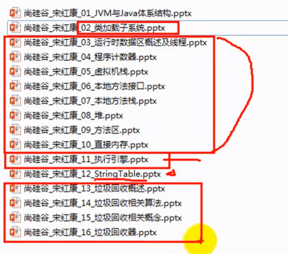
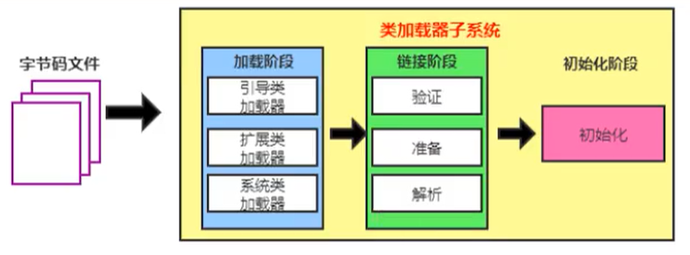
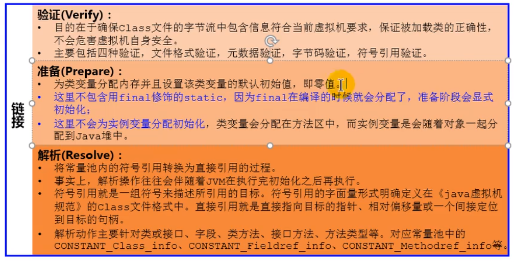
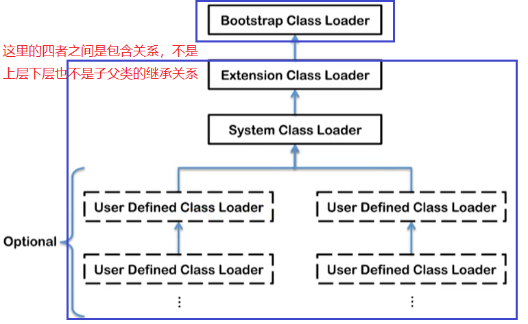

# 类加载子系统



## 1. 内存结构概述


完整图如下


## 2. 类加载器与类的加载过程



### 2.1 类加载器子系统作用

* 类加载器子系统负责从文件系统或者网络中加载Class文件，class文件在文件开头有特定的文件标识（加载位置，标识）
* ClassLoader只负责class文件的加载，至于它是否可以运行，则由Execution Engine决定
* **加载的类信息存放于一块称为方法区的内存空间**。除了类的信息外，方法区中还会存放**运行时常量池**信息，可能还包括字符串字面量和数字常量（这部分常量信息是Class文件中常量池部分的内存映射）

### 2.2 类加载器ClassLoader角色


- class file存在于本地硬盘上，可以理解为设计师画在纸上的模板，而最终这个模板在执行的时候是要加载到JVM当中来根据这个文件实例化出n个一模一样的实例
- class file加载到JVM中，被称为DNA元数据模板，放在方法区
- 在.class文件->JVM->最终成为元数据模板，此过程就要一个运输工具（类装载器Class Loader），扮演一个快递员的角色

### 2.3 类的加载过程


例如下面的一段简单的代码

```java
public class HelloLoader {
    public static void main(String[] args) {
        System.out.println("我已经被加载啦");
    }
}
```

它的加载过程是怎么样的呢?


#### 1. 加载阶段Loading（微观）

* 通过一个类的全限定名获取定义此类的二进制字节流
* 将这个字节流所代表的静态存储结构转化为方法区的运行时数据结构
* **在内存中生成一个代表这个类的java.lang.Class对象**，作为方法区这个类的各种数据的访问入口

**补充：加载.class文件的方式**

- 从本地系统中直接加载
- 通过网络获取，典型场景：Web Applet
- 从zip压缩包中读取，成为日后jar、war格式的基础
- 运行时计算生成，使用最多的是：动态代理技术
- 由其他文件生成，典型场景：JSP应用从专有数据库中提取.class文件，比较少见
- 从加密文件中获取，典型的防Class文件被反编译的保护措施

#### 2. 链接阶段Linking



1. 验证 Verify

   * 目的在于确保Class文件的字节流中包含信息符合当前虚拟机要求，保证被加载类的正确性，不会危害虚拟机自身安全
   * 主要包括四种验证，文件格式验证，元数据验证，字节码验证，符号引用验证

2. 准备 Prepare

   * 为类变量分配内存并且设置该类变量的默认初始值，即零值
   * **这里不包含用final修饰的static，因为final在编译的时候就会分配了，准备阶段会显式初始化**
   * 这里**不会为实例变量分配初始化**，类变量会分配在方法区中，而实例变量是会随着对象一起分配到Java堆中


   ```java
   public class HelloApp {
       private static int a = 1;  // 准备阶段为0，在下个阶段，也就是初始化的时候才是1
       public static void main(String[] args) {
           System.out.println(a);
       }
   }
   ```


3. 解析 Resolve
   * 将常量池内的符号引用转换为直接引用的过程
   * 事实上，解析操作往往会伴随着JVM在执行完初始化之后再执行
   * 符号引用就是一组符号来描述所引用的目标。符号引用的字面量形式明确定义在《java虚拟机规范》的class文件格式中。直接引用就是直接指向目标的指针、相对偏移量或一个间接定位到目标的句柄
   * 解析动作主要针对类或接口、字段、类方法、接口方法、方法类型等。对应常量池中的CONSTANT Class info、CONSTANT Fieldref info、CONSTANT Methodref info等

#### 3. 初始化阶段Initialization

* 初始化阶段就是执行类构造器方法<clinit>() 的过程

* 此方法不需定义，是 javac 编译器自动收集类中的所有**类变量的赋值**动作和**静态代码块**中的语句合并而来

  也就是说，当我们代码中包含static变量的时候，就会有 clinit 方法

* 构造器方法中指令按语句在源文件中出现的顺序执行

  ```java
  public class ClassInitTest {
      static {
          num = 20;
          System.out.println(num); // 报错，非法的前向引用
      }
      
      private static int number = 10; // 语法可行，linking 的 prepare：number = 0 --> initial : 20 --> 10
  }
  ```

* <clinit>() 不同于类的构造器（关联：构造器是虚拟机视角下的<init>()，<init>() 即任何一个类声明后，内部至少存在一个类的构造器）

* 若该类具有父类，JVM会保证子类的 <clinit>() 执行前，父类的 <clinit>() 已经执行完毕（加载子类前会先加载父类）

* 虚拟机必须保证一个类的 <clinit>() 方法在多线程下被同步加锁

## 3. 类加载器分类

* JVM支持两种类型的类加载器 。分别为**引导类加载器（Bootstrap ClassLoader）和自定义类加载器（User-Defined ClassLoader）**
* 从概念上来讲，自定义类加载器一般指的是程序中由开发人员自定义的一类类加载器，但是Java虚拟机规范却没有这么定义，而是将**所有派生于抽象类ClassLoader的类加载器都划分为自定义类加载器**
* 无论类加载器的类型如何划分，在程序中我们最常见的类加载器始终只有3个，如下所示：



### 3.1 虚拟机自带的加载器

#### 1. 启动类加载器（引导类加载器，Bootstrap ClassLoader）

- 这个类加载使用C/C++语言实现的，嵌套在JVM内部
- 它用来加载Java的核心库（JAVAHOME/jre/1ib/rt.jar、resources.jar或sun.boot.class.path路径下的内容），用于提供JVM自身需要的类
- 并不继承自java.lang.ClassLoader，没有父加载器
- 加载扩展类和应用程序类加载器，并指定为他们的父类加载器
- 出于安全考虑，Bootstrap启动类加载器只加载包名为**java、javax、sun**等开头的类

#### 2. 扩展类加载器（Extension ClassLoader）

- Java语言编写，由sun.misc.Launcher$ExtClassLoader实现。
- 派生于ClassLoader类
- 父类加载器为启动类加载器
- 从java.ext.dirs系统属性所指定的目录中加载类库，或从JDK的安装目录的jre/lib/ext子目录（扩展目录）下加载类库。如果用户创建的JAR放在此目录下，也会自动由扩展类加载器加载

#### 3. 应用程序类加载器（系统类加载器，AppClassLoader）

- java语言编写，由sun.misc.LaunchersAppClassLoader实现
- 派生于ClassLoader类
- 父类加载器为扩展类加载器
- 它负责加载环境变量classpath或系统属性 java.class.path 指定路径下的类库
- 该类加载**是程序中默认的类加载器**，一般来说，Java应用的类都是由它来完成加载
- 通过 classLoader#getSystemclassLoader() 方法可以获取到该类加载器

### 3.2 用户自定义类加载器

* 在Java的日常应用程序开发中，类的加载几乎是由上述3种类加载器相互配合执行的，在必要时，我们还可以自定义类加载器，来定制类的加载方式
* 为什么要自定义类加载器？
  * 隔离加载类
  * 修改类加载的方式
  * 扩展加载源
  * 防止源码泄漏

**用户自定义类加载器实现步骤：**

1. 开发人员可以通过继承抽象类java.lang.ClassLoader类的方式，实现自己的类加载器，以满足一些特殊的需求
2. 在JDK1.2之前，在自定义类加载器时，总会去继承ClassLoader类并重写loadClass() 方法，从而实现自定义的类加载类，但是在JDK1.2之后已不再建议用户去覆盖 loadClass() 方法，而是建议把自定义的类加载逻辑写在findclass() 方法中
3. 在编写自定义类加载器时，如果没有太过于复杂的需求，可以直接继承URLClassLoader类，这样就可以避免自己去编写findclass() 方法及其获取字节码流的方式，使自定义类加载器编写更加简洁

## 4. ClassLoader的使用说明

### 4.1 关于ClassLoader

ClassLoader类，它是一个抽象类，其后所有的类加载器都继承自ClassLoader（不包括启动类加载器）


sun.misc.Launcher 它是一个java虚拟机的入口应用


获取ClassLoader的途径

- 获取当前ClassLoader: clazz.getClassLoader()
- 获取当前线程上下文的ClassLoader: Thread.currentThread().getContextClassLoader()
- 获取系统的ClassLoader: ClassLoader.getSystemClassLoader()
- 获取调用者的ClassLoader: DriverManager.getCallerClassLoader()

## 5. 双亲委派机制

Java虚拟机对class文件采用的是**按需加载**的方式，也就是说当需要使用该类时才会将它的class文件加载到内存生成class对象。而且加载某个类的class文件时，Java虚拟机采用的是**双亲委派模式**，即把请求交由父类处理，它是一种任务委派模式

### 5.1 工作原理（类递归）

- 如果一个类加载器收到了类加载请求，它并不会自己先去加载，而是把这个请求委托给父类的加载器去执行
- 如果父类加载器还存在其父类加载器，则进一步向上委托，依次递归，请求最终将到达顶层的启动类加载器
- 如果父类加载器可以完成类加载任务，就成功返回，倘若父类加载器无法完成此加载任务，子加载器才会尝试自己去加载，这就是双亲委派模式


### 5.2 双亲委派机制举例

当我们加载jdbc.jar 用于实现数据库连接的时候，首先我们需要知道的是 jdbc.jar是基于SPI接口进行实现的，所以在加载的时候，会进行双亲委派，最终从根加载器中加载 SPI核心类，然后在加载SPI接口类，接着在进行反向委派，通过线程上下文类加载器进行实现类 jdbc.jar的加载。


### 5.3 双亲委派机制的优势

通过上面的例子，我们可以知道，双亲机制可以

- 避免类的重复加载
- 保护程序安全，防止核心API被随意篡改
  - 自定义类：java.lang.String
  - 自定义类：java.lang.ShkStart（报错：阻止创建 java.lang开头的类）

### 5.4 沙箱安全机制（保护）

自定义string类，但是在加载自定义String类的时候会率先使用引导类加载器加载，而引导类加载器在加载的过程中会先加载jdk自带的文件（rt.jar包中java\lang\String.class），报错信息说没有main方法，就是因为加载的是rt.jar包中的string类。这样可以保证对java核心源代码的保护，这就是沙箱安全机制

## 6. 其他

###  6.1 如何判断两个class对象是否相同

在JVM中表示两个class对象是否为同一个类存在两个必要条件：
- 类的**完整类名**必须一致，包括包名
- 加载这个类的**ClassLoader**（指ClassLoader实例对象）必须相同

换句话说，在JVM中，即使这两个类对象（class对象）来源同一个Class文件，被同一个虚拟机所加载，但只要加载它们的ClassLoader实例对象不同，那么这两个类对象也是不相等的

JVM必须知道一个类型是由启动加载器加载的还是由用户类加载器加载的。如果一个类型是由用户类加载器（非启动类加载器）加载的，那么**JVM会将这个类加载器的一个引用作为类型信息的一部分保存在方法区**中。当解析一个类型到另一个类型的引用的时候，JVM需要保证这两个类型的类加载器是相同的

### 6.2 类的主动使用和被动使用

Java程序对类的使用方式分为：主动使用和被动使用

* 主动使用，又分为七种情况：

  1. 创建类的实例

  2. 访问某个类或接口的静态变量，或者对该静态变量赋值

  3. 调用类的静态方法

  4. 反射（比如：Class.forName("com.atguigu.Test")）

  5. 初始化一个类的子类

  6. Java虚拟机启动时被标明为启动类的类

  7. JDK7开始提供的动态语言支持：

     java.lang.invoke.MethodHandle实例的解析结果REF_getStatic、REF_putStatic、REF_invokeStatic句柄对应的类没有初始化，则初始化

* 除了以上七种情况，其他使用Java类的方式都被看作是对类的被动使用，都**不会导致类的初始化**