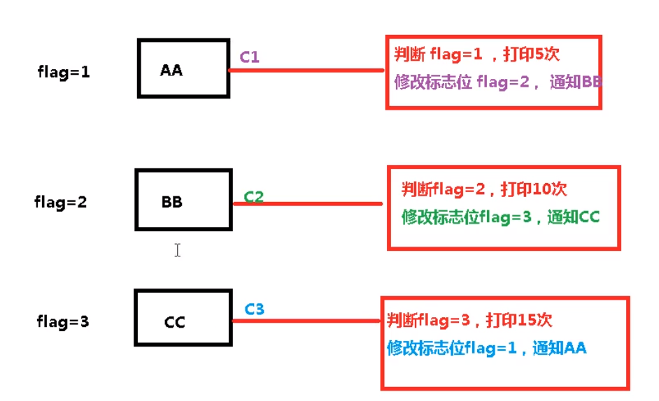
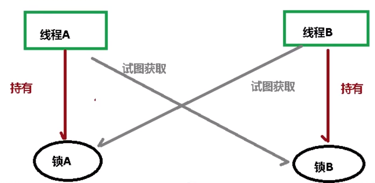
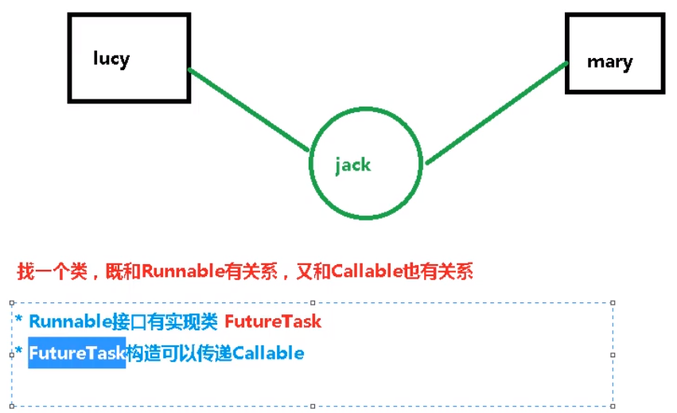
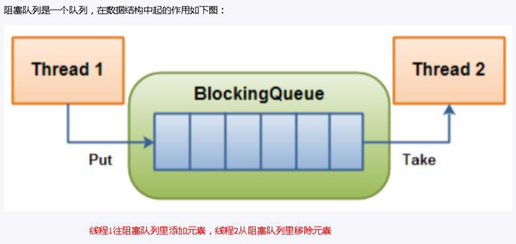

# JUC

## 1. JUC 概述

### 1.1 什么是JUC

JUC 就是 java.util .concurrent 工具包的简称。这是一个处理线程的工具包，JDK1.5 开始出现的

### 1.2 线程和进程概念

#### 1. 进程与线程

* 进程：指在系统中正在运行的一个应用程序；程序一旦运行就是进程

  进程— —资源分配的最小单位

* 线程：系统分配处理器时间资源的基本单元，或者说进程之内独立执行的一个单元执行流

  线程——程序执行的最小单位

#### 2. 线程的状态

```java
// 线程状态枚举类
public enum State {
	NEW, // 新建

    RUNNABLE, // 准备就绪

    BLOCKED, // 阻塞

    WAITING, // 不见不散

    TIMED_WAITING, // 逾时不候

    TERMINATED; // 终结
}
```

#### 3. wait 和 sleep

* sleep 是 Thread 的静态方法，wait 是 Object 的方法，任何对象实例都能调用
* sleep 不会释放锁，它也不需要占用锁。wait 会释放锁，但调用它的前提是当前线程占有锁（即代码要在 synchronized 中）
* 它们都可以被 interrupted 方法中断

#### 4. 并发和并行

1. 串行

   串行是一次只能取得一个任务，并执行这个任务

2. 并行

   并行意味着可以同时取得多个任务，并同时去执行所取得的这些任务（多项工作一起执行，之后再汇总）

3. 并发

   同一时刻多个线程在访问同一个资源，多个线程对一个点 例子：春运抢票 电商秒杀...

#### 5. 管程

理解：锁

#### 6. 用户线程和守护线程

* 用户线程：平时用到的普通线程，自定义线程
* 守护线程：运行在后台，是一种特殊的线程，比如垃圾回收
  * 当主线程结束后，用户线程还在运行，JVM 存活
  * 如果没有用户线程，都是守护线程，JVM 结束

## 2. Lock 接口

### 2.1 synchronized 关键字

#### 1. synchronized 是什么

synchronized 是 Java 中的关键字，是一种同步锁。它修饰的对象有以下几种：

1. 修饰一个代码块，被修饰的代码块称为同步语句块（同步代码块），其作用的范围是大括号 {} 括起来的代码，作用的对象是调用这个代码块的对象
2. 修饰一个方法，被修饰的方法称为同步方法，其作用的范围是整个方法，作用的对象是调用这个方法的对象
   * 虽然可以使用 synchronized 来定义方法，但 synchronized 并不属于方法定义的一部分，因此，synchronized 关键字不能被继承
   * 如果在父类中的某个方法使用了 synchronized 关键字，而在子类中覆盖了这个方法，在子类中的这个方法默认情况下并不是同步的，而必须显式地在子类的这个方法中加上 synchronized 关键字才可以
   * 当然，还可以在子类方法中调用父类中相应的方法，这样虽然子类中的方法不是同步的，但子类调用了父类的同步方法，因此，子类的方法也就相当于同步了
3. 修改一个静态的方法，其作用的范围是整个静态方法，作用的对象是这个类的所有对象
4. 修改一个类，其作用的范围是 synchronized后面括号括起来的部分，作用的对象是这个类的所有对象

#### 2. synchronized实现同步的基础

* Java中的每一个对象都可以作为锁具体表现为以下3种形式
  1. 对于普通同步方法，锁是当前实例对象
  2. 对于静态同步方法，锁是当前类的Class对象
  3. 对于同步方法块，锁是 synchonized 括号里配置的对象

#### 3. 多线程编程步骤

1. 创建资源类，在资源类创建属性和操作方法
2. 在资源类操作方法中
   1. 判断
   2. 干活
   3. 通知
3. 创建多个线程，调用资源类的操作方法

#### 4. synchronized 售票案例

问题：如果线程中用 wait 方法进行延时运行会报错，而用 sleep 方法则不会，原因：wait 释放锁，线程都释放后进入等待状态，没有唤醒其他线程

```java
//第一步  创建资源类，定义属性和和操作方法
class Ticket {
    //票数
    private int number = 30;

    //操作方法：卖票
    public synchronized void sale() {
        //判断：是否有票
        if (number > 0) {
            System.out.println(Thread.currentThread().getName() + " : 卖出：" + (number--) + " 剩下：" + number);
        }
    }
}

public class SaleTicket {
    //第二步 创建多个线程，调用资源类的操作方法
    public static void main(String[] args) {
        //创建Ticket对象
        Ticket ticket = new Ticket();
        //创建三个线程
        new Thread(new Runnable() {
            @Override
            public void run() {
                //调用卖票方法
                for (int i = 0; i < 40; i++) {
                    ticket.sale();
                }
            }
        }, "AA").start();

        new Thread(new Runnable() {
            @Override
            public void run() {
                //调用卖票方法
                for (int i = 0; i < 40; i++) {
                    ticket.sale();
                }
            }
        }, "BB").start();

        new Thread(new Runnable() {
            @Override
            public void run() {
                //调用卖票方法
                for (int i = 0; i < 40; i++) {
                    ticket.sale();
                }
            }
        }, "CC").start();
    }
}
```

#### 5. synchronized 的缺点及解决方案

如果一个代码块被 synchronized 修饰了，当一个线程获取了对应的锁，并执行该代码块时，其他线程便只能一直等待，等待获取锁的线程释放锁，而这里获取锁的线程释放锁只会有两种情况： 

1）获取锁的线程执行完了该代码块，然后线程释放对锁的占有； 

2）线程执行发生异常，此时JVM 会让线程自动释放锁

那么如果这个获取锁的线程由于要等待 IO 或者其他原因（比如调用 sleep 方法）被阻塞了，但是又没有释放锁，其他线程便只能干巴巴地等待，试想一下，这多么影响程序执行效率
因此就需要有一种机制可以不让等待的线程一直无期限地等待下去（比如只等待一定的时间或者能够响应中断），通过 Lock 就可以办到

### 2.2 Lock 接口

#### 1. Lock 是什么

Lock 锁实现提供了比使用同步方法和语句可以获得的更广泛的锁操作。它们允许更灵活的结构，可能具有非常不同的属性，并且可能支持多个关联的条件对象。Lock 提供了比 synchronized 更多的功能

#### 2. synchronized 和 Lock 的区别

* 类型
  * Lock 不是 Java 语言内置的，synchronized 是 Java 语言的关键字，因此是内置特性
  * Lock 是一个接口，通过这个接口的实现类可以实现同步访问
* 是否自动释放锁
  * 采用 synchronized 不需要用户去手动释放锁，当 synchronized 方法或者 synchronized 代码块执行完之后， 系统会自动让线程释放对锁的占用
  * 而 Lock 则必须要用户去手动释放锁，如果没有主动释放锁，就有可能导致出现死锁现象
* 异常处理
  * synchronized 在发生异常时，会自动释放线程占有的锁，因此不会导致死锁现象发生
  * Lock 在发生异常时，如果没有主动通过 unlock() 去释放锁，则很可能造成死锁现象，因此使用 Lock 时需要在 finally 块中释放锁
* 响应中断
  * Lock 可以让等待锁的线程响应中断
  * 而 synchronized 不行，使用 synchronized 时，等待的线程会一直等待下去，不能响应中断
* 获取锁
  * 通过 Lock 可以知道有没有成功获取锁
  * 而 synchronized 无法办到
* Lock 可以提高多个线程进行读操作的效率

在性能上来说，如果竞争资源不激烈，两者的性能是差不多的，而当竞争资源非常激烈时（即有大量线程同时竞争），此时 Lock 的性能要远远优于synchronized

#### 3. 常用方法

1. lock（加锁）与 unlock（释放锁）

   * lock()方法是平常使用得最多的一个方法，就是用来获取锁。如果锁已被其他线程获取，则进行等待

   * 采用 Lock，必须主动去释放锁，并且在发生异常时，不会自动释放锁

   * 因此一般来说，使用 Lock 必须在 try{}catch{}块中进行，并且将释放锁的操作放在 finally 块中进行，以保证锁一定被被释放，防止死锁的发生。通常使用 Lock来进行同步的话，是以下面这种形式去使用的：

     ```java
     Lock lock = ...;
     lock.lock();
     try { 
         //处理任务
     } catch (Exception ex) {
         
     } finally {
         lock.unlock(); //释放锁
     }
     ```

2. newCondition

   * 关键字 synchronized与 wait() / notify()这两个方法一起使用可以实现等待 / 通知模式
   * Lock 锁的 newContition() 方法返回 Condition 对象，Condition 类也可以实现等待 / 通知模式
     * 用 notify() 通知时，JVM会随机唤醒某个等待的线程， 使用 Condition 类可以进行选择性通知
     * Condition 比较常用的两个方法：
       1. await() 会使当前线程等待，同时会释放锁，当其他线程调用 signal() 时，线程会重新获得锁并继续执行
       2. signal() 用于唤醒一个等待的线程，即调用 condition.signal() 后唤醒此 condition 对应的线程

注意：在调用 Condition 的 await() / signal()方法前，也需要线程持有相关的 Lock 锁，调用 await() 后线程会释放这个锁，在 singal() 调用后会从当前 Condition 对象的等待队列中，唤醒一个线程，唤醒的线程尝试获得锁， 一旦获得锁成功就继续执行

#### 4. ReentrantLock（可重入锁）

* ReentrantLock，意思是“可重入锁”，关于可重入锁的概念将在后面讲述
* ReentrantLock 是唯一实现了 Lock 接口的类，并且 ReentrantLock 提供了更多的方法

#### 5. ReadWriteLock（读写锁）

* ReadWriteLock 也是一个接口，在它里面只定义了两个方法：

  ```java
  public interface ReadWriteLock {
      /**
       * Returns the lock used for reading.
       *
       * @return the lock used for reading
       */
      Lock readLock();
  
      /**
       * Returns the lock used for writing.
       *
       * @return the lock used for writing
       */
      Lock writeLock();
  }
  ```

* 一个用来获取读锁，一个用来获取写锁。也就是说将文件的读写操作分开，分成 2 个锁来分配给线程，从而使得多个线程可以同时进行读操作

* 下面的 ReentrantReadWriteLock 实现了 ReadWriteLock 接口。 ReentrantReadWriteLock 里面提供了很多丰富的方法，不过最主要的有两个方法：readLock() 和 writeLock() 用来获取读锁和写锁（可同时读）

**注意：**

* 如果有一个线程已经占用了读锁，则此时其他线程如果要申请写锁，则申请写锁的线程会一直等待释放读锁
* 如果有一个线程已经占用了写锁，则此时其他线程如果申请写锁或者读锁，则申请的线程会一直等待释放写锁

## 3. 线程间通信

线程间通信的模型有两种：**共享内存和消息传递**

### 3.1 案例（共享内存）

**虚假唤醒问题：**

表现：下面代码中，如果判断语句前是 if，可能会出现 number 值小于 0 或者大于 1 的情况（wait 方法后面有代码才会发生）

原因：wait 方法在哪里睡，就在哪里醒

解决方法：将判断改为 while

#### 1. synchronized 方案

```java
//第一步 创建资源类，定义属性和操作方法
class Share {
    //初始值
    private int number = 0;

    //+1的方法
    public synchronized void incr() throws InterruptedException {
        //第二步 判断 干活 通知
        while (number != 0) { //判断number值是否是0，如果不是0，等待
            this.wait(); //在哪里睡，就在哪里醒
        }
        //如果number值是0，就+1操作
        number++;
        System.out.println(Thread.currentThread().getName() + " :: " + number);
        //通知其他线程
        this.notifyAll();
    }

    //-1的方法
    public synchronized void decr() throws InterruptedException {
        //判断
        while (number != 1) {
            this.wait();
        }
        //干活
        number--;
        System.out.println(Thread.currentThread().getName() + " :: " + number);
        //通知其他线程
        this.notifyAll();
    }
}

public class ThreadDemo1 {
    //第三步 创建多个线程，调用资源类的操作方法
    public static void main(String[] args) {
        Share share = new Share();
        //创建线程
        new Thread(() -> {
            for (int i = 1; i <= 10; i++) {
                try {
                    share.incr(); //+1
                } catch (InterruptedException e) {
                    e.printStackTrace();
                }
            }
        }, "AA").start();

        new Thread(() -> {
            for (int i = 1; i <= 10; i++) {
                try {
                    share.decr(); //-1
                } catch (InterruptedException e) {
                    e.printStackTrace();
                }
            }
        }, "BB").start();
    }
}
```

#### 2. Lock 方案

```java
import java.util.concurrent.locks.Condition;
import java.util.concurrent.locks.Lock;
import java.util.concurrent.locks.ReentrantLock;

//第一步 创建资源类，定义属性和操作方法
class Share {
    private int number = 0;

    //创建Lock
    private Lock lock = new ReentrantLock();
    private Condition condition = lock.newCondition();

    //+1
    public void incr() throws InterruptedException {
        //上锁
        lock.lock();
        try {
            //判断
            while (number != 0) {
                condition.await();
            }
            //干活
            number++;
            System.out.println(Thread.currentThread().getName() + " :: " + number);
            //通知
            condition.signalAll();
        } finally {
            //解锁
            lock.unlock();
        }
    }

    //-1
    public void decr() throws InterruptedException {
        lock.lock();
        try {
            while (number != 1) {
                condition.await();
            }
            number--;
            System.out.println(Thread.currentThread().getName() + " :: " + number);
            condition.signalAll();
        } finally {
            lock.unlock();
        }
    }
}

public class ThreadDemo2 {
    public static void main(String[] args) {
        Share share = new Share();
        new Thread(() -> {
            for (int i = 1; i <= 10; i++) {
                try {
                    share.incr();
                } catch (InterruptedException e) {
                    e.printStackTrace();
                }
            }
        }, "AA").start();
        
        new Thread(() -> {
            for (int i = 1; i <= 10; i++) {
                try {
                    share.decr();
                } catch (InterruptedException e) {
                    e.printStackTrace();
                }
            }
        }, "BB").start();

        new Thread(() -> {
            for (int i = 1; i <= 10; i++) {
                try {
                    share.incr();
                } catch (InterruptedException e) {
                    e.printStackTrace();
                }
            }
        }, "CC").start();
        new Thread(() -> {
            for (int i = 1; i <= 10; i++) {
                try {
                    share.decr();
                } catch (InterruptedException e) {
                    e.printStackTrace();
                }
            }
        }, "DD").start();
    }
}
```

## 4. 线程间定制化通信

通过标志位实现定制化线程执行

### 4.1 案例

问题: A线程打印 5 次A，B线程打印 10 次B，C线程打印 15 次 C,按照 此顺序循环 10 轮



为什么要创建 3 个 Condition？

对应三个线程，可指定某线程唤醒

```java
import java.util.ArrayList;
import java.util.List;
import java.util.UUID;
import java.util.concurrent.locks.Condition;
import java.util.concurrent.locks.Lock;
import java.util.concurrent.locks.ReentrantLock;

//第一步 创建资源类
class ShareResource {
    //定义标志位
    private int flag = 1;  // 1 AA     2 BB     3 CC

    //创建Lock锁
    private Lock lock = new ReentrantLock();

    //创建三个condition
    private Condition c1 = lock.newCondition();
    private Condition c2 = lock.newCondition();
    private Condition c3 = lock.newCondition();

    //打印5次，参数第几轮
    public void print5(int loop) throws InterruptedException {
        //上锁
        lock.lock();
        try {
            //判断
            while (flag != 1) {
                //等待
                c1.await();
            }
            //干活
            for (int i = 1; i <= 5; i++) {
                System.out.println(Thread.currentThread().getName() + " :: " + i + " ：轮数：" + loop);
            }
            //通知
            flag = 2; //修改标志位 2
            c2.signal(); //通知BB线程
        } finally {
            //释放锁
            lock.unlock();
        }
    }

    //打印10次，参数第几轮
    public void print10(int loop) throws InterruptedException {
        lock.lock();
        try {
            while (flag != 2) {
                c2.await();
            }
            for (int i = 1; i <= 10; i++) {
                System.out.println(Thread.currentThread().getName() + " :: " + i + " ：轮数：" + loop);
            }
            //修改标志位
            flag = 3;
            //通知CC线程
            c3.signal();
        } finally {
            lock.unlock();
        }
    }

    //打印15次，参数第几轮
    public void print15(int loop) throws InterruptedException {
        lock.lock();
        try {
            while (flag != 3) {
                c3.await();
            }
            for (int i = 1; i <= 15; i++) {
                System.out.println(Thread.currentThread().getName() + " :: " + i + " ：轮数：" + loop);
            }
            //修改标志位
            flag = 1;
            //通知AA线程
            c1.signal();
        } finally {
            lock.unlock();
        }
    }
}

public class ThreadDemo3 {
    public static void main(String[] args) {
        ShareResource shareResource = new ShareResource();
        new Thread(() -> {
            for (int i = 1; i <= 10; i++) {
                try {
                    shareResource.print5(i);
                } catch (InterruptedException e) {
                    e.printStackTrace();
                }
            }
        }, "AA").start();

        new Thread(() -> {
            for (int i = 1; i <= 10; i++) {
                try {
                    shareResource.print10(i);
                } catch (InterruptedException e) {
                    e.printStackTrace();
                }
            }
        }, "BB").start();

        new Thread(() -> {
            for (int i = 1; i <= 10; i++) {
                try {
                    shareResource.print15(i);
                } catch (InterruptedException e) {
                    e.printStackTrace();
                }
            }
        }, "CC").start();
    }
}
```

## 5. 集合的线程安全

### 5.1 ArrayList 线程不安全问题

#### 1. 案例

```java
import java.util.ArrayList;
import java.util.List;
import java.util.UUID;

public class ThreadDemo4 {
    public static void main(String[] args) {
        List<String> list = new ArrayList<>();

        // 多个线程同时对集合进行修改
        for (int i = 0; i < 30; i++) {
            new Thread(() -> {
                list.add(UUID.randomUUID().toString().substring(0, 8));
                System.out.println(list);
            }, String.valueOf(i)).start();
        }
    }
}
```

异常内容

java.util.ConcurrentModificationException 并发修改异常

原因：程序同时对集合进行读和写

#### 2. 解决方案-Vector

将 ArrayList 改为 Vector，Vector 线程安全

不推荐用，性能差

#### 3. 解决方案-Collections

使用 Collections 的 List<T> synchronizedList(List<T> list) 方法，获取一个线程安全的集合

```java
List<String> list = Collections.synchronizedList(new ArrayList<>());
```

不常用

#### 4. 解决方案-CopyOnWriteArrayList

推荐，JUC 提供的

它相当于线程安全的ArrayList。和ArrayList 一样，它是个可变数组；但是和 ArrayList 不同的时，它具有以下特性：
1. 它最适合于具有以下特征的应用程序：
   * List 大小通常保持很小，**只读操作远多于可变操作**，需要在遍历期间防止线程间的冲突（读多写少就用它）
2. 它是线程安全的
3. 因为通常需要复制整个基础数组，所以可变操作（add()、set() 和 remove() 等等）的开销很大
4. 迭代器支持 hasNext()，next()等不可变操作，但不支持可变 remove() 等操作
5. 使用迭代器进行遍历的速度很快，并且不会与其他线程发生冲突。在构造迭代器时，迭代器依赖于不变的**数组快照**

**底层原理：**

1. 独占锁效率低：采用读写分离思想解决（并发读）
2. 写线程获取到锁，其他写线程阻塞（独立写）
3. 复制思想：
   * 当我们往一个容器添加元素的时候，不直接往当前容器添加，而是先将当前容器进行 Copy，复制出一个新的容器，然后新的容器里添加元素，添加完元素之后，再将原容器的引用指向新的容器
   * 这时候会抛出来一个新的问题，也就是数据不一致的问题。如果写线程还没来得及写回内存，其他的线程就会读到了脏数据

**原因分析(重点)：**==动态数组与线程安全== 下面从“动态数组”和“线程安全”两个方面进一步对 CopyOnWriteArrayList 的原理进行说明

* “动态数组”机制
  * 它内部有个“volatile 数组”(array)来保持数据。在“添加/修改/删除”数据时，都会新建一个数组，并将更新后的数据拷贝到新建的数组中，最后再将该数组赋值给“volatile 数组”，这就是它叫做 CopyOnWriteArrayList 的原因
  * 由于它在“添加/修改/删除”数据时，都会新建数组，所以涉及到修改数据的操作，CopyOnWriteArrayList 效率很低；但是单单只是进行遍历查找的话， 效率比较高
* “线程安全”机制（写入安全）
  * 通过 volatile 和互斥锁来实现的
  * 通过“volatile 数组”来保存数据的。一个线程读取 volatile 数组时，总能看到其它线程对该 volatile 变量最后的写入；就这样，通过 volatile 提供了“读取到的数据总是最新的”这个机制的保证
  * 通过互斥锁来保护数据。在“添加/修改/删除”数据时，会先“获取互斥锁”， 再修改完毕之后，先将数据更新到“volatile 数组”中，然后再“释放互斥锁”，就达到了保护数据的目的

### 5.2 HashSet（HashMap）线程不安全问题

案例同上

#### 1. 解决方案-CopyOnWriteArraySet / ConcurrentHashMap

同 CopyOnWriteArrayList，为 JUC 提供

## 6. 多线程锁

### 6.1 锁的 8 个问题

#### 1. synchronized实现同步的基础

* Java中的每一个对象都可以作为锁具体表现为以下3种形式
  1. 对于普通同步方法，锁是当前实例对象
  2. 对于静态同步方法，锁是当前类的Class对象
  3. 对于同步方法块，锁是 synchonized 括号里配置的对象

当一个线程试图访问同步代码块时，它首先必须得到锁，退出或抛出异常时必须释放锁。也就是说如果一个实例对象的非静态同步方法获取锁后，该实例对象的其他非静态同步方法必须等待获取锁的方法释放锁后才能获取锁， 可是别的实例对象的非静态同步方法因为跟该实例对象的非静态同步方法用的是不同的锁， 所以毋须等待该实例对象已获取锁的非静态同步方法释放锁就可以获取他们自己的锁。 所有的静态同步方法用的也是同一把锁——类对象本身，这两把锁是两个不同的对象，所以静态同步方法与非静态同步方法之间是不会有竞态条件的。 但是一旦一个静态同步方法获取锁后，其他的静态同步方法都必须等待该方法释放锁后才能获取锁，而不管是同一个实例对象的静态同步方法之间，还是不同的实例对象的静态同步方法之间，只要它们是同一个类的实例对象！

> 一个对象里面如果有多个 synchronized 方法，某一个时刻内，只要一个线程去调用其中的一个 synchronized方法了， 其它的线程都只能等待，换句话说，某一个时刻内，只能有唯一一个线程去访问这些 synchronized方法，锁的是当前对象 this，被锁定后，其它的线程都不能进入到当前对象的其它的 synchronized方法，加个普通方法后发现和同步锁无关。换成两个对象后，不是同一把锁了，情况立刻变化

### 6.2 公平锁与非公平锁

如 ReentrantLock，源码：

```java
public ReentrantLock() {
    sync = new NonfairSync(); // 默认为非公平锁
}

public ReentrantLock(boolean fair) {
    sync = fair ? new FairSync() : new NonfairSync();
}
```

* 非公平锁：所有活都被某个线程做了
  * 优点：效率高
  * 缺点：“线程饿死”
* 公平锁：佛光普照、雨露均沾
  * 优点：佛光普照
  * 缺点：效率相对较低

### 6.3 可重入锁（递归锁）

synchronized（隐式） 和 Lock（显式） 都是可重入锁

#### 1. 案例（套娃）

```java
import java.util.concurrent.locks.Lock;
import java.util.concurrent.locks.ReentrantLock;

public class LockTest {
    public static void main(String[] args) {
        Lock lock = new ReentrantLock();

        new Thread(() -> {
            try {
                lock.lock();
                System.out.println(Thread.currentThread().getName() + "外层");
                try {
                    lock.lock();
                    System.out.println(Thread.currentThread().getName() + "中层");
                    try {
                        lock.lock();
                        System.out.println(Thread.currentThread().getName() + "内层");
                    } finally {
                        lock.unlock(); // 如果不释放，此线程可正常执行完，但会导致占用锁，以至于 aa 线程无法执行
                    }
                } finally {
                    lock.unlock();
                }
            } finally {
                lock.unlock();
            }
        }, "t1").start();

        new Thread(() -> {
            lock.lock();
            System.out.println("aaaa");
            lock.unlock();
        }, "aa").start();
    }
}
```

### 6.4 死锁

#### 1. 什么是死锁

两个或者两个以上进程在执行过程中，因为争夺资源而造成一种互相等待的现象，如果没有外力干涉，他们无法再执行下去



#### 2. 产生死锁的原因

1. 系统资源不足
2. 进程运行推进顺序不合适
3. 资源分配不当

```java
public class DeadLock {
    static Object a = new Object();
    static Object b = new Object();
    public static void main(String[] args) {

        new Thread(() -> {
            synchronized (a) {
                System.out.println(Thread.currentThread().getName() + "持有锁a");
                try {
                    Thread.sleep(10);
                } catch (InterruptedException e) {
                    e.printStackTrace();
                }
                synchronized (b) {
                    System.out.println(Thread.currentThread().getName() + "持有锁a和锁b");
                }
            }
        }, "aa").start();

        new Thread(() -> {
            synchronized (b) {
                System.out.println(Thread.currentThread().getName() + "持有锁b");
                try {
                    Thread.sleep(10);
                } catch (InterruptedException e) {
                    e.printStackTrace();
                }
                synchronized (a) {
                    System.out.println(Thread.currentThread().getName() + "持有锁b和锁a");
                }
            }
        }, "bb").start();
    }
}
```

#### 3. 验证是否是死锁

命令：

* jps（类似 Linux 中的 ps -ef）
* jstack（JVM 自带的堆栈跟踪工具）

```shell
jps
jstack 程序进程号
# 显示 Found 1 deadlock.
```

## 7. Callable 接口

### 7.1 创建线程的 4 种方式

1. 继承 Thread 类（java.lang）
2. 实现 Runnable 接口（java.lang）
3. Callable 接口（java.util.concurrent）
4. 线程池

* Runnable 缺少的一项功能是，当线程终止时（即 run() 完成时），我们无法使线程返回结果
* 为了支持此功能，Java 中提供了 Callable 接口

### 7.2 Runnable 接口和 Callable 接口的区别

|              | Runnable 接口 | Callable 接口 |
| ------------ | ------------- | ------------- |
| 是否有返回值 | 无            | 有            |
| 是否抛出异常 | 无            | 有            |
| 实现方法名称 | run()         | call()        |



### 7.3 使用方法

```java
FutureTask<Integer> futureTask = new FutureTask<Integer>(() -> {
    // call 方法
    return 1024;
});
new Thread(futureTask, "BB").start();
```

### 7.4 Future 接口

* 当 call 方法完成时，结果必须存储在主线程已知的对象中，以便主线程可以知道该线程返回的结果。为此，可以使用 Future 对象

* 将 Future 视为**保存结果的对象**

  * 它可能暂时不保存结果，但将来会保存（一旦 Callable 返回）

  * Future 是主线程可以跟踪进度以及其他线程的结果的一种方式

  * 要实现此接口，必须重写 5 种方法，这里列出了重要的方法，如下：

    | 方法                                        | 作用                                                         |
    | ------------------------------------------- | ------------------------------------------------------------ |
    | public boolean cancel(boolean mayInterrupt) | 用于停止任务：<br>如果尚未启动，它将停止任务<br/>如果已启动，则仅在 mayInterrupt 为 true 时才会中断任务 |
    | public Object get ()                        | 抛出 InterruptedException，ExecutionException<br/>用于获取任务的结果<br/>如果任务完成，它将立即返回结果，否则将等待任务完成，然后返回结果 |
    | public boolean isDone ()                    | 如果任务完成，则返回 true，否则返回 false                    |

* 可以看到 Callable 和 Future 做两件事
  * Callable 与 Runnable 类似，因为它封装了要在另一个线程上运行的任务
  * 而 Future 用于存储从另一个线程获得的结果
  * 实际上，future 也可以与 Runnable 一起使用。要创建线程，需要 Runnable。为了获得结果，需要 Future

### 7.5 FutureTask

#### 1. 是什么

* Java 库具有具体的 FutureTask 类型，该类型**实现 Runnable 和 Future**，并方便地将两种功能组合在一起
* 可以通过为其构造函数提供 Callable 来创建 FutureTask。然后，将 FutureTask 对象提供给 Thread 的构造函数以创建Thread 对象。因此，间接地使用 Callable 创建线程

#### 2. 核心原理

* 使用场景：
  * 在主线程中需要执行比较耗时的操作时，但又不想阻塞主线程时，可以把这些作业交给 Future 对象在后台完成
* 作用：
  * 当主线程将来需要时，就可以通过 Future 对象获得后台作业的计算结果或者执行状态
* 获取细节：
  * 仅在计算完成时才能检索结果；如果计算尚未完成，则阻塞 get 方法直到任务转入完成状态，然后会返回结果或者抛出异常
  * 一旦计算完成，就不能再重新开始或取消计算
  * 只计算一次

## 8. JUC 强大的辅助类

### 8.1 减少计数 CountDownLatch

CountDownLatch 类可以设置一个计数器，然后通过 countDown方法来进行减 1 的操作，使用 await 方法等待，直到计数器为 0才继续执行await 方法之后的语句

* 构造方法

  * public CountDownLatch(int count)

    计数器数值

* CountDownLatch 主要有两个方法

  * countDown () ：线程调用 countDown 方法会将计数器减 1（调用 countDown 方法的线程不会阻塞）
  * 当线程调用 await 方法时，此线程会阻塞（防火墙），当计数器的值变为 0 时，因 await 方法阻塞的线程会被唤醒，继续执行

```java
public class CountDownLatchDemo {
    public static void main(String[] args) {

        CountDownLatch countDownLatch = new CountDownLatch(6);
        
        for (int i = 0; i < 6; i++) {
            new Thread(() -> {
                System.out.println(Thread.currentThread().getName() + "离开教室");
                countDownLatch.countDown();
            }, String.valueOf(i)).start();
        }

        try {
            countDownLatch.await();
        } catch (InterruptedException e) {
            e.printStackTrace();
        }
        System.out.println(Thread.currentThread().getName() + "锁门");
    }
}
```

### 8.2 循环栅栏 CyclicBarrier

CyclicBarrier 看英文单词可以看出大概就是循环阻塞的意思，在使用中 CyclicBarrier 的构造方法第一个参数是目标障碍数，每次执行 CyclicBarrier 一 次障碍数会加一，如果达到了目标障碍数，才会执行 cyclicBarrier.await()之后的语句。可以将 CyclicBarrier 理解为加 1 操作

* 构造方法

  1. public CyclicBarrier(int parties, Runnable barrierAction)

     人头数，达到人头后要执行的操作（由最后一个线程执行）

  2. public CyclicBarrier(int parties)

     人头数

* await() 方法：

  1. 在线程中调用，相当于告知 CyclicBarrier 又有一个哥们进来了，如果没有达到人头数，则进入阻塞
  2. 如果达到人头数，所有处于阻塞的线程都被唤醒，则执行定义操作（如果有），并继续执行 await 方法之后的语句

```java
public class CyclicBarrierDemo {

    private static final int NUMBER = 7;

    public static void main(String[] args) {
        CyclicBarrier cyclicBarrier = new CyclicBarrier(NUMBER, () -> {
            System.out.println("集齐成功");
        });

        for (int i = 0; i < 6; i++) {
            new Thread(() -> {
                System.out.println(Thread.currentThread().getName() + "收集到了");
                try {
                    cyclicBarrier.await();
                    System.out.println(Thread.currentThread().getName() + "aaaaaaaaaaaaaaaaaa");
                } catch (InterruptedException e) {
                    e.printStackTrace();
                } catch (BrokenBarrierException e) {
                    e.printStackTrace();
                }
            }, String.valueOf(i)).start();
        }

        try {
            Thread.sleep(5000);
        } catch (InterruptedException e) {
            e.printStackTrace();
        }

        new Thread(() -> {
            System.out.println(Thread.currentThread().getName() + "收集到了");
            try {
                cyclicBarrier.await();
                System.out.println(Thread.currentThread().getName() + "aaaaaaaaaaaaaaaaaa");
            } catch (InterruptedException e) {
                e.printStackTrace();
            } catch (BrokenBarrierException e) {
                e.printStackTrace();
            }
        }, String.valueOf(6)).start();


        System.out.println("bbbbbbbbbbbbbbb");
    }
}
```

### 8.3 信号灯 Semaphore

* 构造方法

  * public Semaphore(int permits)

    车位数量

* 常用方法

  * 使用 acquire 方法获得许可证（若无空闲车位则阻塞，直到有空位或线程被中断）
  * release 方法释放许可（抢车位）

```java
public class SemaphoreDemo {
    public static void main(String[] args) {
        Semaphore semaphore = new Semaphore(3);

        for (int i = 0; i < 6; i++) {
            new Thread(() -> {
                try {
                    semaphore.acquire();

                    System.out.println(Thread.currentThread().getName() + "获取到车位");
                    TimeUnit.SECONDS.sleep(new Random().nextInt(5));
                    System.out.println(Thread.currentThread().getName() + "---离开车位");
                } catch (InterruptedException e) {
                    e.printStackTrace();
                } finally {
                    semaphore.release();
                }
            }, String.valueOf(i)).start();
        }
    }
}
```

## 9. ReentrantReadWriteLock读写锁

* 乐观锁 VS 悲观锁
* 表锁 VS 行锁（行锁会出现死锁）
* 读锁 VS 写锁（都可能发生死锁）
  * 线程1与线程2同时进行读操作，线程1准备进行写操作，此时需等待线程2释放读锁，此时线程2也进行写操作，会出现死锁
  * 

### 9.1 读写锁概述

* 现实中有这样一种场景：对共享资源有读和写的操作，且写操作没有读操作那么频繁
* 在没有写操作的时候，多个线程同时读一个资源没有任何问题，所以应该允许多个线程同时读取共享资源
* 但是如果一个线程想去写这些共享资源， 就不应该允许其他线程对该资源进行读和写的操作了（读写互斥，读读共享）
* 针对这种场景，JAVA的并发包提供了读写锁 ReentrantReadWriteLock， 它表示两个锁，一个是读操作相关的锁，称为共享锁；一个是写相关的锁，称为排他锁

### 9.2 读写锁演变

| 第一种         | 第二种                                    | 第三种                                                       |
| -------------- | ----------------------------------------- | ------------------------------------------------------------ |
| 无锁           | 使用 synchronized 或 ReentrantLock 独占锁 | 读写锁 ReentrantReadWriteLock                                |
| 多线程抢夺资源 | 读读无法共享，并发性差                    | 读读共享，提升性能                                           |
|                |                                           | 缺点：<br>（1）造成锁饥饿，一直读，没有写<br>（2）读时不能写，只有读完成才可以写，写操作可以读 |

### 9.3 读写锁深入

1. 线程进入读锁的前提条件：

   * 没有其他线程的写锁
   * 没有写请求，或者有写请求，但调用线程和持有锁的线程是同一个(可重入锁)

2. 线程进入写锁的前提条件：

   * 没有其他线程的读锁
   * 没有其他线程的写锁

3. 读写锁有以下三个重要的特性：
   （1）公平选择性：支持非公平（默认）和公平的锁获取方式，吞吐量还是非公平优于公平

   （2）重进入：读锁和写锁都支持线程重进入

   （3）锁降级：遵循获取写锁、获取读锁再释放写锁的次序，写锁能够降级成为读锁

   

## 10. BlockingQueue阻塞队列

### 10.1 阻塞队列概述

* Concurrent 包中，BlockingQueue 很好的解决了多线程中，如何高效安全 “传输” 数据的问题。通过这些高效并且线程安全的队列类，为我们快速搭建高质量的多线程程序带来极大的便利
* 阻塞队列，顾名思义，首先它是一个队列，通过一个共享的队列，可以使得数据由队列的一端输入，从另外一端输出



* 当队列是空的，从队列中获取元素的操作将会被阻塞，直到其他线程往空的队列插入新的元素
* 当队列是满的，从队列中添加元素的操作将会被阻塞，直到其他线程从队列中移除一个或多个元素或者完全清空
* 常用的队列主要有以下两种：
  * 先进先出（FIFO）：先插入的队列的元素也最先出队列，类似于排队的功能。 从某种程度上来说这种队列也体现了一种公平性
  * 后进先出（LIFO）：后插入队列的元素最先出队列，这种队列优先处理最近发 生的事件(栈)
* 在多线程领域：所谓阻塞，在某些情况下会挂起线程（即阻塞），一旦条件满足，被挂起的线程又会自动被唤起
* 为什么需要 BlockingQueue？
  * 好处是我们不需要关心什么时候需要阻塞线程，什么时候需要唤醒线程，因为这一切 BlockingQueue 都给你一手包办了
  * 在 concurrent 包发布以前，在多线程环境下，我们每个程序员都必须去自己控制这些细节，尤其还要兼顾效率和线程安全，而这会给我们的程序带来不小的复杂度
* 多线程环境中，通过队列可以很容易实现数据共享
  * 比如经典的“生产者”和 “消费者”模型中，通过队列可以很便利地实现两者之间的数据共享
  * 假设我们有若干生产者线程，另外又有若干个消费者线程。如果生产者线程需要把准备好的数据共享给消费者线程，利用队列的方式来传递数据，就可以很方便地解决他们之间的数据共享问题
  * 但如果生产者和消费者在某个时间段内，万一发生数据处理速度不匹配的情况呢？理想情况下，如果生产者产出数据的速度大于消费者消费的速度，并且当生产出来的数据累积到一定程度的时候，那么生产者必须暂停等待一下（阻塞生产者线程），以便等待消费者线程把累积的数据处理完毕，反之亦然
  * 当队列中没有数据的情况下，消费者端的所有线程都会被自动阻塞（挂起），直到有数据放入队列
  * 当队列中填满数据的情况下，生产者端的所有线程都会被自动阻塞（挂起），直到队列中有空的位置，线程被自动唤醒

### 10.2 阻塞队列的架构

### 10.3 阻塞队列分类

#### 1. ArrayBlockingQueue(常用)

* 基于数组的阻塞队列实现，在ArrayBlockingQueue 内部，维护了一个定长数组，以便缓存队列中的数据对象
* 这是一个常用的阻塞队列，除了一个定长数组外，ArrayBlockingQueue 内部还保存着两个整形变量，分别标识着队列的头部和尾部在数组中的位置
* ArrayBlockingQueue 在生产者放入数据和消费者获取数据，都是共用同一个锁对象，由此也意味着两者无法真正并行运行，这点尤其不同于 LinkedBlockingQueue；按照实现原理来分析，ArrayBlockingQueue 完全可以采用分离锁，从而实现生产者和消费者操作的完全并行运行
* Doug Lea 之所以没这样去做，也许是因为ArrayBlockingQueue 的数据写入和获取操作已经足够轻巧，以至于引入独立的锁机制，除了给代码带来额外的复杂性外，其在性能上完全占不到任何便宜
* ArrayBlockingQueue 和 LinkedBlockingQueue 间还有一个明显的不同之处在于，前者在插入或删除元素时不会产生或销毁任何额外的对象实例，而后者则会生成一个额外的 Node 对象。这在长时间内需要高效并发地处理大批量数据的系统中，其对于 GC的影响还是存在一定的区别。而在创建ArrayBlockingQueue 时，我们还可以控制对象的内部锁是否采用公平锁，默认采用非公平锁。
  ==一句话总结: 由数组结构组成的有界阻塞队列。==

### 10.4 阻塞队列核心方法

| 方法类型 | 抛出异常  | 特殊值   | 阻塞   | 超时                 |
| -------- | --------- | -------- | ------ | -------------------- |
| 插入     | add(e)    | offer(e) | put(e) | offer(e, time, unit) |
| 移除     | remove()  | poll()   | take() | poll(time, unit)     |
| 检查     | element() | peek()   | 不可用 | 不可用               |

| 类型     | 描述                                                         |
| -------- | ------------------------------------------------------------ |
| 抛出异常 | 当阻塞队列满时，再往队列里 add 插入元素会抛 IllegalStateException:Queue full<br>当阻塞队列空时，再往队列里 remove 移除元素会抛 NoSuchElementException |
| 特殊值   | 插入方法，成功ture失败false<br>移除方法，成功返回出队列的元素，队列里没有就返回null |
| 阻塞     | 当阻塞队列满时，生产者线程继续往队列里put元素，队列会一直阻塞生产者线程直到 put 数据 or 响应中断退出<br/>当阻塞队列空时，消费者线程试图从队列里take元素，队列会一直阻塞消费者线程直到队列可用 |
| 超时     | 当阻塞队列满时，队列会阻塞生产者线程一定时间，超过限时后生产者线程会退出 |


## 11. ThreadPool线程池

### 11.1 线程池概述

线程池（英语：thread pool）：一种线程使用模式

* 线程过多会带来调度开销， 进而影响缓存局部性和整体性能
* 而线程池维护着多个线程，等待着监督管理者分配可并发执行的任务。这避免了在处理短时间任务时创建与销毁线程的代价。线程池不仅能够保证内核的充分利用，还能防止过分调度
* 例子： 10 年前单核CPU 电脑，假的多线程，像马戏团小丑玩多个球，CPU 需要来回切换。 现在是多核电脑，多个线程各自跑在独立的 CPU 上，不用切换效率高。
  线程池的优势： 线程池做的工作只要是控制运行的线程数量，处理过程中将任 务放入队列，然后在线程创建后启动这些任务，如果线程数量超过了最大数量， 超出数量的线程排队等候，等其他线程执行完毕，再从队列中取出任务来执行。
  它的主要特点为：
  • 降低资源消耗: 通过重复利用已创建的线程降低线程创建和销毁造成的销耗。 • 提高响应速度: 当任务到达时，任务可以不需要等待线程创建就能立即执行。 • 提高线程的可管理性: 线程是稀缺资源，如果无限制的创建，不仅会销耗系统资 源，还会降低系统的稳定性，使用线程池可以进行统一的分配，调优和监控。
  • Java 中的线程池是通过 Executor 框架实现的，该框架中用到了 Executor，Executors，
  ExecutorService，ThreadPoolExecutor 这几个类

### 11.2 线程池架构

### 11.3 线程池使用方式

### 11.4 线程池底层原理

### 11.5 线程池的七个参数

* corePoolSize 线程池的核心线程数
* maximumPoolSize 能容纳的最大线程数
* keepAliveTime 空闲线程存活时间
* unit 存活的时间单位
* workQueue 存放提交但未执行任务的队列
* threadFactory 创建线程的工厂类
* handler 等待队列满后的拒绝策略

```java
public ThreadPoolExecutor(int corePoolSize,
                          int maximumPoolSize,
                          long keepAliveTime,
                          TimeUnit unit,
                          BlockingQueue<Runnable> workQueue) {
    this(corePoolSize, maximumPoolSize, keepAliveTime, unit, workQueue,
         Executors.defaultThreadFactory(), defaultHandler);
}
```

### 11.6 线程池底层工作流程


### 11.7 自定义线程池


## 12. Fork/Join分支合并框架

## 13. CompletableFuture异步回调