# Javaweb

> * JavaWeb 是指所有通过 Java 语言编写可以通过浏览器访问的程序的总称，叫 JavaWeb。
> * JavaWeb 是基于请求和响应来开发的。
>   * 请求是指客户端给服务器发送数据，叫请求 Request。
>   * 响应是指服务器给客户端回传数据，叫响应 Response。
>   * 请求和响应是成对出现的，有请求就有响应。

### web资源分类

* web 资源按**实现的技术和呈现的效果**的不同，又分为静态资源和动态资源两种。
  * 静态资源： html、css、js、txt、mp4 视频 , jpg 图片
  * 动态资源： jsp 页面、Servlet 程序

## html

书写规范

```html
<html> <!-- 表示整个 html 页面的开始 -->
	<head>
        <title>标题</title>
	</head>
    <body>
		页面主体内容
    </body>
</html> <!-- 表示整个 html 页面的结束 -->
```

```html
<!DOCTYPE html> <!-- 声明 -->
<html lang="en"> <!-- -->
    <head>
        <meta charset="UTF-8"> <!-- 网页编码 -->
        <title>html学习</title>
    </head>

    <body> <!-- 页面主题内容 -->
        <!--
            标签：<标签名>封装的数据</标签名>
            - 标签名大小写不敏感
            - 标签拥有自己的属性(引号)
                - 基本属性：bgcolor="red"    可以修改简单的样式效果
                - 事件属性： onclick="alert('你好！');"     可以直接设置事件响应后的代码
            - 单标签和双标签
                - 单标签格式: <标签名/>
                - 双标签格式: <标签名>封装的数据</标签名>
            - <br/> 换行 <hr/> 水平线
        -->
        <!--
            重点！！！！
            a标签是超链接
            - href属性设置连接的地址
            - target属性设置哪个目标进行跳转
                * _self 表示当前页面(默认值)
                * _blank 表示打开新页面来进行跳转
        -->
        <a href="http://www.baidu.com">百度</a><br/>
        <a href="http://www.baidu.com" target="_self">百度_self</a><br/>
        <a href="http://www.baidu.com" target="_blank">百度_blank</a><br/>
        <!--
                需求 1：做一个 带表头的，三行，三列的表格，并显示边框
                需求 2：修改表格的宽度，高度，表格的对齐方式，单元格间距
                重点！！！！！！！
                table 标签是表格标签
                - border 设置表格边框
                - width 设置表格宽度
                - height 设置表格高度
                - align 设置表格相对于页面的对齐方式
                - cellspacing 设置单元格间距
                tr 是行标签
                td 是单元格标签
                th 是表头标签(特殊的td)
                align 设置单元格文本对齐方式
                b 是加粗标签
        -->
        <table align="center" border="1" width="300" height="300" cellspacing="0">
            <tr>
                <td align="center"><b>1.1</b></td> <!--效果与th同-->
                <th>1.2</th>
                <th>1.3</th>
            </tr>
            <tr>
                <td>2.1</td>
                <td>2.2</td>
                <td>2.3</td>
            </tr>
            <tr>
                <td>3.1</td>
                <td>3.2</td>
                <td>3.3</td>
            </tr>
        </table>
    
        <!--
            需求 1： 新建一个五行，五列的表格，
                第一行，第一列的单元格要跨两列，
                第二行第一列的单元格跨两行，
                第四行第四列的单元格跨两行两列。
            colspan 属性设置跨列
            rowspan 属性设置跨行
        -->
        <table width="500" height="500" cellspacing="0" border="1">
            <tr>
                <td colspan="2">1.1</td>
                <td>1.3</td>
                <td>1.4</td>
                <td>1.5</td>
            </tr>
            <tr>
                <td rowspan="2">2.1</td>
                <td>2.2</td>
                <td>2.3</td>
                <td>2.4</td>
                <td>2.5</td>
            </tr>
            <tr>
                <td>3.2</td>
                <td>3.3</td>
                <td>3.4</td>
                <td>3.5</td>
            </tr>
            <tr>
                <td>4.1</td>
                <td>4.2</td>
                <td>4.3</td>
                <td colspan="2" rowspan="2">4.4</td>
            </tr>
            <tr>
                <td>5.1</td>
                <td>5.2</td>
                <td>5.3</td>
            </tr>
        </table>
        <!--
            需求 1:创建一个个人信息注册的表单界面
            包含用户名，密码，确认密码
            性别（单选），兴趣爱好（多选），国籍（下拉列表）
            隐藏域，自我评价（多行文本域）
            重置，提交
        -->
        <!--
            重要！！！！！！！！！！！！
            form 标签就是表单
                - input type=text       是文件输入框  value设置默认显示内容
                - input type=password   是密码输入框  value设置默认显示内容
    
                - input type=radio      是单选框    name属性可以对其进行分组(同组单选)  checked="checked"表示默认选中
                - input type=checkbox   是复选框    checked="checked"表示默认选中
    
                - input type=reset      是重置按钮
                - input type=submit     是提交按钮
                - input type=button     是按钮
    
                - input type=file       是文件上传域
                - input type=hidden     是隐藏域    当我们要发送某些信息，而这些信息，不需要用户参与，就可以使用隐藏域（提交的时候同时发送给服务器）
    
                - select标签是下拉列表框
                - option标签是下拉列表框中的选项 selected="selected"设置默认选中
    
                - textarea 表示多行文本输入框 （起始标签和结束标签中的内容是默认值）
                * rows属性设置可以显示几行的高度
                * cols属性设置每行可以显示几个字符宽度
    
            提交细节：
                action 属性设置提交的服务器地址
                method 属性设置提交的方式 GET(默认值)或 POST
    
                表单提交的时候，数据没有发送给服务器的三种情况：
                1、表单项没有name属性值
                2、单选、复选（下拉列表中的 option 标签）都需要添加value属性，以便发送给服务器
                3、表单项不在提交的 form 标签中
    
                GET请求的特点是：
                1、浏览器地址栏中的地址是：action 属性[+?+请求参数]
                    请求参数的格式是：name=value&name=value
                2、不安全(信息显式)
                3、有数据长度的限制
    
                POST请求的特点是：
                1、浏览器地址栏中只有action属性值
                2、相对于 GET 请求要安全
                3、理论上没有数据长度的限制
        -->
        <form action="http://localhost:8080" method="post">
            用户名：<input type="text"><br/>
            用户密码：<input type="password"><br/>
            确认密码：<input type="password"><br/>
            性别：<input type="radio" name="sex">男 <input type="radio" name="sex">女<br/>
            兴趣爱好：
            <input type="checkbox" checked="checked">Java
            <input type="checkbox">C++
            <input type="checkbox">Python<br/>
            国籍：
            <select>
                <option>--请选择国籍--</option>
                <option>中国</option>
                <option>美国</option>
                <option>日本</option>
            </select><br/>
            自我评价：
            <textarea rows="10" cols="20">默认值</textarea><br/>
            文件：
            <input type="file"><br/>
            隐藏域：
            <input type="hidden"><br/>
            <input type="reset">
            <input type="submit">
            <input type="button" value="普通按钮">
        </form>
        <hr/>
        <!-- 表单格式化 -->
        <form action="http://localhost:8080" method="get">
            <h1 align="center">用户注册</h1>
            <table align="center">
                <tr>
                    <td>用户名：</td>
                    <td>
                        <input type="text" name="username">
                    </td>
                </tr>
                <tr>
                    <td>用户密码：</td>
                    <td>
                        <input type="password" name="password">
                    </td>
                </tr>
                <tr>
                    <td>性别：</td>
                    <td>
                        <input type="radio" name="sex" value="boy">男
                        <input type="radio" name="sex" value="girl">女
                    </td>
                </tr>
                <tr>
                    <td>兴趣爱好：</td>
                    <td>
                        <input name="hobby" type="checkbox" checked="checked" value="java">Java
                        <input name="hobby" type="checkbox" value="cpp">C++
                        <input name="hobby" type="checkbox" value="py">Python
                    </td>
                </tr>
                <tr>
                    <td> 国籍：</td>
                    <td>
                        <select name="select">
                            <option value="psel">--请选择国籍--</option>
                            <option value="cn">中国</option>
                            <option value="us">美国</option>
                            <option value="jp">日本</option>
                        </select>
                    </td>
                </tr>
                <tr>
                    <td>自我评价：</td>
                    <td>
                        <textarea rows="10" cols="20">默认值</textarea><br/>
                    </td>
                </tr>
                <tr>
                    <td>文件：</td>
                    <td>
                        <input type="file"><br/>
                    </td>
                </tr>
                <tr>
                    <td></td>
                    <td></td>
                </tr>
                <tr>
                    <td><input type="reset"></td>
                    <td align="center"><input type="submit"></td>
                </tr>
            </table>
            <input type="hidden" name="action" value="abc">
        </form>
        <!--
            字体标签
                需求1：在网页上显示我是字体标签，并修改字体为宋体，颜色为红色。
                font标签是字体标签,它可以用来修改文本的字体,颜色,大小(尺寸)
                - color属性修改颜色
                - face属性修改字体
                - size属性修改文本大小
        -->
        <font color="red" face="宋体" size="7">我是字体标签</font> <br/>
        <!--
            特殊字符:
                需求1：把 <br> 换行标签 变成文本 转换成字符显示在页面上
                空格: &nbsp;
                <:   &lt;
                >:   &gt;
        -->
        我是&lt;br&gt;&nbsp;标签<br/>
        <!--
            标题标签
                需求1：演示标题1到标题6的
            h1 - h6 都是标题标签
            h1 最大 h6 最小
            align 属性是对齐属性
                - left 左对齐(默认)
                - center 居中
                - right 右对齐
        -->
        <h1 align="left">标题 1</h1>
        <h2 align="center">标题 2</h2>
        <h3 align="right">标题 3</h3>
        <h4>标题 4</h4>
        <h5>标题 5</h5>
        <h6>标题 6</h6>
        <h7>标题 7</h7><br/> <!-- 无效 -->
        <!--
            列表(就是分点)
            需求1：使用无序，列表方式，把东北F4，赵四，刘能，小沈阳，宋小宝，展示出来
            ul 无序列表
            ol 有序列表
            li 是列表项
            type属性可以修改列表项前面的符号
        -->
        <ul type="none">
            <li>赵四</li>
            <li>刘能</li>
            <li>小沈阳</li>
            <li>宋小宝</li>
        </ul>
        <ol>
            <li>赵四</li>
            <li>刘能</li>
            <li>小沈阳</li>
            <li>宋小宝</li>
        </ol>
        <!--
            需求1：使用img标签显示一张美女的照片。并修改宽高，和边框属性
            img标签是图片标签,用来显示图片
            - src属性可以设置图片的路径
            - width属性设置图片的宽度
            - height属性设置图片的高度
            - border属性设置图片边框大小
            - alt属性设置当指定路径找不到图片时,用来代替显示的文本内容
            在JavaSE中路径也分为相对路径和绝对路径
            - 相对路径:从工程名开始算
            - 绝对路径:盘符:/目录/文件名
            在web中路径分为相对路径和绝对路径两种
            - 相对路径:
                .   表示当前文件所在的目录
                ..  表示当前文件所在的上一级目录
                文件名 表示当前文件所在目录的文件,相当于./文件名
            - 绝对路径:
                正确格式是: http://ip:port/工程名/资源路径
                错误格式是: 盘符:/目录/文件名
        -->
         <!--路径以web文件夹为基准？-->
        <!--
            ifarme 标签可以在页面上开辟一个小区域显示一个单独的页面(用双标签否则后续内容不显示)
            应用案例:
                ifarme 和 a 标签组合使用的步骤:
                    1 在iframe标签中使用name属性定义一个名称(指针)
                    2 在a标签的target属性上设置iframe的name的属性值
        -->
        <iframe src="./imgs/1.jpg" width="500" height="400" name="abc"></iframe><br/>
        <ul>
            <li><a href="./imgs/1.jpg" target="abc">图片1</a></li> <!--也可用html文件-->
            <li><a href="./imgs/2.jpg" target="abc">图片2</a></li>
            <li><a href="./imgs/3.jpg" target="abc">图片3</a></li>
        </ul>
        <!--
            需求1：div、span、p 标签的演示
            - div标签    默认独占一行
            - span标签   它的长度是封装数据的长度
            - p段落标签   默认会在段落的上方或下方各空出一行来（如果已有就不再空）
        -->
        <div>div标签1</div>
        <div>div标签2</div>
        <span>span标签1</span>
        <span>span标签2</span>
        <p>p段落标签1</p>
        <p>p段落标签2</p>
</body>
</html>
```

## CSS

> CSS 是「层叠样式表单」。给网页加样式的标记性语言

### 语法规则

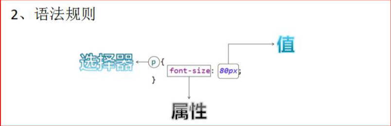

* 选择器：浏览器根据“选择器”**决定**受 CSS 样式影响的**HTML 元素（标签）**
* 属性 (property)：是你要改变的样式名，并且每个属性都有一个值
  * 属性和值被冒号分开，并由花括号包围，这样就组成了一个完整的样式声明（declaration）
  * 例如：p {color: blue}
* 多个声明：如果要定义不止一个声明，则需要用分号将每个声明分开。虽然最后一条声明最后可以不加分号(但**尽量在每条声明的末尾都加上分号**)

```css
p{
    color:red;
    font-size:30px;
}
/* 注：一般每行只描述一个属性 */
```

### CSS 和HTML 的结合方式

#### 方式一

* 在标签的 style 属性上设置”key:value value;”，修改标签样式

```html
<!DOCTYPE html>
<html lang="en">
<head>
    <meta charset="UTF-8">
    <title>CSS&html1</title>
</head>
<body>
    <!--需求 1：分别定义两个 div、span 标签，分别修改每个 div 标签的样式为：边框 1 个像素，实线，红色。-->
    <div style="border: 1px solid red;">div 标签 1</div>
    <div style="border: 1px solid red;">div 标签 2</div>
    <span style="border: 1px solid red;">span 标签 1</span>
    <span style="border: 1px solid red;">span 标签 2</span>
</body>
</html>
<!--
    缺点：
    1.如果标签多了。样式多了。代码量非常庞大。
    2.可读性非常差。
    3.CSS 代码没什么复用性可方言。
-->
```

#### 方式二

* 在 head 标签中，使用 style 标签来定义各种自己需要的 css 样式

```html
<!DOCTYPE html>
<html lang="en">
<head>
    <meta charset="UTF-8">
    <title>CSS&html2</title>
    <!--style 标签专门用来定义 css 样式代码-->
    <style type="text/css">
        /*
           style标签内为CSS语言
           需求 1：分别定义两个 div、span 标签，分别修改每个 div 标签的样式为：边框 1 个像素，实线，红色。
         */
        div{
            border: 1px solid red;
        }
        span{ 
            border: 1px solid red;
        }
    </style>
</head>
<body>
    <div>div 标签 1</div>
    <div>div 标签 2</div>
    <span>span 标签 1</span>
    <span>span 标签 2</span>
</body>
</html>
<!--
    缺点：
    1. 只能在同一页面内复用代码，不能在多个页面中复用 css 代码。
    2.维护起来不方便，实际的项目中会有成千上万的页面，要到每个页面中去修改。工作量太大了。
-->
```

#### 方式三

* 把 css 样式写成一个单独的 css 文件，再通过 link 标签引入即可复用

```css
div {
    border: 1px solid red;
}

span {
    border: 1px solid red;
}
```

```html
<!DOCTYPE html>
<html lang="en">
<head>
    <meta charset="UTF-8">
    <title>CSS&html3</title>
    <!--link 标签专门用来引入 css 样式代码-->
    <link rel="stylesheet" type="text/css" href="css&html3.css">
</head>
<body>
    <div>div 标签 1</div>
    <div>div 标签 2</div>
    <span>span 标签 1</span>
    <span>span 标签 2</span>
</body>
</html>
```

### CSS选择器

#### 标签名选择器

* 可以决定哪些标签被动的使用这个样式

```html
<!--
	格式：
	标签名 { 
		属性：值;
	}
-->
<!DOCTYPE html>
<html lang="en">
<head>
    <meta charset="UTF-8">
    <title>标签名选择器</title>
    <style type="text/css">
        div {
            border: 1px solid yellow;
            color: blue;
            font-size: 30px;
        }
        span {
            border: 5px dashed blue;
            color: yellow;
            font-size: 20px;
        }
    </style>
</head>
<body>
    <!--
        需求 1：在所有 div 标签上修改字体颜色为蓝色，字体大小 30 个像素。边框为 1 像素黄色实线。
        并且修改所有 span 标签的字体颜色为黄色，字体大小 20 个像素。边框为 5 像素蓝色虚线。
    -->
    <div>div 标签 1</div>
    <div>div 标签 2</div>
    <span>span 标签 1</span>
    <span>span 标签 2</span>
</body>
</html>
```

#### id选择器

* 可以让我们通过 id 属性选择性的去使用这个样式

```html
<!--
	格式：
	#id属性值 { 
		属性：值;
	}
-->
<!DOCTYPE html>
<html lang="en">
<head>
    <meta charset="UTF-8">
    <title>id选择器</title>
    <style type="text/css">
        #id001 {
            color: blue;
            font-size: 30px;
            border: 1px yellow solid;
        }
        #id002{
            color: red;
            font-size: 20px;
            border: 5px blue dotted ;
        }
    </style>
</head>
<body>
    <!--
        需求1：分别定义两个div标签，
        第一个div标签定义id为id001，然后根据id属性定义css样式修改字体颜色为蓝色，字体大小 30 个像素。边框为 1 像素黄色实线。
        第二个div标签定义id为id002，然后根据id属性定义css样式修改的字体颜色为红色，字体大小 20 个像素。 边框为 5 像素蓝色点线。
    -->
    <div id="id002">div 标签 1</div>
    <div id="id001">div 标签 2</div>
</body>
</html>
```

#### class选择器(类选择器)

* 可以通过 class 属性有效的选择性地去使用这个样式

```html
<!--
	格式：
	.class属性值 { 
		属性：值;
	}
-->
<!DOCTYPE html>
<html lang="en">
<head>
    <meta charset="UTF-8">
    <title>class选择器</title>
    <style type="text/css">
        .class01{
            color: blue;
            font-size: 30px;
            border: 1px solid yellow;
        }
        .class02{
            color: grey;
            font-size: 26px;
            border: 1px solid red;
        }
    </style>
</head>
<body>
    <!--
        需求 1：修改 class 属性值为 class01 的 span 或 div 标签，字体颜色为蓝色，字体大小 30 个像素。边框为 1 像素黄色实线。
        需求 2：修改 class 属性值为 class02 的 div 标签，字体颜色为灰色，字体大小 26 个像素。边框为 1 像素红色实线。
    -->
    <div class="class02">div 标签 class01</div> 
    <div class="class02">div 标签</div>
    <span class="class02">span 标签 class01</span>
    <span>span 标签 2</span>
</body>
</html>
```

#### 组合选择器

* 可以让多个选择器共用同一个 css 样式代码

```html
<!--
	格式：
    选择器1, 选择器2, 选择器n{ 
		属性：值;
    }
-->
<!DOCTYPE html>
<html lang="en">
<head>
    <meta charset="UTF-8">
    <title>组合选择器</title>
    <style type="text/css">
        .class01 , #id01{
            color: blue;
            font-size: 20px;
            border: 1px yellow solid;
        }
    </style>
</head>
<body>
    <!--
        需求 1：修改 class="class01" 的 div 标签 和 id="id01" 所有的 span 标签， 字体颜色为蓝色，字体大小 20 个像素。边框为 1 像素黄色实线。
    -->
    <div id="id01">div 标签 class01</div><br/>
    <span class="class01">span 标签</span><br/>
    <div>div 标签</div> <br/>
    <div>div 标签 id01</div><br/>
</body>
</html>
```

### 常用样式

1. 字体颜色

   * color：red；
   * 颜色可以写颜色名如：black, blue, red, green 等
   * 颜色也可以写 rgb 值和十六进制表示值：如 rgb(255,0,0)，#00F6DE，如果写十六进制值必须加#

2. 宽度

   * width:19px;
   * 宽度可以写像素值：19px；
   * 也可以写百分比值：20%；

3. 高度

   * height:20px;
   * 高度可以写像素值：19px；
   * 也可以写百分比值：20%；

4. 背景颜色

   * background-color:#0F2D4C

5. 字体样式：

   * color：#FF0000；字体颜色红色
   * font-size：20px; 字体大小

6. DIV 居中

   * margin-left: auto;
   * margin-right: auto;

7. 文本居中：

   * text-align: center;

8. 超连接去下划线

   * text-decoration: none;

9. 表格细线

   ```css
   table { 
       border: 1px solid black; /*设置边框*/ 
       border-collapse: collapse; /*将边框合并*/
   } 
   td,th { 
       border: 1px solid black; /*设置边框*/
   }
   ```

10. 列表去除修饰

    ```css
    ul { 
        list-style: none;
    }
    ```

```html
<!DOCTYPE html>
<html lang="en">
<head>
    <meta charset="UTF-8">
    <title>css常用样式</title>
    <style type="text/css">
        div{
            color: red;
            border: 1px yellow solid;
            width: 300px;
            height: 300px;
            background-color: green;
            font-size: 30px;
            margin-left: auto;
            margin-right: auto;
            text-align: center;
        }
        table {
            border: 1px red solid;
            border-collapse: collapse;
        }
        td {
            border: 1px red solid;
        }
        a {
            text-decoration: none;
        }
        ul {
            list-style: none;
        }
    </style>
</head>
<body>
    <ul>
        <li>11111111111</li>
        <li>11111111111</li>
        <li>11111111111</li>
        <li>11111111111</li>
        <li>11111111111</li>
    </ul>
    <table>
        <tr>
            <td>1.1</td>
            <td>1.2</td>
        </tr>
    </table>
    <a href="http://www.baidu.com">百度</a>
    <div>我是 div 标签</div>
</body>
</html>
```

## JavaScript

> Javascript 语言诞生主要是完成页面的数据验证。因此它运行在客户端，需要运行浏览器来解析执行 JavaScript 代码
>
> 特点：
>
> 1. 交互性（它可以做的就是信息的动态交互）
> 2. 安全性（不允许直接访问本地硬盘）
> 3. 跨平台性（只要是可以解释 JS 的浏览器都可以执行，和平台无关）

### JavaScript 和 html 代码的结合方式

#### 方式一

* 在 head 标签中，或者在 body 标签中，使用 script 标签书写 JavaScript 代码

```html
<!DOCTYPE html>
<html lang="en">
<head>
    <meta charset="UTF-8">
    <title>js&html1</title>
    <script type="text/javascript">
        // alert是JavaScript语言提供的一个警告框函数。
        // 它可以接收任意类型的参数，这个参数就是警告框的提示信息
        alert("hello javaScript!");
    </script>
</head>
<body>

</body>
</html>
```

#### 方式二

* 使用 script 标签引入单独的 JavaScript 代码文件

```javascript
alert("hello javaScript2!");
```

```html
<!DOCTYPE html>
<html lang="en">
<head>
    <meta charset="UTF-8">
    <title>js&html2</title>
    <!--
        现在需要使用 script 引入外部的 js 文件来执行
        src 属性专门用来引入 js 文件路径（可以是相对路径，也可以是绝对路径）
        
        script 标签可以用来定义 js 代码，也可以用来引入 js 文件
        但是，两个功能二选一使用。不能同时使用两个功能
    -->
    <script type="text/javascript" src="js&html2.js"></script>
</head>
<body>

</body>
</html>
```

### 基本语法

#### 变量

JavaScript 的变量类型：

* 数值类型：number
*  字符串类型： string
* 对象类型： object
* 布尔类型：boolean
* 函数类型：function

JavaScript 里特殊的值：

* undefined 	未定义，所有 js 变量未赋于初始值的时候，默认值都是 undefined
* null               空值
* NaN             全称是：Not a Number，非数字，非数值

```javascript
JS中的定义变量格式： 
var 变量名;
var 变量名 = 值;
```

#### 关系（比较）运算

* 等于：       ==        等于是简单的做字面值的比较
* 全等于：   ===      除了做字面值的比较之外，还会比较两个变量的数据类型

#### 逻辑运算

* 与运算：      &&
  * 第一种情况：当表达式全为真的时候。返回最后一个表达式的值。
  * 第二种情况：当表达式中，有一个为假的时候。返回第一个为假的表达式的值
* 或运算：       ||
  * 第一种情况：当表达式全为假时，返回最后一个表达式的值
  * 第二种情况：只要有一个表达式为真。就会把回第一个为真的表达式的值
* 取反运算：   !

注：

* 在 JavaScript 语言中，所有的变量，都可以做为一个 boolean 类型的变量去使用
* 0 、null、 undefined、""(空串) 都认为是 false；
* && 与运算 和 ||或运算 有短路。 短路就是说，当这个&&或||运算有结果了之后 。后面的表达式不再执行

#### 数组！！！

##### 定义方式

```javascript
var 数组名 = []; // 空数组
var 数组名 = [1 , ’abc’ , true]; // 定义数组同时赋值元素
/* 定义空数组后对其赋值会自动扩容 */
```

#### 函数！！！

##### 定义方式

* 使用function关键字来定义函数

```javascript
//格式
function 函数名(形参列表) {
    函数体
}
// 定义一个无参函数
function fun(){
	alert("无参函数fun()被调用了");
}
// 函数调用才会执行
fun();

// 定义一个有参函数
function fun2(a ,b) {
	alert("有参函数fun2()被调用了a=>" + a + ",b=>"+b);
}
fun2(12,"abc");

// 定义带有返回值的函数
function sum(num1,num2) {
	var result = num1 + num2;
	return result;
}
alert( sum(100,50) );
```

* var 函数名= function(形参列表) { 函数体 }

```javascript
var fun = function () {
	alert("无参函数");
}

var fun2 = function (a,b) {
	alert("有参函数a=" + a + ",b=" + b);
}

var fun3 = function (num1,num2) {
	return num1 + num2;
}
```

注：在Java 中函数允许重载。但是在JS 中函数的重载会直接**覆盖**掉上一次的定义

##### 函数的arguments 隐形参数（只在function 函数内）

* 在function 函数中不需要定义，但却可以直接用来**获取所有参数**的变量
* 隐形参数类似Java 基础的可变长参数一样
* public void fun( Object ... args );
* 可变长参数实质是一个数组。
* js 中的隐形参数也跟java 的可变长参数一样。操作类似数组

```javascript
function fun(a) {
    alert( arguments.length ); //可看参数个数
    for (var i = 0; i < arguments.length; i++){
    	alert( arguments[i] );
    }
}
```

#### 自定义对象

##### Object 形式的自定义对象

```javascript
//对象的定义：
var 变量名 = new Object(); // 对象实例（空对象）
变量名.属性名= 值; // 定义一个属性
变量名.函数名= function(){} // 定义一个函数
//对象的访问：
变量名.属性/ 函数名();
```

##### {}花括号形式的自定义对象

```javascript
//对象的定义：
var 变量名 = {
    属性名 : 值, // 定义一个属性
    属性名 : 值, // 定义一个属性
    函数名 : function(){} // 定义一个函数
};
//对象的访问：
变量名.属性/ 函数名();
```

#### 事件

> 电脑输入设备与页面进行交互的响应

##### 事件的注册

> 告诉浏览器，当事件响应后要执行哪些操作代码，叫事件注册或事件绑定

###### 分类

* 静态注册事件：通过html标签的事件属性直接赋于事件响应后的代码
* 动态注册事件：是指先通过js代码得到标签的dom对象，然后再通过dom对象.事件名= function(){} 这种形式赋于事件响应后的代码
  * 基本步骤：
    * 获取标签对象
    * 标签对象.事件名= fucntion(){}

##### 常用事件(标签属性)

* onload 加载完成事件：              页面加载完成之后执行，常用于做页面js代码初始化操作
* onclick 单击事件：                     常用于按钮的点击响应操作
* onblur 失去焦点事件：               常用用于输入框失去焦点后验证其输入内容是否合法
* onchange 内容发生改变事件：  常用于下拉列表和输入框内容发生改变后操作
* onsubmit 表单提交事件：           常用于表单点击提交时，验证所有表单项是否合法

```html
<!--onload加载完成事件-->
<!DOCTYPE html>
<html lang="en">
<head>
    <meta charset="UTF-8">
    <title>Title</title>
    <script type="text/javascript">
        // onload 事件的方法
        function onloadFun() {
            alert('静态注册onload 事件，所有代码');
        }
        // onload 事件动态注册。是固定写法
        window.onload = function () {
        	alert("动态注册的onload 事件");
        }
	</script>
</head>
<!--onload 事件是浏览器解析完页面之后就会自动触发的事件-->
<!--静态注册onload事件-->
<body onload="onloadFun();">
</body>
<!--动态注册onload事件-->
<body>
</body>
</html>
```

```html
<!--onclick单击事件-->
<!DOCTYPE html>
<html lang="en">
<head>
<meta charset="UTF-8">
<title>Title</title>
<script type="text/javascript">
    function onclickFun() {
    	alert("静态注册onclick 事件");
    }
    // 动态注册onclick 事件
    window.onload = function () {
        // 1 获取标签对象
        /*
         * document 是JavaScript语言提供的一个对象（文档）<br/>
         * getElementById 通过id属性获取标签对象
         */
        var btnObj = document.getElementById("btn01");
        // 2 通过标签对象.事件名= function(){}
        btnObj.onclick = function () {
        	alert("动态注册的onclick 事件");
        }
    }
</script>
</head>
<body>
<!--静态注册onClick事件-->
<button onclick="onclickFun();">按钮1</button>
<!--动态注册onClick事件-->
<button id="btn01">按钮2</button>
</body>
</html>
```

```html
<!--onsubmit表单提交事件-->
<!--注意静态注册-->
<!DOCTYPE html>
<html lang="en">
<head>
<meta charset="UTF-8">
<title>Title</title>
<script type="text/javascript">
    // 静态注册表单提交事务
    function onsubmitFun(){
        // 要验证所有表单项是否合法，如果，有一个不合法就阻止表单提交
    	if (合法) {
            return true;
        } else {
            return flase;
        }
    }
	// 动态注册表单提交事务
    window.onload = function () {
        //1 获取标签对象
        var formObj = document.getElementById("form01");
    	//2 通过标签对象.事件名= function(){}
        formObj.onsubmit = function () {
        	 // 要验证所有表单项是否合法，如果，有一个不合法就阻止表单提交
	    	if (合法) {
        		return true;
        	} else {
            	return flase;
        	}
        }
	}
</script>
</head>
<body>
    <!--return false 可以阻止表单提交-->
    <form action="http://localhost:8080" method="get" onsubmit="return onsubmitFun();">
    	<input type="submit" value="静态注册"/>
    </form>
    <form action="http://localhost:8080" id="form01">
    	<input type="submit" value="动态注册"/>
    </form>
</body>
</html>
```

#### DOM模型！！！

> DOM 全称是Document Object Model 文档对象模型
>
> 把文档中的标签，属性，文本，转换成为对象来管理
>
> 用于获取文档中的标签对象，并作处理

##### Document 对象

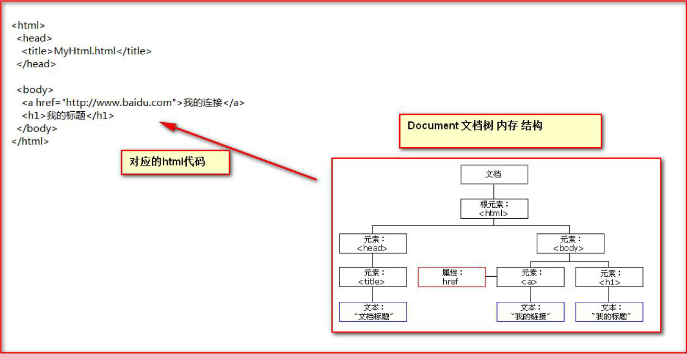

Document 对象的理解：

* Document 它管理了所有的HTML 文档内容
* document 它是一种树结构的文档。有层级关系
* 它让我们把所有的标签都对象化
* 我们可以通过document 访问所有的标签对象

###### Document 对象中的方法

* document.getElementById(elementId)
  通过标签的id 属性查找标签dom 对象，elementId 是标签的id 属性值
* document.getElementsByName(elementName)
  通过标签的name 属性查找标签dom 对象，elementName 标签的name 属性值
* document.getElementsByTagName(tagname)
  通过标签名查找标签dom 对象。tagname 是标签名
* document.createElement( tagName)
  方法，通过给定的标签名，创建一个标签对象。tagName 是要创建的标签名

注：

* document 对象的三个查询方法，如果有id 属性，优先使用getElementById 方法来进行查询
* 如果没有id 属性，则优先使用getElementsByName 方法来进行查询
* 如果id 属性和name 属性都没有最后再按标签名查getElementsByTagName
* 以上三个方法，**一定要在页面加载完成之后执行**，才能查询到标签对象

```html
<!--getElementById 方法示例-->
<!--两种常用显示方法（span文字或图片）-->
<!--正则表达式-->
<!DOCTYPE html>
<html lang="en">
<head>
<meta charset="UTF-8">
<title>Title</title>
<script type="text/javascript" >
    /*
     * 需求：当用户点击了较验按钮，要获取输出框中的内容。然后验证其是否合法。<br/>
     * 验证的规则是：必须由字母，数字。下划线组成。并且长度是5到12 位。
     */
	function onclickFun() {
		// 1 当我们要操作一个标签的时候，一定要先获取这个标签对象。
		var usernameObj = document.getElementById("username");
		// [object HTMLInputElement] 它就是dom 对象
		var usernameText = usernameObj.value;
		// 如何验证字符串，符合某个规则，需要使用正则表达式技术
		var patt = /^\w{5,12}$/;
        /*
         * test()方法用于测试某个字符串，是不是匹配我的规则，
         * 匹配就返回true。不匹配就返回false.
         */
		var usernameSpanObj = document.getElementById("usernameSpan");
        // innerHTML 表示起始标签和结束标签中的内容
        // innerHTML 这个属性可读，可写
        usernameSpanObj.innerHTML = "国哥真可爱！";
        if (patt.test(usernameText)) {
            // alert("用户名合法！");
            // usernameSpanObj.innerHTML = "用户名合法！";
            usernameSpanObj.innerHTML = "";
        } else {
            // alert("用户名不合法！");
            // usernameSpanObj.innerHTML = "用户名不合法！";
            usernameSpanObj.innerHTML = "";
        }
}
</script>
</head>
<body>
用户名：<input type="text" id="username" value="wzg"/>
<span id="usernameSpan" style="color:red;">
</span>
<button onclick="onclickFun()">较验</button>
</body>
</html>
```

```html
<!DOCTYPE html>
<html lang="en">
<head>
<meta charset="UTF-8">
<title>Title</title>
<script type="text/javascript">
    // 全选
    function checkAll() {
        // 让所有复选框都选中
        // document.getElementsByName();是根据指定的name 属性查询返回多个标签对象集合
        // 这个集合的操作跟数组一样
        // 集合中每个元素都是dom 对象
        // 这个集合中的元素顺序是他们在html 页面中从上到下的顺序
        var hobbies = document.getElementsByName("hobby");
        // checked 表示复选框的选中状态。如果选中是true，不选中是false
        // checked 这个属性可读，可写
        for (var i = 0; i < hobbies.length; i++){
        	hobbies[i].checked = true;
        }
	}
    //全不选
    function checkNo() {
        var hobbies = document.getElementsByName("hobby");
        // checked 表示复选框的选中状态。如果选中是true，不选中是false
        // checked 这个属性可读，可写
        for (var i = 0; i < hobbies.length; i++){
        	hobbies[i].checked = false;
        }
    }
    // 反选
    function checkReverse() {
        var hobbies = document.getElementsByName("hobby");
        for (var i = 0; i < hobbies.length; i++) {
            hobbies[i].checked = !hobbies[i].checked;
            // if (hobbies[i].checked) {
            // hobbies[i].checked = false;
            // }else {
            // hobbies[i].checked = true;
            // }
        }
	}
</script>
</head>
<body>
    兴趣爱好：
    <input type="checkbox" name="hobby" value="cpp" checked="checked">C++
    <input type="checkbox" name="hobby" value="java">Java
    <input type="checkbox" name="hobby" value="js">JavaScript
    <br/>
    <button onclick="checkAll()">全选</button>
    <button onclick="checkNo()">全不选</button>
    <button onclick="checkReverse()">反选</button>
</body>
</html>
```

###### 节点(标签对象)的常用属性和方法

* 方法
  * 通过具体的元素节点调用getElementsByTagName()方法，获取当前节点的指定标签名孩子节点
  * appendChild( oChildNode )方法，可以添加一个子节点，oChildNode 是要添加的孩子节点
* 属性
  * childNodes属性，获取当前节点的所有子节点
  * firstChild属性，获取当前节点的第一个子节点
  * lastChild属性，获取当前节点的最后一个子节点
  * parentNode属性，获取当前节点的父节点
  * nextSibling属性，获取当前节点的下一个节点
  * previousSibling属性，获取当前节点的上一个节点
  * className用于获取或设置标签的class 属性值
  * innerHTML属性，表示获取/设置起始标签和结束标签中的内容
  * innerText属性，表示获取/设置起始标签和结束标签中的文本

## jQuery

## xml

> xml 是可扩展的标记性语言

### 作用

1. 用来**保存数据**，而且这些数据具有自我描述性
2. 做为项目或者模块的**配置文件**
3. 还可以做为**网络传输数据的格式**（现在 JSON 为主）

### 语法

1. 文档声明
2. 元素（标签）
3. xml 属性
4. xml 注释
5. 文本区域（CDATA 区）

```xml
<?xml version="1.0" encoding="utf-8" ?>
<!--
    xml声明
    属性
    version 版本号
    encoding xml文件编码方式
    standalone="yes/no" 这个xml文件是否是独立的xml文件
-->
<!--
    XML文档必须有根元素
    根元素就是顶级元素，没有父标签的元素，叫顶级元素。
    根元素是没有父标签的顶级元素，而且是唯一一个才行，如books
-->
<books>
    <!-- 双标签 -->
    <book sn="SN123412123412"> <!-- book标签描述一本图书 id属性描述的是图书的编号-->
        <name>时间简史</name> <!--name标签表示书名-->
        <author>金</author> <!--author表示作者-->
        <price>75</price> <!--price 表示图书价格-->
    </book>
    <!-- 单标签 -->
    <book sn="SN123412123412" name="人类简史"/>

    <!--
        属性：可以提供元素的额外信息
        1.一个标签上可以书写多个属性
        2.每个属性的值必须使用 引号 引起来（单双引号皆可）
    -->

    <!-- 文本区域（CDATA区） -->
    <![CDATA[ 这里可以把你输入的字符原样显示，不会解析 xml ]]>

</books> <!-- 所有XML元素都须关闭标签（也就是闭合） -->
<!--
    1.元素（标签）是指从开始标签到结束标签的内容。
    例如：<title>java编程思想</title>
    2.元素可包含其他元素或文本，也可以拥有属性
    3.xml中的元素（标签）分成单标签和双标签
-->
```

## Tomcat

win10下安装配置：https://blog.csdn.net/qq_41559516/article/details/81569145?utm_medium=distribute.pc_relevant.none-task-blog-BlogCommendFromMachineLearnPai2-2.control&dist_request_id=&depth_1-utm_source=distribute.pc_relevant.none-task-blog-BlogCommendFromMachineLearnPai2-2.control

### 目录介绍

* bin：专门用来存放 Tomcat 服务器的可执行程序
* conf：专门用来存放 Tocmat 服务器的配置文件
* lib：专门用来存放 Tomcat 服务器的 jar 包
* logs：专门用来存放 Tomcat 服务器运行时输出的日记信息
* temp：专门用来存放 Tomcat 运行时产生的临时数据
* webapps：专门用来存放部署的Web 工程
* work：是 Tomcat 工作时的目录，用来存放 Tomcat 运行时 jsp 翻译为 Servlet 的源码，和 Session 钝化的目录

### 启停

* 运行
  * startup.bat / cmd - startup
  * cmd - catalina run
* 停止
  * shutdown.bat / cmd - shutdown
  * ×
  * ctrl + c

### 修改配置

* 端口号：\conf\server.xml
  * HTTP 协议默认的端口号是：80
* 编码方式：\conf\logging.properties

### 访问Tomcat下的web 工程

* 当我们在浏览器地址栏中输入访问地址如下：
  * http://ip:port/ ：没有工程名的时候，默认访问的是 ROOT 工程。
* 当我们在浏览器地址栏中输入的访问地址如下：
  * http://ip:port/工程名/ ：没有资源名，默认访问 index.html 页面

### IDEA Web工程目录

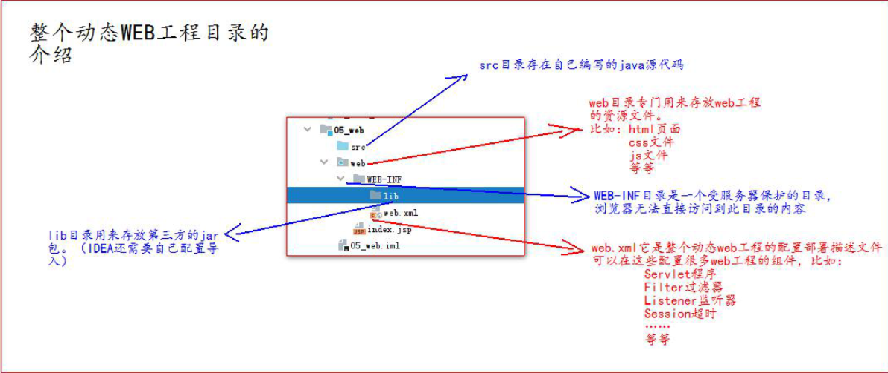


Servlet 就 JavaWeb 三大组件之一

* 三大组件分别是：
  * Servlet 程序
  * Filter 过滤器
  * Listener 监听器。

## 1. Servlet


[导图](./思维导图/Javaweb.xmind)

> * 定义
>   * **狭义**的Servlet是指Java语言实现的一个**接口**，**广义**的Servlet是指**任何实现了这个Servlet接口的类**
>   * 接收请求，响应数据
> * 生命周期
> * 实现方式
>   * 继承HttpServlet类
>   * 实现Servlet接口

### 1.1 Servlet 是什么

* 运行在服务器上的一个 java 小程序（用于**接收请求，响应数据**）
  * **狭义**的Servlet：指Java语言实现的一个**接口**
  * **广义**的Servlet：指**任何实现了这个Servlet接口的类**

### 1.2 Servlet 的生命周期

1. 第一次访问时web时，创建 Servlet 程序，调用：
   1. Servlet 构造器方法
   2. init 初始化方法
2. 每次访问都调用：
   * service 方法
3. web 工程停止时调用：
   * destroy 销毁方法

### 1.3 Servlet 类的继承体系

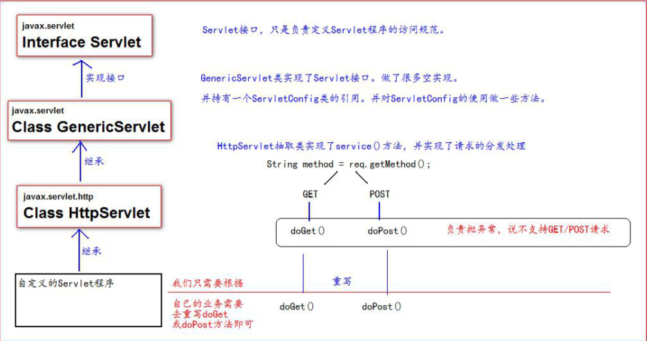

### 1.4 Servlet实现

> 直接或间接实现 Servlet 接口

#### 1.4.1 方式一：实现Servlet接口（少用）

1. 编写一个类去实现 Servlet 接口
2. 实现 service 方法，处理请求，并响应数据
3. 到web.xml 中去配置 servlet 程序的访问地址

```java
public class HelloServlet implements Servlet {
    /**
     * service方法是专门用来处理请求和响应的
     * @param servletRequest
     * @param servletResponse
     * @throws ServletException
     * @throws IOException
     */
	@Override
	public void service(ServletRequest servletRequest, ServletResponse servletResponse) throws ServletException, IOException {
        System.out.println("Hello Servlet 被访问了");
	}
}
```

```xml
<!-- web.xml文件配置 -->
<?xml version="1.0" encoding="UTF-8"?>
<web-app xmlns="http://xmlns.jcp.org/xml/ns/javaee"
         xmlns:xsi="http://www.w3.org/2001/XMLSchema-instance"
         xsi:schemaLocation="http://xmlns.jcp.org/xml/ns/javaee http://xmlns.jcp.org/xml/ns/javaee/web-app_4_0.xsd"
         version="4.0">
    
    <!--context-param是上下文参数(它属于整个web工程)-->
    <context-param>
        <param-name>username</param-name>
        <param-value>context</param-value>
    </context-param>

    <!-- servlet标签: 给Tomcat配置Servlet程序 -->
    <servlet>
        <servlet-name>ServletTest</servlet-name> <!-- servlet-name标签: 给Servlet程序起一个别名(一般是类名) -->
        <servlet-class>com.hasim.Servlet.ServletTest</servlet-class> <!-- servlet-class标签: Servlet程序的全类名 -->
        <!-- 以下参数可选 -->
        <init-param> <!--init-param是初始化参数-->
            <param-name>username</param-name> <!--是参数名-->
            <param-value>root</param-value> <!--是参数值-->
        </init-param>
    </servlet>

    <!-- servlet-mapping标签: 给Servlet程序配置访问地址 -->
    <servlet-mapping>
        <servlet-name>ServletTest</servlet-name> <!-- servlet-name标签: 当前配置地址给哪个Servlet程序使用 -->
        <url-pattern>/hello</url-pattern> <!-- url-pattern标签: 配置访问地址 -->
    </servlet-mapping>

    <!--
        访问路径为 http://ip:port/工程路径/hello
        此处为: http://localhost:8080/web01/hello

        常见错误:
            1.url-pattern中配置的路径没有以'/'开头
            2.servlet-name配置的值不存在
            3.servlet-class配置的全类名错误
    -->
</web-app>
```

注：url地址到 Servlet 程序的访问

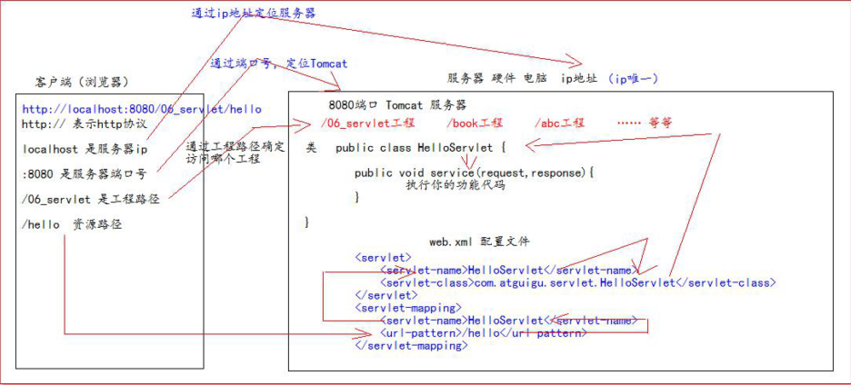

GET 和 POST 请求的分发处理

通过HttpServletRequest的getMethod()方法获取请求方式

```java
public class HelloServlet implements Servlet { 
    /**
     * service方法是专门用来处理请求和响应的
     * @param servletRequest
     * @param servletResponse
     * @throws ServletException
     * @throws IOException
     */
	@Override public void service(ServletRequest servletRequest, ServletResponse servletResponse) throws ServletException, IOException {
		System.out.println("3 service === Hello Servlet 被访问了"); 
		// 类型转换（因为它有getMethod()方法）
         HttpServletRequest httpServletRequest = (HttpServletRequest) servletRequest; 
         // 获取请求的方式 String method = httpServletRequest.getMethod();
		if ("GET".equals(method)) { 
         	doGet();
         } else if ("POST".equals(method)) {
            doPost();
         }
     }
	 /**
      * 做get请求的操作
      */
     public void doGet(){
         System.out.println("get 请求");
         System.out.println("get 请求");
     } 
     /**
      * 做post请求的操作
      */
     public void doPost(){
         System.out.println("post 请求");
         System.out.println("post 请求");
     }
}
```

#### 1.4.2 方式二：继承HttpServlet类

1. 编写一个类去继承 HttpServlet 类
2. 根据业务需要**重写 doGet 或 doPost 方法**（底层已实现自动分发）
3. 到web.xml 中的配置 Servlet 程序的访问地址


### 几个重要的组件

#### ServletConfig 类

> Servlet 程序的**配置信息类**
>
> * 对应于某个Servlet程序
> * Servlet 程序和 ServletConfig 对象都由 Tomcat 负责创建，我们负责使用
> * Servlet 程序默认是第一次访问的时候创建，每个 Servlet 程序创建时，就创建一个对应的 ServletConfig 对象

##### 作用

1. 获取 Servlet 程序的别名 servlet-name 的值

   `servletConfig.getServletName()`

2. 获取初始化参数 init-param

   `servletConfig.getInitParameter("username")`

3. 获取 ServletContext 对象

   `servletConfig.getServletContext()`

注：

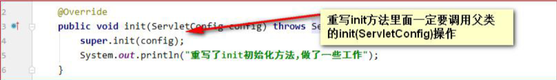

（get方法都定义在GenericServlet类中）

#### ServletContext接口

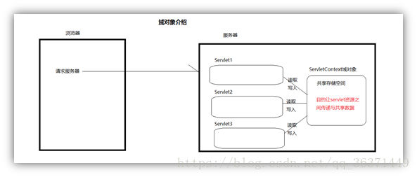

> * ServletContext 是一个接口，它表示 Servlet 上下文对象
> * 一个web 工程，只有一个 ServletContext 对象实例（单例，全局唯一、共享）
> * ServletContext 对象是一个域对象
> * ServletContext 是在 web 工程部署启动的时候创建。在 web 工程停止的时候销毁

> 域对象
>
> * 域对象是服务器**在内存上创建的存储空间**，用于在不同动态资源（servlet）之间**传递与共享数据**
> * 凡是域对象都有如下3个方法
>   * setAttribute(name,value)：name是String类型，value是Object类型；往域对象里面添加数据，添加时以key-value形式添加
>   * getAttribute(name)：根据指定的key读取域对象里面的数据
>   * removeAttribute(name)：根据指定的key从域对象里面删除数据

##### 作用

* 获取web.xml 中配置的上下文参数 context-param（全局配置参数）
* 获取当前的工程路径，格式: /工程路径
* 获取工程部署后在服务器硬盘上的绝对路径
* 像Map 一样存取数据
* 搜索当前工程目录下面的资源文件

#### HttpServletRequest 类

##### 作用

* 每次只要有请求进入 Tomcat 服务器，Tomcat 服务器就会把请求过来的 HTTP 协议信息解析好封装到 Request 对象中
* 然后传递到 service 方法（doGet 和 doPost）中给我们使用
* **通过 HttpServletRequest 对象，可以获取到所有请求的信息**

##### 常用方法

* 普通获取

  * **getParameter()**：获取请求的参数（参数有多个值时获取第一个）
  * getParameterValues()：获取请求的参数（多个值的时候使用）
  * getMethod()：获取请求的方式 GET 或 POST
  * getRequestURI()：获取请求的资源路径（相对路径：工程/资源）
  * getRequestURL()：获取请求的统一资源定位符（绝对路径）
  * getRemoteHost()：获取客户端的 ip 地址
  * getHeader()：获取请求头

* 请求转发

  * setAttribute(key, value)：设置域数据（Request域数据，其他Servlet可访问到）

  * getAttribute(key)：获取域数据

  * getRequestDispatcher()：获取请求转发对象

    请求转发必须要以斜杠打头，/ 斜杠表示地址为：http://ip:port/工程名/ , 映射到IDEA代码的web目录

注：

* POST请求中文乱码问题：

  ```java
  //设置请求体字符集编码方式为UTF-8。解决POST请求的中文乱码问题
  //在获取请求参数方法调用前调用才有效
  req.setCharacterEncoding("UTF-8");
  ```

##### 请求转发

```java
public class Servlet1 extends HttpServlet {
    @Override
    protected void doGet(HttpServletRequest req, HttpServletResponse resp) throws ServletException, IOException {
        //获取请求参数
        String username = req.getParameter("username");
        System.out.println("Servlet1中:username" + username);
        //加上标签（设置域数据）
        req.setAttribute("key", "Servlet1");
        //获取Servlet2转发对象
        RequestDispatcher requestDispatcher = req.getRequestDispatcher("/servlet2");
        //转发
        requestDispatcher.forward(req, resp);
    }
}

public class Servlet2 extends HttpServlet {
    @Override
    protected void doGet(HttpServletRequest req, HttpServletResponse resp) throws ServletException, IOException {
        //获取请求参数
        String username = req.getParameter("username");
        System.out.println("Servlet2中username" + username);

        //查看标签
        Object key = req.getAttribute("key");
        System.out.println("标签：" + key);

        System.out.println("Servlet2业务");
    }
}
```

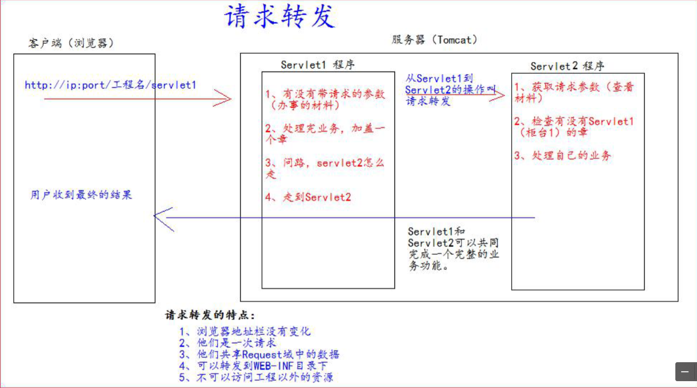

###### 特点

* 浏览器地址栏没有变化
* 为一次请求
* 共享Request域数据
* 可以转发到WEB-INF目录下（浏览器无法直接访问WEB-INF目录下资源）
* 不可以访问工程以外资源（采用相对路径）

#### HttpServletResponse类

##### 作用

* 每次请求进来，Tomcat 服务器都会创建一个 Response 对象传递给 Servlet 程序去使用
* HttpServletRequest 表示请求过来的信息，HttpServletResponse 表示所有响应的信息
* 我们如果需要设置返回给客户端的信息，都可以通过 HttpServletResponse 对象来进行设置

##### 响应方式

* 两个输出流

  * 字节流 	getOutputStream() 	常用于下载（传递二进制数据）

  * 字符流     getWriter()                  常用于回传字符串（常用）         返回一个可以向客户端发送文本的Java.io.PrintWriter对象 `resp.getWriter().write();`

    ```java
    PrintWriter writer = resp.getWriter();
    writer.write("response's content!!!");
    //设置响应状态码302，表示重定向
    resp.setStatus(302);
    //响应的乱码解决
    //方案一（不推荐）
    // 设置服务器字符集为UTF-8
    resp.setCharacterEncoding("UTF-8");
    // 通过响应头，设置浏览器也使用UTF-8字符集
    resp.setHeader("Content-Type", "text/html; charset=UTF-8");
    //方案二（推荐）
    //它会同时设置服务器和客户端都使用UTF-8字符集，还设置了响应头
    // 此方法一定要在获取流对象之前调用才有效
    resp.setContentType("text/html; charset=UTF-8");
    ```

* 注：

  * 两个流同时只能使用一个

##### 请求重定向

```java
public class Response1 extends HttpServlet {
    @Override
    protected void doGet(HttpServletRequest req, HttpServletResponse resp) throws ServletException, IOException {
        System.out.println("Response1");
        /**
         * 方式一
         */
        //设置响应状态码302，表示重定向
        resp.setStatus(302);
        //设置响应头，说明新的地址在哪里
        resp.setHeader("Location", "http://localhost:8080/web02/response2");
        
        /**
         * 方式二（推荐）
         */
        resp.sendRedirect("http://localhost:8080/web02/response2");
    }
}

public class Response2 extends HttpServlet {
    @Override
    protected void doGet(HttpServletRequest req, HttpServletResponse resp) throws ServletException, IOException {
        System.out.println("Response2");
    }
}

```

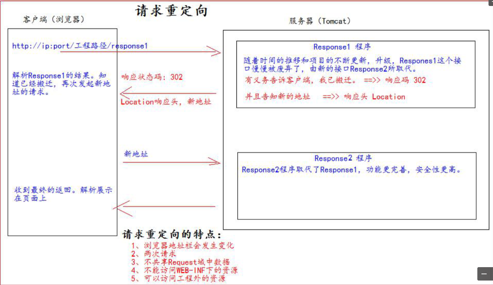

###### 特点

* 浏览器地址栏发生变化
* 为两次请求
* 不共享Request域数据（每次请求都会封装Request对象）
* 无法访问到WEB-INF目录下（重定向相当于浏览器直接访问WEB-INF目录下资源）
* 可以访问工程以外资源（采用绝对路径）

### 请求转发与重定向

https://blog.csdn.net/liubin5620/article/details/79922692?utm_medium=distribute.pc_relevant.none-task-blog-2%7Edefault%7EBlogCommendFromMachineLearnPai2%7Edefault-4.control&dist_request_id=1332037.7978.16191436758687775&depth_1-utm_source=distribute.pc_relevant.none-task-blog-2%7Edefault%7EBlogCommendFromMachineLearnPai2%7Edefault-4.control

### web中的路径

在 javaWeb 中，路径分为相对路径和绝对路径两种：

* 相对路径是：
  * .  表示当前目录
  * .. 表示上一级目录
  * 资源名  表示当前目录/资源名
* 绝对路径： 
  * http://ip:port/工程路径/资源路径
* 在实际开发中，路径都使用绝对路径，而不简单的使用相对路径
  1. 绝对路径
  2. base+相对路径

web 中 / 斜杠的不同意义

* 在web 中 / 斜杠 是一种绝对路径

  1. / 斜杠 如果被浏览器解析，得到的地址是：http://ip:port/

     ```xml
      <a href="/">斜杠</a>
     ```

  2. / 斜杠 如果被服务器解析，得到的地址是：http://ip:port/工程路径

     * `<url-pattern>/servlet1</url-pattern>`
     * `servletContext.getRealPath(“/”);`
     * `request.getRequestDispatcher(“/”);`

  3. 特殊情况：

     * response.sendRediect(“/”); 
     * 把斜杠发送给浏览器解析。得到 http://ip:port/

web

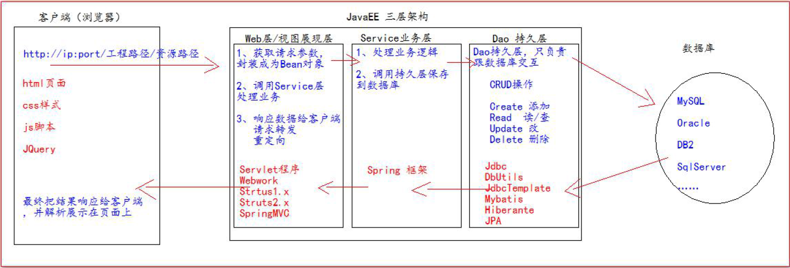

工程架构

web层				com.xxxxxx.web/servlet/controller
service层		   com.xxxxxx.service								Service 接口包
						  com.xxxxxx.service.impl						Service 接口实现类
dao持久层		 com.xxxxxx.dao 									Dao 接口包
						  com.xxxxxx.dao.impl 							Dao 接口实现类
实体bean对象    com.xxxxxx.pojo/entity/domain/bean    JavaBean 类
测试包			    com.xxxxxx.test/junit
工具类				com.xxxxxx.utils

### Listener 监听器

1. Listener 监听器它是JavaWeb 的三大组件之一。JavaWeb 的三大组件分别是：Servlet 程序、Filter 过滤器、Listener 监
   听器
2. Listener 它是JavaEE 的规范，就是接口
3. 监听器的作用是，监听某种事物的变化。然后通过回调函数，反馈给客户（程序）去做一些相应的处理

### ServletContextListener 监听器

ServletContextListener 它可以监听ServletContext 对象的创建和销毁。
ServletContext 对象在web 工程启动的时候创建，在web 工程停止的时候销毁。
监听到创建和销毁之后都会分别调用ServletContextListener 监听器的方法反馈。

```java
public interface ServletContextListener extends EventListener {
    /**
    * 在ServletContext 对象创建之后马上调用，做初始化
    */
    public void contextInitialized(ServletContextEvent sce);
    /**
    * 在ServletContext 对象销毁之后调用
    */
    public void contextDestroyed(ServletContextEvent sce);
}
```

如何使用ServletContextListener 监听器监听ServletContext 对象。
使用步骤如下：

1. 编写一个类去实现ServletContextListener

2. 实现其两个回调方法

3. 到web.xml 中去配置监听器

   ```xml
   <!--  配置监听器  -->
   <listener>
       <listener-class>com.hasim.listener.MyServletContextListener</listener-class>
   </listener>
   ```

## 1. Servlet

MVC概念

流程：

数据库：表……

javabean

DAO 测试

Service 测试

Web 与页面


**表单重复提交的三种情况**

* 重复刷新 + 请求转发

  提交完表单。服务器使用请求转发来进行页面跳转。这个时候，用户按下功能键 F5，就会发起最后一次的请求。 造成表单重复提交问题。

  解决方法：使用重定向来进行跳转 

* 因网络延迟等原因，重复提交操作

* 提交完成后，用户回退浏览器重新提交

  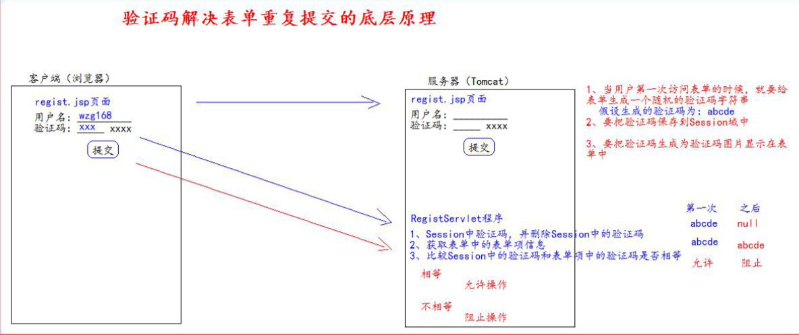

ThreadLocal


## 2. Cookie

### 2.1 Cookie是什么

1. Cookie 是服务器通知客户端保存**键值对**的一种技术
2. 客户端有了Cookie 后，**每次**请求都发送给服务器
3. 每个Cookie 的大小不能超过4kb

### 2.2 Cookie相关操作

#### 2.2.1 增（为客户端创建Cookie）

1. 创建Cookie对象(**Cookie是类**)
2. 通知客户端保存（响应）`resp.addCookie(cookie);`

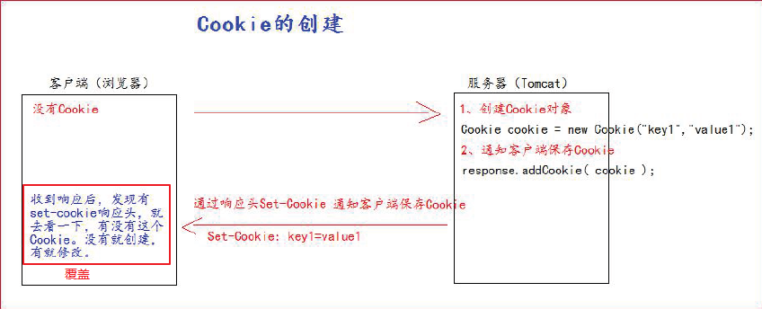

```java
protected void createCookie(HttpServletRequest req, HttpServletResponse resp) throws ServletException, IOException {
    // 创建Cookie对象(可同时创建保存多个Cookie)
    Cookie cookie = new Cookie("key1", "value1");
    // 通知客户端保存Cookie
    resp.addCookie(cookie);

    resp.getWriter().write("Cookie创建成功");
}
```

#### 2.2.2 查（服务器获取Cookie）

1. 通过请求获取Cookie数组`req.getCookies();`
2. 遍历数组查找所需Cookie（`cookie.getName()` `cookie.getValue()`）

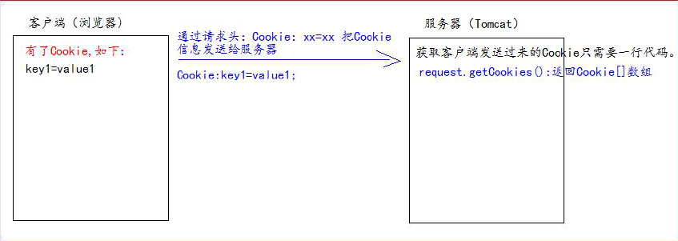

```java
public class CookieUtils {
    /**
     * 查找指定名称的 cookie 对象
     * @param name
     * @param cookies
     * @return
     */
    public static Cookie findCookie(String name, Cookie[] cookies) {
        if (name != null && cookies.length != 0 && cookies != null) {
            for (Cookie cookie : cookies) {
                if (name.equals(cookie.getName())) {
                    return cookie;
                }
            }
        }
        return null;
    }
}
```

```java
protected void getCookie(HttpServletRequest req, HttpServletResponse resp) throws ServletException, IOException {
    // 获取客户端Cookie对象
    Cookie[] cookies = req.getCookies();

    Cookie cookie = CookieUtils.findCookie("key1", cookies);

    if (cookie != null) {
        resp.getWriter().write("cookie:" + cookie.getName() + "->" + cookie.getValue() + "<br/>");
    }
}
```

#### 2.2.3 改（修改Cookie的值）

**方式一**：覆盖

**方式二**：

1. 先查找到需要修改的Cookie 对象
2. 调用setValue()方法赋于新的Cookie 值
3. 调用response.addCookie()通知客户端保存修改

```java
protected void updateCookie(HttpServletRequest req, HttpServletResponse resp) throws ServletException, IOException {
    Cookie[] cookies = req.getCookies();
    // 方式二
    Cookie cookie = CookieUtils.findCookie("key1", cookies);
    if (cookie != null) {
        cookie.setValue("newValue");
        // 通知客户端保存Cookie
        resp.addCookie(cookie);
        resp.getWriter().write("Cookie修改成功");
    } else {
        resp.getWriter().write("Cookie修改失败");
    }
}
```

#### 2.2.4 删（Cookie生命周期控制）

> 如何管理 Cookie 什么时候被销毁（删除）

setMaxAge()

* 正数，表示在指定的秒数后过期
* 负数，表示浏览器一关，Cookie 就会被删除（默认值是-1）
* 零，表示马上删除Cookie

```java
protected void deleteNow(HttpServletRequest req, HttpServletResponse resp) throws ServletException, IOException {
    Cookie[] cookies = req.getCookies();

    Cookie cookie = CookieUtils.findCookie("defaultLife", cookies);
    if (cookie != null) {
        cookie.setMaxAge(0); //设置存活时间(销毁)
        // 记得保存
        resp.addCookie(cookie);
        resp.getWriter().write("Cookie删除成功");
    }
}
```

#### 2.2.5 其他（Cookie有效路径Path设置）

> Cookie 的 path 属性可以有效的过滤哪些 Cookie 可以发送给服务器，哪些不发
> path 属性通过请求的地址来进行有效的过滤

1. CookieA path=/工程路径
2. CookieB path=/工程路径/abc
   * 请求地址如下：
     * http://ip:port/工程路径/a.html
       CookieA 发送
       CookieB 不发送
     * http://ip:port/工程路径/abc/a.html
       CookieA 发送
       CookieB 发送

```java
/* cookie.setPath(String path); 设置路径*/
protected void testPath(HttpServletRequest req, HttpServletResponse resp) throws ServletException, IOException {
    Cookie cookie = new Cookie("path1", "path1");
    System.out.println(req.getContextPath());
    cookie.setPath(req.getContextPath() + "/abc");
    resp.addCookie(cookie);
    resp.getWriter().write("创建带有path的cookies");
}
```

### 2.3 应用

免用户名登录

```jsp
<!-- value="${cookie.username.value}" -->
用户名: <input type="text" name="username" value="${cookie.username.value}"><br/>
```

## 3. Session

### 3.1 Session是什么

1. Session 就是会话。它是用来维护一个客户端和服务器之间关联的一种技术
2. 每个客户端都有自己的一个 Session 会话
3. Session 会话中，我们经常用来保存用户登录之后的信息
4. java中为接口

> 由于HTTP协议是一种无状态的协议，也就是当一个客户端发送请求，服务器端收到请求，并返回响应后，该连接就结束了，而服务器不保存任何相关的信息。
>
> 为了弥补这一缺点，HTTP协议提供了session。通过session可以在应用程序的web页面间进行跳转时，保存用户的状态，使得整个用户会话一直存在下去，直到浏览器关闭（会话结束）。

### 3.2 Session相关操作

#### 3.2.1 增/查（创建和获取Session）

1. 相关方法

   |         方法         |                             描述                             |
   | :------------------: | :----------------------------------------------------------: |
   | request.getSession() | 第一次调用是：创建Session 会话<br/>之后调用都是：获取前面创建好的Session 会话对象 |
   |   session.isNew()    |             true 表示刚创建<br/>false 表示已创建             |
   |   session.getId()    |    获取 Session 会话 的id 值（每个会话都有一个唯一的ID）     |

   ```java
   protected void createOrGetSession(HttpServletRequest req, HttpServletResponse resp) throws ServletException, IOException {
       HttpSession session = req.getSession();
   
       boolean isnew = session.isNew();
       String id = session.getId();
   
       resp.getWriter().write("Session is new? " + isnew + "<br/>" + "Session id is " + id);
   }
   ```

#### 3.2.2 删（Session 生命周期管理）

1. 相关方法

   |                       方法                       |                             描述                             |
   | :----------------------------------------------: | :----------------------------------------------------------: |
   | public void setMaxInactiveInterval(int interval) | 设置 Session 的超时时间（以秒为单位）<br/>interval为正数: 设定Session 的超时时长<br/>interval为负数: 表示永不超时（极少使用） |
   |       public int getMaxInactiveInterval()        |                   获取 Session 的超时时间                    |
   |             public void invalidate()             |               让当前 Session 会话马上超时无效                |

   **说明**：

   * Session 默认的超时时间长为30 分钟

     > 因为在Tomcat 服务器的配置文件web.xml 中默认有以下的配置，它就表示配置了当前Tomcat 服务器下所有的Session超时配置默认时长为：30 分钟
     >
     > ```xml
     > <session-config>
     > 	<session-timeout>30</session-timeout>
     > </session-config>
     > ```

   * 自定义web工程默认Session超时时长

     ```xml
     <!-- web.xml -->
     <!--表示当前web 工程。创建出来的所有Session 默认是20 分钟超时时长-->
     <session-config>
     	<session-timeout>20</session-timeout>
     </session-config>
     ```

   * 自定义个别Session超时时长：使用上述API

2. Session超时概念

   Session超时指客户端**两次请求**的**最大时间间隔**

   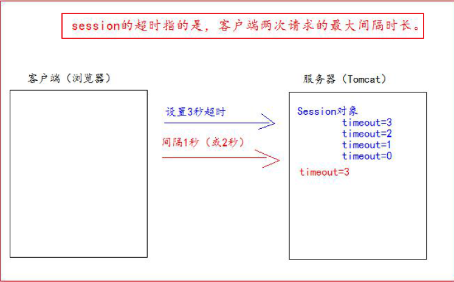

#### 3.2.3 其他（Session 域数据的存取）

相关方法

|                      方法                      |             描述             |
| :--------------------------------------------: | :--------------------------: |
| session.setAttribute(String key, String value) |   往 Session 域中保存数据    |
|        session.getAttribute(String key)        | 获取 Session 域中对应key的值 |

### 3.3 Session 底层原理

基于 Cookie 技术实现

由 Cookie 来指定 Session

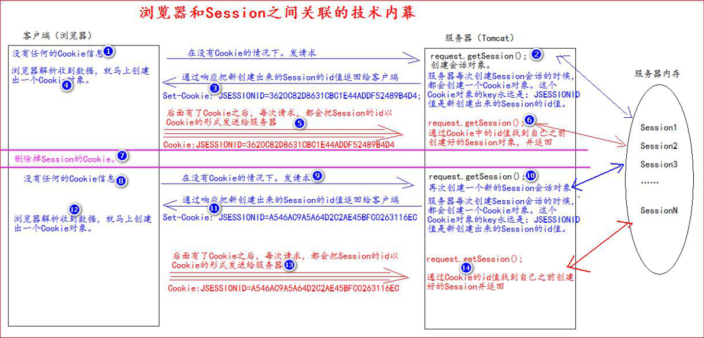

## 4. Filter 过滤器

### 4.1 Filter 是什么

1. Filter 过滤器是JavaEE 的规范，也就是接口
2. Filter 过滤器的作用是：**拦截请求，过滤响应**
3. Filter 过滤器只关心**请求的地址是否匹配**，不关心请求的资源是否存在！！！

### 4.2 Filter 工作流程

对所有的请求进行拦截，并检查权限，有则放行，无则跳转或拒绝访问

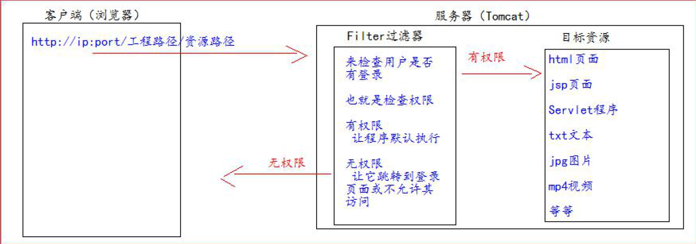

### 4.3 Filter 使用

1. 编写一个类实现 Filter 接口
2. 实现过滤方法doFilter()
3. 配置 web.xml 中的 Filter 的拦截路径

**注**：（关于**拦截路径**）

* 精确配置

  ```xml
  <url-pattern>/target.jsp</url-pattern>
  <!-- 
  	以上配置的路径，表示请求地址必须为：
  	http://ip:port/工程路径/target.jsp
  -->
  ```

* 目录配置

  ```xml
  <url-pattern>/admin/*</url-pattern>
  <!-- 
  	以上配置的路径，表示请求地址必须为：
  	http://ip:port/工程路径/admin/*
  -->
  ```

* 后缀名配置（**前面不加"/"**）

  ```xml
  <url-pattern>*.html</url-pattern>
  <!-- 
  	以上配置的路径，
  	表示请求地址必须以.html 结尾才会拦截到
  -->
  ```

```java
public class AdminFilter implements Filter {
    /**
    * doFilter 方法，专门用于拦截请求。可以做权限检查
    */
    @Override
    public void doFilter(ServletRequest servletRequest, ServletResponse servletResponse, FilterChain filterChain) throws IOException, ServletException {
        HttpServletRequest httpServletRequest = (HttpServletRequest) servletRequest;
        HttpSession session = httpServletRequest.getSession();
        Object user = session.getAttribute("user");
        // 如果等于null，说明还没有登录
        if (user == null) {
        	servletRequest.getRequestDispatcher("/login.jsp").forward(servletRequest,servletResponse);
        	return;
        } else {
            // 让程序继续往下访问用户的目标资源
            filterChain.doFilter(servletRequest,servletResponse);
        }
    }
}
```

```xml
<!--filter 标签用于配置一个Filter 过滤器-->
<filter>
    <!--给filter 起一个别名-->
    <filter-name>AdminFilter</filter-name>
    <!--配置filter 的全类名-->
    <filter-class>com.atguigu.filter.AdminFilter</filter-class>
</filter>
<!--filter-mapping 配置Filter 过滤器的拦截路径-->
<filter-mapping>
    <!--filter-name 表示当前的拦截路径给哪个 filter 使用-->
    <filter-name>AdminFilter</filter-name>
    <!-- url-pattern 配置拦截路径
        / 表示请求地址为：http://ip:port/工程路径/ 映射到IDEA 的web 目录
        /admin/* 表示请求地址为：http://ip:port/工程路径/admin/*
    -->
    <url-pattern>/admin/*</url-pattern>
</filter-mapping>
```

### 4.4 Filter 生命周期

Filter 的生命周期包含几个方法

1. web 工程启动的时候执行（创建 Filter）
   1. 构造器方法
   2. init 初始化方法
2. 每次拦截到请求，执行
   * doFilter 过滤方法
3. 停止 web 工程时，执行（销毁 Filter 过滤器）
   * destroy 方法

### 4.5 相关组件

#### 4.5.1 FilterConfig 类

1. FilterConfig是什么

   Filter 过滤器的配置文件类

   Tomcat 每次创建 Filter 时，会同时创建一个 FilterConfig 类，包含 Filter 配置文件的配置信息

2. 作用：获取 Filter 过滤器的配置内容

   * 获取 Filter 的名称：filter-name 的内容

     `filterConfig.getFilterName()`

   * 获取在 Filter 中配置的 init-param 初始化参数

     `filterConfig.getInitParameter(String key)`

   * 获取 ServletContext 对象

     `filterConfig.getServletContext()`

   ```java
   @Override
   public void init(FilterConfig filterConfig) throws ServletException {
       // 1、获取Filter 的名称filter-name 的内容
       System.out.println("filter-name 的值是：" + filterConfig.getFilterName());
       // 2、获取在web.xml 中配置的init-param 初始化参数
       System.out.println("初始化参数username 的值是：" + filterConfig.getInitParameter("username"));
       System.out.println("初始化参数url 的值是：" + filterConfig.getInitParameter("url"));
       // 3、获取ServletContext 对象
       System.out.println(filterConfig.getServletContext());
   }
   ```

   ```xml
   <filter>
   	<filter-name>AdminFilter</filter-name>
   	<filter-class>com.atguigu.filter.AdminFilter</filter-class>
       <init-param>
           <param-name>username</param-name>
           <param-value>root</param-value>
       </init-param>
       <init-param>
           <param-name>url</param-name>
           <param-value>jdbc:mysql://localhost3306/test</param-value>
       </init-param>
   </filter>
   ```

#### 4.5.2 FilterChain 过滤器链

作用：多个 Filter 之间协同工作（相同拦截路径或拦截路径有交集）

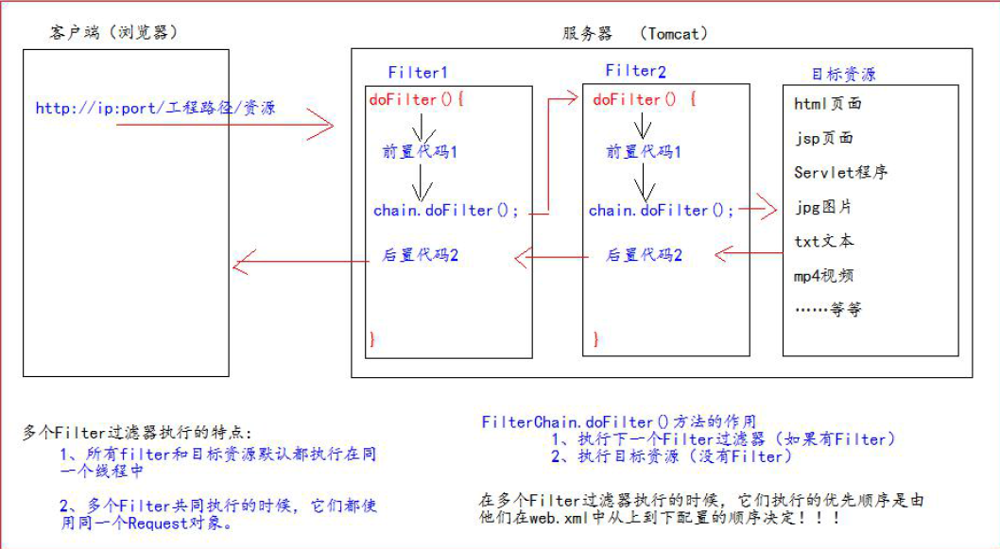

## JSP


## HTTP协议

> 客户端和服务器之间通信时，发送的数据，需要遵守的规则，叫 HTTP 协议。 HTTP 协议中的数据又叫报文。
>

### GET请求

#### 格式

* 请求行
  * 请求的方式      GET
  * 请求的资源路径(?请求参数)
  * 请求的协议的版本号      HTTP/1.1

* 请求头
  * key : value   组成不同的键值对，表示不同的含义

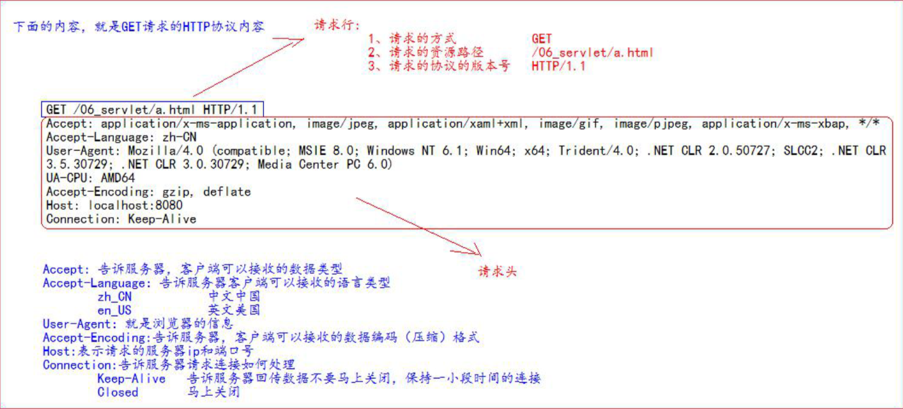

### POST请求

#### 格式

* 请求行
  * 请求的方式      POST
  * 请求的资源路径(?请求参数)
  * 请求的协议的版本号      HTTP/1.1
* 请求头
  * key : value   组成不同的键值对，表示不同的含义
* 空行
* 请求体 ===>>> 就是发送给服务器的数据

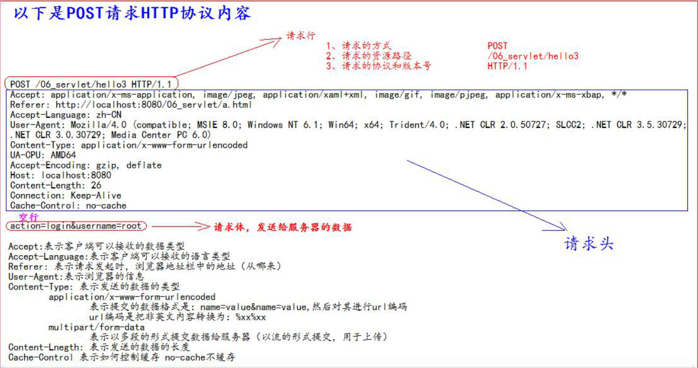

### GET 请求 & POST 请求区分

* GET 请求有哪些
  1. form标签 method=get
  2. a 标签
  3. link 标签引入 css
  4. Script 标签引入 js 文件
  5. img 标签引入图片
  6. iframe 引入 html 页面
  7. 在浏览器地址栏中输入地址后敲回车
* POST 请求有哪些
  1. form标签 method=post

### 响应的HTTP 协议格式

* 响应行
  * 响应的协议和版本号
  * 响应状态码
  * 响应状态描述符
* 响应头
  * key : value
* 空行
* 响应体 ---->>> 就是回传给客户端的数据

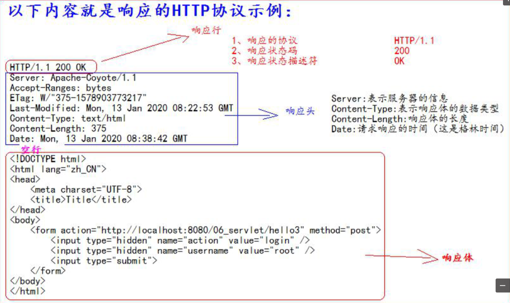

### 常用响应码

* 200 -> 表示请求成功
* 302 -> 表示请求重定向
* 404 -> 表示请求服务器已经收到了，但是你要的数据不存在（请求地址错误）
* 500 -> 表示服务器已经收到请求，但是服务器内部错误（代码错误）

### MIME 类型说明

> MIME 是 HTTP 协议中数据类型。
>
> MIME 的英文全称是"Multipurpose Internet Mail Extensions" 多功能 Internet 邮件扩充服务。MIME 类型的格式是“大类型/小类型”，并与某一种文件的扩展名相对应。

|        文件        | MIME 类型 |
| :----------------: | :-------: |
| 超文本标记语言文本 |           |
|      普通文本      |           |
|      RTF 文本      |           |
|      GIF 图形      |           |
|     JPEG 图形      |           |
|    au 声音文件     |           |
|                    |           |

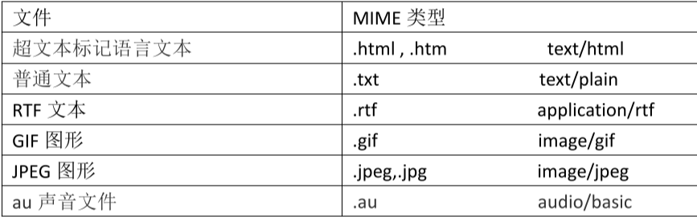

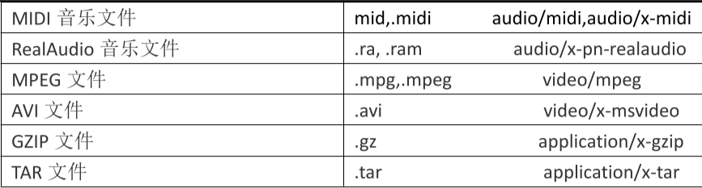


