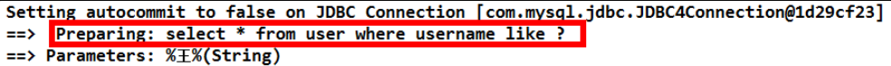
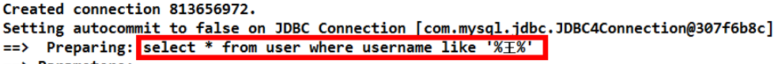
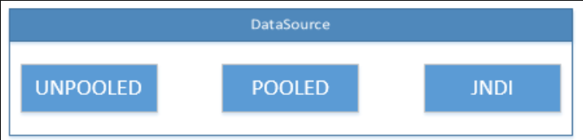
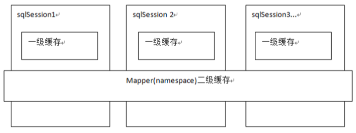
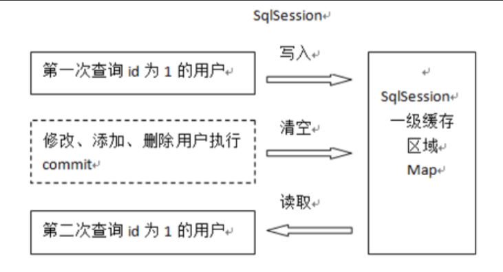
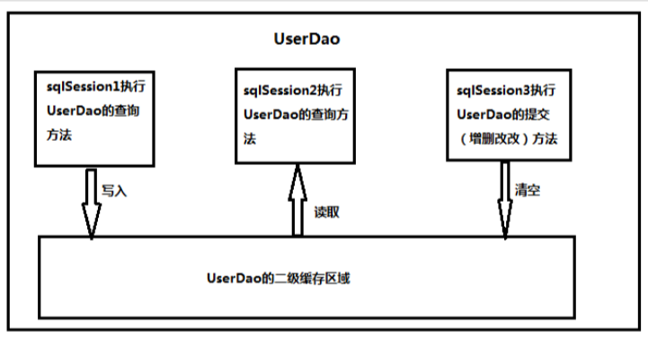

# Mybatis

> 选择：select * from table1 where 范围
> 插入：insert into table1(field1,field2) values(value1,value2)
> 删除：delete from table1 where 范围
> 更新：update table1 set field1=value1 where 范围
> 查找：select * from table1 where field1 like ’%value1%’ ---like的语法很精妙，查资料!
> 排序：select * from table1 order by field1,field2 [desc]
> 总数：select count as totalcount from table1
> 求和：select sum(field1) as sumvalue from table1
> 平均：select avg(field1) as avgvalue from table1
> 最大：select max(field1) as maxvalue from table1
> 最小：select min(field1) as minvalue from table1

> [Mybatis常见面试题总结_张维鹏的博客-CSDN博客_mybatis面试题](https://blog.csdn.net/a745233700/article/details/80977133?utm_medium=distribute.pc_relevant.none-task-blog-2~default~BlogCommendFromBaidu~default-6.baidujs&depth_1-utm_source=distribute.pc_relevant.none-task-blog-2~default~BlogCommendFromBaidu~default-6.baidujs)
>
> [MyBatis面试题（2020最新版）_ThinkWon的博客-CSDN博客_mybatis面试题](https://blog.csdn.net/ThinkWon/article/details/101292950?ops_request_misc=%7B%22request%5Fid%22%3A%22162069258516780271551800%22%2C%22scm%22%3A%2220140713.130102334..%22%7D&request_id=162069258516780271551800&biz_id=0&utm_medium=distribute.pc_search_result.none-task-blog-2~all~top_positive~default-2-101292950.first_rank_v2_pc_rank_v29&utm_term=mybatis)

JDBC问题：

> 1. 数据库链接创建、释放频繁造成系统资源浪费从而影响系统性能，如果使用数据库链接池可解决此问题。
>
>    解决：
>    在 SqlMapConfig.xml中配置数据链接池，使用连接池管理数据库链接。
>
> 2. Sql 语句在代码中硬编码，造成代码不易维护，实际应用 sql 变化的可能较大，sql 变动需要改变 java 代码
>
>    解决：
>    将 Sql语句配置在 XXXXmapper.xml文件中与 java 代码分离。
>
> 3. 使用preparedStatement向占有位符号传参数存在硬编码，因为sql语句的where 条件不一定，可能多也可能少，修改 sql 还要修改代码，系统不易维护
>
>    解决： Mybatis自动将java对象映射至sql语句，通过statement中的parameterType定义输入参数的
>
> 4. 对结果集解析存在硬编码（查询列名），sql 变化导致解析代码变化，系统不易维护，如果能将数据库记录封装成 pojo 对象解析比较方便
>
>    解决： Mybatis自动将sql执行结果映射至java对象，通过statement中的resultType定义输出结果的
>    类型。

## 1. 基于 xml 的使用

### 1.1 步骤

1. 创建 maven 工程

2. pom.xml 添加依赖（mybatis、mysql-connector 等）

3. 编写 JavaBean 实体类（如 User）

4. 编写持久层接口（Dao）

   注：JavaBean 实现 Serialziable 接口

5. 编写持久层接口的映射文件（UserDao.xml，配置sql语句及封装对象类型等）

   注：添加约束，文件夹需逐层创建

6. 编写配置文件 SqlMapConfig.xml（数据库连接及映射文件信息）

   注：添加约束

### 1.2 映射文件配置

#### 1.2.1 基本SQL 语句的配置标签

1. id属性：Dao接口中对应方法名

2. resultType 属性：指定结果集的类型

   * 基本类型和 String 我们可以直接写类型名称，也可以使用包名.类名的方式，例如： java.lang.String
   * 实体类类型，目前只能使用全限定类名(或注册) 

3. parameterType 属性：用于指定传入参数的类型（自定义类默认要写全限定类名）

   * 基本类型和 String 我们可以直接写类型名称，也可以使用包名.类名的方式，例如： java.lang.String
   * 实体类类型，目前只能使用全限定类名(或注册) 
   * **可传递包装对象实现多个查询条件一次执行**

4. resultMap 结果类型

   * 建立查询的列名和实体类的属性名称不一致时建立对应关系。从而实现封装

     ```xml
     <!-- 
     	建立 User 实体和数据库表的对应关系
     	type 属性：指定实体类的全限定类名
     	id 属性：给定一个唯一标识，是给查询 select标签引用用的。
     -->
     <resultMap type="com.itheima.domain.User" id="userMap">
         <id column="id" property="userId"/>
         <result column="username" property="userName"/>
         <result column="sex" property="userSex"/>
         <result column="address" property="userAddress"/>
         <result column="birthday" property="userBirthday"/>
     </resultMap>
     <!--
     	id 标签：用于指定主键字段
     	result 标签：用于指定非主键字段
     	column 属性：用于指定数据库列名
     	property 属性：用于指定实体类属性名称
     -->
     
     <!-- 配置生效 -->
     <!-- 配置查询所有操作 -->
     <select id="findAll" resultMap="userMap">
         select * from user
     </select>
     ```

5. ognl 表达式：

   * apache提供的一种表达式语言，全称是： Object Graphic Navigation Language 对象图导航语言
   * 按照一定的语法格式来获取数据，语法格式就是使用 #{对象.对象}的方式（见insert）
   * #{user.username}它会先去找 user 对象，然后在 user 对象中找到 username 属性，并调用 getUsername()方法把值取出来
   * 我们在parameterType 属性上指定了实体类名称，所以可以省略user，而直接写 username

6. #{}与${}的区别

   * #{}表示一个占位符号
     * 通过#{}可以实现 preparedStatement 向占位符中设置值，自动进行 java 类型和 jdbc 类型转换，#{}可以有效防止 sql 注入。 #{}可以接收简单类型值或 pojo 属性值。 如果 parameterType 传输单个简单类型值，#{}括号中可以是 value或其它名称。 
   * ${}表示拼接 sql串
     * 通过${}可以将parameterType 传入的内容拼接在sql中且不进行jdbc类型转换， ${}可以接收简单类型值或 pojo 属性值，如果parameterType传输单个简单类型值，${}括号中只能是 value。

注：Java代码中使用 session.commit(); 实现事务提交

**模糊查询的两种方式**：

**方式一**

* ```xml
  <!-- 根据名称模糊查询 -->
  <select id="findByName" resultType="com.itheima.domain.User" parameterType="String">
      select * from user where username like #{username}
  </select>
  ```

  ```java
  List<User> users = userDao.findByName("%王%");
  ```

  

  说明：

  在配置文件中没有加入%来作为模糊查询的条件，所以在传入字符串实参时，就需要给定模糊查询的标识%

  配置文件中的#{username}也只是一个占位符，所以 SQL语句显示为“？”（PreparedStatement）

**方式二**

*  ```xml
  <!-- 根据名称模糊查询 -->
  <select id="findByName" parameterType="string" resultType="com.itheima.domain.User"> 
      select * from user where username like '%${value}%'<!-- ${value} 写法固定 -->
  </select>
  ```

  ```java
  List<User> users = userDao.findByName("王");
  ```

  

  说明：

  此时在程序代码中就不需要加入模糊查询的匹配符%（Statement）

```xml
<!-- 查询所有 -->
<select id="findById" resultType="com.itheima.domain.User" parameterType="int">
    select * from user where id = #{uid}
</select>

<!-- 增 -->
<insert id="saveUser" parameterType="com.itheima.domain.User">
    insert into user(username,birthday,sex,address) values(#{username},#{birthday},#{sex},#{address})
</insert>

<!-- 用户 id 的返回值 -->
<insert id="saveUser" parameterType="USER">
    <!-- 配置保存时获取插入的 id -->
    <!--
		selectKey  会将 SELECT LAST_INSERT_ID()的结果放入到传入的 parameterType 类型对象中，  
         keyProperty ：parameterType 类型对象属性名，这里是 user 中的id，因为它跟数据库的主键对应
		keyColumn ：列名
         order AFTER 表示 SELECT LAST_INSERT_ID()  在insert执行之后执行，多用与自增主键  
               BEFORE 表示 SELECT LAST_INSERT_ID() 在insert执行之前执行，这样的话就拿不到主键了，适合主键不是自增的类型
         resultType 返回参数类型
	-->
    <selectKey keyColumn="id" keyProperty="id" resultType="int">
        select last_insert_id();
	</selectKey>
    insert into user(username,birthday,sex,address) values(#{username},#{birthday},#{sex},#{address})
</insert>

<!-- 更新用户 -->
<update id="updateUser" parameterType="com.itheima.domain.User">
    update user set username=#{username},birthday=#{birthday},sex=#{sex}, address=#{address} where id=#{id}
</update>

<!-- 删除用户 -->
<delete id="deleteUser" parameterType="java.lang.Integer">
    delete from user where id = #{uid}
</delete>

<!-- 根据名称模糊查询 -->
<select id="findByName" resultType="com.itheima.domain.User" parameterType="String">
    select * from user where username like #{username}
</select>

<!-- 查询总记录条数 -->
<select id="findTotal" resultType="int">
    select count(*) from user;
</select>
```

### 1.3 Config文件配置

#### 1.3.1 配置的内容和顺序

- properties（属性）
  - property
    -settings（全局配置参数） --setting
    -typeAliases（类型别名） --typeAliase --package
    -typeHandlers（类型处理器） -objectFactory（对象工厂） -plugins（插件） -environments（环境集合属性对象） --environment（环境子属性对象） ---transactionManager（事务管理） ---dataSource（数据源）
    -mappers（映射器） --mapper
    --package

#### 1.3.2 properties（属性）

两种方式指定属性配置

1. ```xml
   <properties>
       <property name="jdbc.driver" value="com.mysql.jdbc.Driver"/>
       <property name="jdbc.url" value="jdbc:mysql://localhost:3306/eesy"/>
       <property name="jdbc.username" value="root"/>
       <property name="jdbc.password" value="1234"/>
   </properties>
   ```

2. ```properties
   # classpath 下定义 db.properties 文件
   jdbc.driver=com.mysql.jdbc.Driver
   jdbc.url=jdbc:mysql://localhost:3306/eesy
   jdbc.username=root
   jdbc.password=1234
   ```

   ```xml
   ```

   

## 2. 基于注解的使用

### 2.1 步骤

1. 创建 maven 工程

2. pom.xml 添加依赖（mybatis、mysql-connector 等）

3. 编写 JavaBean 实体类（如 User）

4. 编写持久层接口（Dao）

   注：JavaBean 实现 Serialziable 接口

5. 在持久层接口中添加注解（sql 语句）

6. 编写配置文件 SqlMapConfig.xml（数据库连接及映射文件信息）

   注：添加约束

### 2.2 常用注解说明

* @Insert:实现新增 
* @Update:实现更新 
* @Delete:实现删除 
* @Select:实现查询 
* @Result:实现结果集封装 
* @Results:可以与@Result 一起使用，封装多个结果集 
* @ResultMap:实现引用@Results 定义的封装 
* @One:实现一对一结果集封装 
* @Many:实现一对多结果集封装 
* @SelectProvider: 实现动态SQL映射
* @CacheNamespace:实现注解二级缓存的使用

### 2.3 单表操作

```java
public interface IUserDao { 
    //查询所有用户 
    @Select("select * from user") 
    @Results(id="userMap", value= { // 配置实体类和数据库表的映射，id = true 表示主键
        @Result(id=true,column="id", property="userId"), 
        @Result(column="username", property="userName"), 
        @Result(column="sex", property="userSex"),
        @Result(column="address", property="userAddress"),
        @Result(column="birthday", property="userBirthday")
    })
    List<User> findAll();
    
    //根据id 查询一个用户
    @Select("select * from user where id = #{uid} ") 
    @ResultMap("userMap") // 表示引用 userMap 映射
    User findById(Integer userId);
    
    // 保存操作（获取id）
    @Insert("insert into user(username,sex,birthday,address) values(#{username},#{sex},#{birthday},#{address})")
    @SelectKey(keyColumn="id", keyProperty="id", resultType=Integer.class, before = false, statement = { "select last_insert_id()" })
    int saveUser(User user);
    
    // 更新
    @Update("update user set username=#{username},address=#{address},sex=#{sex},birthday=#{birthday} where id =#{id}")
    int updateUser(User user);
    
    // 删除
    @Delete("delete from user where id = #{uid} ") 
    int deleteUser(Integer userId);
    
    // 查询使用聚合函数
    @Select("select count(*) from user ") 
    int findTotal();
    
    // 模糊查询
    @Select("select * from user where username like #{username} ")
    List<User> findByName(String name);
}
```

### 2.4 多表操作

1. @Results注解 

   * 代替的是标签<resultMap> 

   * 该注解中可以使用单个@Result 注解，也可以使用@Result 集合
   * @Results（ {   @Result(), @Result()   } ）或@Results( @Result() )

2. @Resutl 注解 

   * 代替了 <id>标签和<result>标签 
   * @Result 中 属性介绍： 
     * id: 是否是主键字段
     * column: 数据库的列名
     * property: 需要装配的属性名
     * one: 需要使用的@One 注解 ( @Result(one=@One) )
     * many 需要使用的@Many注解 ( @Result(many=@many) )

3. @One注解（一对一）

   * 代替了<assocation>标签，是多表查询的关键，在注解中用来指定子查询返回单一对象。
   * @One注解属性介绍： 
     * select: 指定用来多表查询的 sqlmapper（对于Dao接口中的方法）
     * fetchType 会覆盖全局的配置参数 lazyLoadingEnabled （设置是否延迟加载）
     * 使用格式：
       @Result(column=" ",property="",one=@One(select=""))

4. @Many注解（多对一）

   * 代替了<Collection>标签，是是多表查询的关键，在注解中用来指定子查询返回对象集合。
   * 注意：聚集元素用来处理“一对多”的关系。需要指定映射的 Java 实体类的属性，属性的 javaType（一般为 ArrayList）但是注解中可以不定义； 使用格式：
     @Result(property="",column="",many=@Many(select=""))

```java
// 一对一
public interface IAccountDao { 
    // 查询所有账户，采用延迟加载的方式查询账户的所属用户
    @Select("select * from account") 
    @Results(id = "accountMap", value = {
        @Result(id=true,column="id",property="id"), 
        @Result(column="uid",property="uid"), 
        @Result(column="money",property="money"), 
        @Result(column="uid", property="user", one=@One(select="com.itheima.dao.IUserDao.findById", fetchType=FetchType.LAZY))
    })
    List<Account> findAll();
}

// 一对多
public interface IUserDao { 
    // 查询所有用户
    @Select("select * from user") 
    @Results(id="userMap", value= {
        @Result(id=true,column="id",property="userId"), 
        @Result(column="username",property="userName"), 
        @Result(column="sex",property="userSex"), 
        @Result(column="address",property="userAddress"), 
        @Result(column="birthday",property="userBirthday"), 
        @Result(column="id",property="accounts", many=@Many(select="com.itheima.dao.IAccountDao.findByUid", fetchType=FetchType.LAZY))
    }) 
    List<User> findAll();
}
```

### 2.5 二级缓存

1. 在 SqlMapConfig 中开启二级缓存支持

   ```xml
   <!-- 配置二级缓存 --> 
   <settings> 
       <!-- 开启二级缓存的支持(默认开启) --> 
       <setting name="cacheEnabled" value="true"/>
   </settings>
   ```

   

2. 在持久层接口中使用注解配置二级缓存

   ```java
   @CacheNamespace(blocking=true)//mybatis 基于注解方式实现配置二级缓存 
   public interface IUserDao {}
   ```

## 3. Mybatis连接池与事务

### 3.1 Mybatis 的连接池技术

> 我们在前面的 WEB 课程中也学习过类似的连接池技术，而在 Mybatis 中也有连接池技术，但是它采用的是自己的连接池技术。在 Mybatis的 SqlMapConfig.xml配置文件中，通过<dataSource type="pooled">来实现 Mybatis中连接池的配置。

#### 3.1.1 Mybatis 连接池的分类

1. UNPOOLED 不使用连接池的数据源

2. POOLED 使用连接池的数据源

3. JNDI 使用JNDI实现的数据源

   

#### 3.1.2 Mybatis 中数据源的配置

```xml
我们的数据源配置就是在 SqlMapConfig.xml 文件中，具体配置如下：
<!-- 配置数据源（连接池）信息 --> 
<dataSource type="POOLED"> 
    <property name="driver" value="${jdbc.driver}"/> 
    <property name="url" value="${jdbc.url}"/> 
    <property name="username" value="${jdbc.username}"/> 
    <property name="password" value="${jdbc.password}"/>
</dataSource> 
MyBatis 在初始化时，根据<dataSource>的 type 属性来创建相应类型的的数据源 DataSource，
    即： 
    type=”POOLED”：MyBatis 会创建 PooledDataSource 实例 
    type=”UNPOOLED” ： MyBatis 会创建 UnpooledDataSource 实例
	type=”JNDI”：MyBatis会从JNDI服务上查找DataSource 实例，然后返回使用
```

### 3.2 Mybatis 的事务控制

默认不自动提交，通过调用`sqlSession.commit()`提交事务

回滚：`sqlSession.rollback()`

设置自动提交事务：`session = factory.openSession(true);`

## 4. Mybatis 的动态 SQL 语句

### 4.1 &lt;if&gt;

*  条件判断添加
* &lt;if&gt;标签的 test属性中写的是对象的属性名，如果是包装类的对象要使用 OGNL表达式的写法

```xml
<select id="findByUser" resultType="user" parameterType="user">
    select * from user where 1=1
    <if test="userName !=null and userName != '' ">
        and username like #{userName}
    </if>
    <if test="address != null"> 
        and address like #{userAddress}
    </if>
</select>
<!-- 
	select * from user where 1=1 and username like ?
-->
注意：where 1=1  工具人
```

### 4.2 &lt;where&gt;

* where 标记

```xml
<!-- 根据用户信息查询 --> 
<select id="findByUser" resultType="user" parameterType="user"> 
    <include refid="defaultSql"></include> 
    <where> 
        <if test="username!=null and username != '' "> 
            and username like #{username}
        </if> 
        <if test="address != null"> 
            and address like #{address}
        </if> 
    </where>
</select>
<!-- 
	select * from user where username like ? and address like ?
	代替上面的 where 1 = 1
-->
```

### 4.3 &lt;foreach&gt;

* 循环添加参数

```xml
<!-- 查询所有用户在 id的集合之中 --> 
<select id="findInIds" resultType="user" parameterType="queryvo"> 
    <include refid="defaultSql"></include> 
    <where> 
        <if test="ids != null and ids.size() > 0"> 
            <foreach collection="ids" open="id in ( " close=")" item="uid" separator=",">
                #{uid} 
            </foreach> 
        </if> 
    </where>
</select>
<!--
	<foreach>标签用于遍历集合，它的属性： 
		collection:代表要遍历的集合元素，注意编写时不要写#{}
		open:代表语句的开始部分
		close:代表结束部分
		item:代表遍历集合的每个元素，生成的变量名
		sperator:代表分隔符
-->
<!-- select * from user where id in (1,2,3,4,5); -->
```

### 4.4 封装重复语句

```xml
<!-- 抽取重复的语句代码片段 --> 
<sql id="defaultSql"> 
    select * from user
</sql>
<!-- 引用 --> 
<select id="findAll" resultType="user"> 
    <include refid="defaultSql"></include>
</select>
```

## 5. Mybatis 多表查询

### 5.1 一对一（多对一）

> * 用户 User 账户 Account 一个用户可有多个用户
> * 需求：查询所有账户信息及其关联用户信息

#### 5.1.1 方式一

* 定义 AccountUser 类继承 Account 类，包含用户信息

  ```xml
  <!-- AccountDao.xml -->
  <?xml version="1.0" encoding="UTF-8"?>
  <!DOCTYPE mapper PUBLIC "-//mybatis.org//DTD Mapper 3.0//EN"
   "http://mybatis.org/dtd/mybatis-3-mapper.dtd">
  <mapper namespace="com.itheima.dao.IAccountDao">
      <!-- 配置查询所有操作--> 
      <select id="findAll" resultType="accountuser"> 
          select a.*,u.username,u.address from account a,user u where a.uid = u.id;
      </select>
  </mapper>
  ```

#### 5.1.2 方式二

* 使用 resultMap，在 Account 类中加入一个 User 类对象属性

* 单个从表对象用 association

  ```xml
  <?xml version="1.0" encoding="UTF-8"?> 
  <!DOCTYPE mapper PUBLIC "-//mybatis.org//DTD Mapper 3.0//EN" 
  	"http://mybatis.org/dtd/mybatis-3-mapper.dtd"> 
  <mapper namespace="com.itheima.dao.IAccountDao">
  	<!-- 建立对应关系 --> 
      <resultMap type="account" id="accountMap"> 
          <id column="aid" property="id"/> 
          <result column="uid" property="uid"/> 
          <result column="money" property="money"/> 
          <!-- 它是用于指定从表方的引用实体属性的 --> 
          <association property="user" javaType="user"> 
              <id column="id" property="id"/> 
              <result column="username" property="username"/> 
              <result column="sex" property="sex"/> 
              <result column="birthday" property="birthday"/> 
              <result column="address" property="address"/>
          </association>
      </resultMap>
      <select id="findAll" resultMap="accountMap"> 
          select u.*,a.id as aid,a.uid,a.money from account a,user u where a.uid =u.id;
      </select>
  </mapper>
  ```

### 5.2 一对多

> * 用户 User 账户 Account 一个用户可有多个用户
> * 需求：查询所有用户信息及其关联账户信息

* User 类中加入 List&lt;Account&gt;

* 从表对象集合用 collection

  ```xml
  <?xml version="1.0" encoding="UTF-8"?> 
  <!DOCTYPE mapper PUBLIC "-//mybatis.org//DTD Mapper 3.0//EN" "http://mybatis.org/dtd/mybatis-3-mapper.dtd"> 
  <mapper namespace="com.itheima.dao.IUserDao">
      <resultMap type="user" id="userMap"> 
          <id column="id" property="id"></id> 
          <result column="username" property="username"/> 
          <result column="address" property="address"/> 
          <result column="sex" property="sex"/> 
          <result column="birthday" property="birthday"/> 
          <!-- 
  			collection是用于建立一对多中集合属性的对应关系
  			ofType用于指定集合元素的数据类型
  		-->
          <collection property="accounts" ofType="account"> 
              <id column="aid" property="id"/> 
              <result column="uid" property="uid"/>
              <result column="money" property="money"/>
          </collection> 
      </resultMap>
      <!-- 配置查询所有操作 --> 
      <select id="findAll" resultMap="userMap"> 
          select u.*,a.id as aid ,a.uid,a.money from user u left outer join account a on u.id =a.uid 
      </select>
  </mapper>
  collection 部分定义了用户关联的账户信息。表示关联查询结果集
  	property="accList"： 关联查询的结果集存储在 User对象的上哪个属性。
  	ofType="account"：指定关联查询的结果集中的对象类型即List中的对象类型。此处可以使用别名，也可以使用全限定名。
  ```

### 5.3 多对多

> * 用户 User 角色 Role 一个用户可有多个角色 一个角色可有多个用户
> * 实现查询所有角色并且加载它所分配的用户信息

```xml
<?xml version="1.0" encoding="UTF-8"?> 
<!DOCTYPE mapper PUBLIC "-//mybatis.org//DTD Mapper 3.0//EN" "http://mybatis.org/dtd/mybatis-3-mapper.dtd"> 
<mapper namespace="com.itheima.dao.IRoleDao">
    <!--定义 role表的ResultMap--> 
    <resultMap id="roleMap" type="role"> 
        <id property="roleId" column="rid"></id> 
        <result property="roleName" column="role_name"></result> 
        <result property="roleDesc" column="role_desc"></result> 
        <collection property="users" ofType="user"> 
            <id column="id" property="id"></id> 
            <result column="username" property="username"></result> 
            <result column="address" property="address"></result> 
            <result column="sex" property="sex"></result> 
            <result column="birthday" property="birthday"></result>
        </collection>
    </resultMap>
    <!--查询所有--> 
    <select id="findAll" resultMap="roleMap">
        select u.*,r.id as rid,r.role_name,r.role_desc from role r
        left outer join user_role ur on r.id = ur.rid
        left outer join user_role u on u.id = ur.uid
    </select>
</mapper>
```

## 6. Mybatis 延迟加载

> 延迟加载：就是在需要用到数据时才进行加载，不需要用到数据时就不加载数据。延迟加载也称懒加载
>
> * 好处：先从单表查询，需要时再从关联表去关联查询，大大提高数据库性能，因为查询单表要比关联查询多张表速度要快
> * 坏处： 因为只有当需要用到数据时，才会进行数据库查询，这样在大批量数据查询时，因为查询工作也要消耗时间，所以可能造成用户等待时间变长，造成用户体验下降。

1. 在 Mybatis 的配置文件 SqlMapConfig.xml文件中添加延迟加载的配置

   ```xml
   <!-- Mybaits 的官方文档 -->
   <settings> 
       <setting name="lazyLoadingEnabled" value="true"/> 
       <setting name="aggressiveLazyLoading" value="false"/>
   </settings>
   ```

2. 修改 association 或 标签

   > select： 填写我们要调用的 select 映射（方法）的 id
   >
   > column ： 填写我们要传递给 select 映射的参数

   * ```xml
     <resultMap type="account" id="accountMap"> 
         <id column="aid" property="id"/> 
         <result column="uid" property="uid"/> 
         <result column="money" property="money"/> 
         <!-- 它是用于指定从表方的引用实体属性的 --> 
         <association property="user" javaType="user" select="com.itheima.dao.IUserDao.findById" column="uid"></association>
     </resultMap>
     ```

   * ```xml
     <resultMap type="user" id="userMap"> 
         <id column="id" property="id"></id> 
         <result column="username" property="username"/> 
         <result column="address" property="address"/> 
         <result column="sex" property="sex"/> 
         <result column="birthday" property="birthday"/> 
         <!-- collection是用于建立一对多中集合属性的对应关系 
     		ofType用于指定集合元素的数据类型 
     		select是用于指定查询账户的唯一标识（账户的dao 全限定类名加上方法名称） 
     		column是用于指定使用哪个字段的值作为条件查询
     	-->
         <collection property="accounts" ofType="account" select="com.itheima.dao.IAccountDao.findByUid" column="id"></collection>
     </resultMap>
     ```


## 7. Mybatis 缓存

> 像大多数的持久化框架一样，Mybatis 也提供了缓存策略，通过缓存策略来减少数据库的查询次数，从而提高性能。
> Mybatis 中缓存分为一级缓存，二级缓存。
>
> 

### 7.1 一级缓存

> * **一级缓存是 SqlSession级别的缓存，只要SqlSession 没有 flush或 close，它就存在**。
> * 当调用 SqlSession 的修改，添加，删除，commit()，close()等方法时，就会清空一级缓存
>
> 

### 7.2 二级缓存

> * 二级缓存是 mapper 映射级别的缓存，多个 SqlSession 去操作同一个 Mapper 映射的 sql 语句，多个 SqlSession可以共用二级缓存，二级缓存是跨SqlSession 的
>
> * 当我们在使用二级缓存时，所缓存的类一定要实现 java.io.Serializable 接口，这种就可以使用序列化方式来保存对象
>
>   

使用：

1. SqlMapConfig.xml 文件开启二级缓存

   ```xml
   <settings> 
       <!-- 开启二级缓存的支持 --> 
       <setting name="cacheEnabled" value="true"/>
   </settings> 
   因为 cacheEnabled 的取值默认就为 true，所以这一步可以省略不配置。
   为 true 代表开启二级缓存；
   为 false 代表不开启二级缓存。
   ```

2. 配置相关的Mapper 映射文件

   ```xml
   <mapper namespace="com.itheima.dao.IUserDao"> 
       <!-- 开启二级缓存的支持 --> 
       <cache></cache>
   </mapper>
   ```

3. 配置 statement 上面的 useCache 属性

   ```xml
   <!-- 根据 id查询 --> 
   <select id="findById" resultType="user" parameterType="int" useCache="true"> 
       select * from user where id = #{uid}
   </select> 
   将 UserDao.xml 映射文件中的<select>标签中设置 useCache=”true” 代表当前这个 statement要使用二级缓存，如果不使用二级缓存可以设置为false。
   注意：针对每次查询都需要最新的数据 sql，要设置成 useCache=false，禁用二级缓存。
   ```

   


补：

[图解MySQL 内连接、外连接、左连接、右连接、全连接……太多了_plg17的专栏-CSDN博客_左外连接](https://blog.csdn.net/plg17/article/details/78758593?ops_request_misc=%7B%22request%5Fid%22%3A%22162073828416780262525871%22%2C%22scm%22%3A%2220140713.130102334..%22%7D&request_id=162073828416780262525871&biz_id=0&utm_medium=distribute.pc_search_result.none-task-blog-2~all~sobaiduend~default-3-78758593.first_rank_v2_pc_rank_v29&utm_term=mysql+连接)

[关于数据库主键和外键（终于弄懂啦）_bingqingsuimeng的专栏-CSDN博客_主键和外键](https://blog.csdn.net/bingqingsuimeng/article/details/51595560?utm_medium=distribute.pc_relevant.none-task-blog-2~default~BlogCommendFromBaidu~default-14.control&depth_1-utm_source=distribute.pc_relevant.none-task-blog-2~default~BlogCommendFromBaidu~default-14.control)

