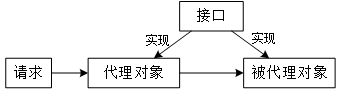

[TOC]

面向对象：以类的方式组织代码，以对象的方式组织（封装）数据

* 类：模板
* 对象：具体的实例（对象通过引用来操作）
  * 属性
  * 方法

构造器（构造方法）

1. 是什么：一个创建对象时被自动调用的特殊方法
2. 为什么：初始化对象
3. 要点：
   * 和类名相同
   * 没有返回类型，也不能写void
   * 使用new关键字时实际是调用构造器
   * 不是函数，不能被继承
   * 定义有参构造后，如果想使用无参构造，需显式定义
   * IDEA快捷键    alt + Insert  -->  Constructor

JVM内存管理

 https://blog.csdn.net/zhangerqing/article/details/8214365?utm_medium=distribute.pc_relevant_t0.none-task-blog-BlogCommendFromMachineLearnPai2-1.control&dist_request_id=&depth_1-utm_source=distribute.pc_relevant_t0.none-task-blog-BlogCommendFromMachineLearnPai2-1.control

三大特性

封装：

1. 是什么：把同一类事物的共性（包括属性和方法）归到同一类中，方便使用（信息隐藏）
   * "高内聚，低耦合"
   * 属性私有（private），get/set（提供方法）
   * alt + Insert  -->  Getter and Setter

继承（extends）

1. 是什么：从已有的类中派生出新的类，新的类吸收已有类的数据属性和行为，并能扩展新的能力

2. 要点：

   * 私有的东西（属性或方法）无法被继承（private）
   * Java只支持单继承（一儿只有一爹）
   * ctrl + H  继承树

3. this

   * 是什么：当前对象的引用（当前用构造函数建的对象是谁，这个this就代表谁）
   * 在调用成员（成员变量和成员方法）时如果不特殊标明，默认省略了this
   * this()：在构造函数里调用其他重载的构造函数（只能放在第一行）

4. super

   * 子类中父类的引用
   * super()：子类构造函数想调用父类的构造函数（只能放在第一行）

   

5. 方法重写（注解@Override 可帮助检查错误）

   * 重载
     * 功能：让类以统一的方式（同名函数）处理不同类型数据（不同参数）的一种手段
     * 返回类型随意，访问修饰符随意，异常随意
     * 范围：同一个类中
   * 重写
     * 功能：对父类的方法重新定义（同名同参数同返回类型）
     * 注：
       * 访问修饰符的限制一定要大于等于被重写方法的访问修饰符
       * 重写方法一定不能抛出新的检查异常或者比被重写方法申明更加宽泛的检查型异常
       * 如果一个方法不能被继承（如private）, 则不能重写它
       * 不能重写被标识为final的方法（final修饰的方法可以被继承，final修饰的类不能被继承）
       * 静态方法（static）不能被重写
       * 《JAVA编程思想》:只有普通的方法调用可以是多态的，静态方法是与类而不是与某个对象相关联
     * 范围：父类与子类
     * 问题：
       * 限制条件
       * Animal a = new Dog b;  访问方法规则


多态

引用变量所指向的具体类型和通过该引用变量发出的方法调用在编程时并不确定，而是在程序运行期间才确定，即一个引用变量到底会指向哪个类的实例对象，该引用变量发出的方法调用到底是哪个类中实现的方法，必须在由程序运行期间才能决定（结合方法重写）

前提：

* 继承
* 重写
* 向上转型

```java
酒 a = 剑南春
酒 b = 五粮液
酒 c = 酒鬼酒
  剑南春、五粮液、酒鬼酒都是酒的子类，我们只是通过酒这一个父类就能够引用不同的子类，这就是多态——我们只有在运行的时候才会知道引用变量所指向的具体实例对象
```


向上转型&向下转型

* 向上转型：子类对象-->父类对象（可以是接口）

  ```java
  Animal animal = new Cat(); //向上转型
  
  优势：
  public void eat(Animal a){
      a.eat();
  }
  
  eat(new Cat());
  eat(new Cat());
  eat(new Dog());
  ```

  * 向上转型时，子类单独定义的方法会丢失
  * 子类引用不能指向父类对象。`Cat c = new Animal()`这样是不行的。

* 向下转型：父类对象-->子类对象

  * 向下转型的前提是父类对象指向的是子类对象（也就是说，在向下转型之前，它得先向上转型）
  * 向下转型只能转型为本类对象（猫是不能变成狗的）

instanceof关键字

1. 用法：对象 instanceof 类
2. true：对象归属于右边类或子类
3. 左边显式声明的类型与右边操作元必须是**同种类或存在继承关系**，否则报错

static关键字

> 静态：指在编译后所分配的内存会一直存在，直到程序退出内存才会释放这个空间，也就是只要程序在运行，那么这块内存就会一直存在
>
> 用static修饰的成员可以通过类名加“.”进行直接访问（与类一起加载，不用实例化对象）
>
> 如果有些代码必须在项目启动的时候就执行,就需要使用静态代码块,这种代码是主动执行的；需要在项目启动的时候就初始化但是不执行,在不创建对象的情况下,可以供其他程序调用,而在调用的时候才执行，这需要使用静态方法,这种代码是被动执行的。 静态方法在类加载的时候 就已经加载 可以用类名直接调用。
>
> 在静态方法里只能直接调用同类中其他的静态成员（包括变量和方法），而不能直接访问类中的非静态成员。这是因为，对于非静态的方法和变量，需要先创建类的实例对象后才可使用，而静态方法在使用前不用创建任何对象。（备注：静态变量是属于整个类的变量而不是属于某个对象的）
>
> 静态方法不能以任何方式引用this和super关键字，因为静态方法在使用前不用创建任何实例对象，当静态方法调用时，this所引用的对象根本没有产生。
>
> 静态程序块：当一个类需要在被载入时就执行一段程序，这样可以使用静态程序块。

1. static变量
   * JVM只为静态变量分配一次内存，在加载类的过程中完成静态变量的内存分配，可用类名直接访问（方便），当然也可以通过对象来访问（不推荐）
   * 实例变量，每创建一个实例，就会为实例变量分配一次内存，实例变量可以在内存中有多个拷贝，互不影响（灵活）
2. static方法
3. static代码块

抽象类和接口

1. 抽象类 abstract 
2. 接口 定义：Interface  实现：implements
   * 支持“多继承”，一个实现类可以实现多个接口

异常机制

Error

Exception

异常处理机制（先被抛出，后被捕获）

一旦某个catch捕获到匹配的异常类型，将进入异常处理代码。一经处理结束，就意味着整个try-catch语句结束。其他的catch子句不再有匹配和捕获异常类型的机会。

* try 块：
  * 用于捕获异常。其后可接零个或多个catch块，如果没有catch块，则必须跟一个finally块。抛出异常后监控区的后续代码不执行
* catch 块：
  * 用于处理try捕获到的异常。
* finally 块：
  * 无论是否捕获或处理异常，finally块里的语句都会被执行。**当在try块或catch块中遇到return语句时，finally语句块将在方法返回之前被执行**。
  * finally中的return语句会覆盖try的return语句。
  * 在以下4种特殊情况下，finally块不会被执行：
    1）在finally语句块中发生了异常
    2）在前面的代码中用了System.exit()退出程序
    3）程序所在的线程死亡
    4）关闭CPU


当在try块或catch块中遇到return语句时，finally语句块将在方法返回之前被执行

> 异常处理五个关键字：try（监控区域）、catch（捕获异常）、finally（善后工作，非必要，无论是否发生异常，都将执行）、throw（主动抛出异常，方法中使用）、throws（主动抛出异常，方法上使用）

1. 抛出异常
2. 捕获异常 Ctrl + Alt + T
3. 自定义异常

IDEA

* Project
  * Module 模块

类

* 匿名类

  ```java
  class outerClass {
      // 定义一个匿名类
      object1 = new Type(parameterList) {
           // 匿名类代码
      };
  }
  ```

对象名存储的是地址 p183

## 关键字

### static

## 设计模式

### 单例模式（p324-328）

> 1.保证某个类只能存在一个对象实例
>
> 2.如何实现
>
> ​	私有化类构造器（使得类外部无法new）
>
> ​	内部创建类的对象（需为static，否则公共方法无法返回此对象）
>
> ​	提供公共方法（需为static，否则需要创建对象才能调用），返回类的对象

#### 1.饿汉式

```java
/* 饿汉式 */
class Bank{
    //1.私有化类的构造器
    private Bank(){
    }

    //2.内部创建类的对象
    //4.要求此对象也为静态的
    //一上来就new
    private static Bank instance = new Bank();

    //3.提供公共的静态方法返回类对象
    public static Bank getInstance(){
        return instance;
    }
}

public class SingletonTest {
    public static void main(String[] args) {
        Bank bank1 = Bank.getInstance();
        Bank bank2 = Bank.getInstance();

        System.out.println(bank1 == bank2);
    }
}
```

#### 2.懒汉式

```java
/* 懒汉式 */
class Order{
    //1.私有化类的构造器
    private Order(){
    }

    //2.内部创建类的对象
    //4.要求此对象也为静态的
    //先不new，后面用到再new
    private static Order instance = null;

    //3.提供公共的静态方法返回类对象
    public static Order getInstance(){
        if (instance == null) {
            instance = new Order();
        }
        return instance;
    }
}

public class SingletonTest2 {
    public static void main(String[] args) {
        Order order1 = Order.getInstance();
        Order order2 = Order.getInstance();

        System.out.println(order1 == order2);
    }
}
```

#### 3.两种模式区别

* 饿汉式
  * 坏处：对象加载时间过长
  * 好处：线程安全
* 懒汉式
  * 好处：延迟对象的创建
  * 目前的写法：线程不安全（有判断）

#### 4.单例模式的应用场景

* 同步
* 共享

## 多线程

### 1.概念

* 程序、进程与线程
  * 程序：完成特定任务、用某种语言编写、指令集合（一段静态的代码）
  * 进程：正在运行的一个程序（作为资源分配的单位）
  * 线程：一个程序内部的一条**执行路径**
    * 作为调度和执行的单位
    * 每个线程拥有独立的运行栈和程序计数器（pc）
* 并行与并发
  * 并行：多CPU同时执行多任务
  * 并发：单CPU（采用时间片）同时执行多任务

### 2.优点

* 提高应用程序的响应
* 提高CPU利用率
* 改善程序结构（进程分为多个线程）

### 3.何时需要

* 需要同时执行多个任务
* 需要实现需等待任务
* 需后台运行程序

### 4.线程创建与使用！！！

#### 2种创建方式

##### 1. 继承Thread类

* 方式
  * 重写Thread类的run()  -->  此线程执行的操作
  * 创建Thread类的子类对象
  * 通过此对象调用start()    start()作用：
    * 启动当前线程
    * 调用当前线程的run()
* **注意**
  * 不能通过直接调用run()的方式启动线程（还是处于主线程）
  * 不能让已经start()的线程再执行start()  -->  需再new一个线程对象
* Thread类常用方法
  * String getName()：返回线程名称
  * void setName(String name)：设置该线程名称
  * static Thread currentThread()：返回当前线程
  * yield()：释放当前CPU执行权
  * join()：在线程a中调用线程b的join()，此时线程a进入阻塞状态，直到线程b执行完成后恢复
  * sleep(long ms)：让当前线程阻塞指定毫秒
  * isAlive()：判断线程是否存活
  *  stop()：强制结束当前进程（已过时）

##### 2.实现Runnable接口

* 方式
  * 创建一个实现Runnable接口的类
  * 实现类去实现Runnable中的抽象方法：run()
  * 创建实现类的对象
  * 将此对象作为参数传递到Thread类的构造器中，创建Thread类的对象（多个线程可共用一个此对象）
  * 通过Thread类的对象调用start()

##### 3.两种创建方式对比

* 开发中**优先选择实现Runnable**接口方式
  * 实现的方式没有类的**单继承的局限性**
  * 实现的方式更适合来处理多个线程有**共享数据**的情况
* 联系
  * Thread类也实现了Runnable接口
  * 两种方式都需要重写run()

#### 线程调度

> 调度策略：
>
> * 时间片
>
> * 抢占式：高优先级的线程抢占CPU

##### Java的调度方法

###### 策略

* 同优先级：线程组成先到先出队列，使用时间片策略
* 高优先级：抢占式策略

###### 线程优先等级

* MIN_PRIORITY=1
* MAX_PRIORITY=10
* NORM_PRIORITY=5

###### 涉及方法

* getPriority()：返回线程优先值
* setPriority(int newPriority)：改变线程的优先级（先设置，再启动）

###### 说明

* 线程创建时**继承**父线程的**优先级**
* 低优先级只是获得调度的**概率**低

### 5.线程的生命周期

* 新建：Thread类或其子类的对象被创建时，新生的线程对象处于新建状态
* 就绪：处于新建状态的线程被start()后，将进入线程队列等待CPU时间片，此时它已具备运行条件，只是还未分配到CPU资源
* 运行：当就绪的线程被调度并获得CPU资源时
* 阻塞：被人为挂起或者执行输入输出操作时
* 死亡：线程完成全部工作或被提前强制性中止或出现异常结束时


### 6.线程的同步！！！

#### 线程安全问题

* 多个线程执行的不确定性引起执行结果的不稳定
* 多个线程对账本的**共享**，会造成操作的不完整性，会破坏数据
* **有共享数据时**，共享数据是谁，操作共享数据的代码是哪些

#### 解决方法

##### 同步机制

###### 方式一：同步代码块

```java
synchronized(同步监视器){
	//需要被同步的代码，不能包多或者包少
    //进来就锁住了，当前线程执行完代码别人才能进来
}
说明：
    1.操作共享数据的代码-->需要被同步的代码
    2.共享数据-->多个线程共同操作的变量
    3.同步监视器，俗称：锁。任何一个类的对象都可以充当锁
    	要求：多个线程必须共用一把锁
    4.解决继承Thread类线程安全问题时注意锁的唯一性(会new多个对象，锁需为static)
    5.解决实现Runnable接口线程安全问题时，锁可用this或者当前类对象：类名.class(考虑唯一性)
```

###### 方式二：同步方法

```java
synchronized 修饰方法
例：
public synchronized void show(){
    //操作代码
}
说明：
    1.如果操作共享数据的代码完整声明在一个方法中，我们不妨将此方法声明为同步的
    2.同步方法仍然涉及同步监视器，只是不需要我们显式声明
    3.非静态的同步方法，同步监视器(锁)为：this
      静态的同步方法，同步监视器(锁)为：当前类对象
    4.解决继承Thread类线程安全问题时，由于需要new多个线程对象，默认使用this作为锁不满足锁的唯一性，故将同步方法写成静态方法(无this)，此时采用的锁为当前类对象
```

###### 评价

* 好处：解决线程安全问题
* 局限性：操作同步代码时，只能有一个线程参与，相当于是单线程，效率低
* 同步锁，后面详细讲

#### 线程安全的单例模式（懒汉式）

```java
class Bankt {
    private Bankt(){
    }

    private static Bankt instance = null;

    public static Bankt getInstance(){
        //方式一：效率稍差
        synchronized(Bankt.class) { //所有线程都需要进入代码块进行判断
            if (instance == null) {
                instance = new Bankt();
            }
            return instance;
        }

        /*************************************/

        //方式二：效率稍高
        if (instance == null) {
            synchronized (Bankt.class) {
                if (instance == null) {
                    instance = new Bankt();
                }
            }
        }
        return instance;
    }
}
```

#### 死锁

* 不同的线程**分别占用对方需要的同步资源**不放弃，都在等待对方放弃自己需要的同步资源，就形成了**线程**的死锁
* 两把锁
* 说明：
  1. 出现死锁后，不会出现异常和提示，所有的线程都处于阻塞状态，无法继续
  2. 使用同步时，要避免出现死锁
* 解决方法
  * 专门的算法、原则
  * 尽量少用同步资源
  * 尽量避免嵌套同步

#### Lock锁（同步锁）  JDK5.0新增

```java
class LockTest implements Runnable{
    //1.实例化ReetrantLock (默认参数fair为false，true则线程公平先进先出)
    private ReentrantLock lock = new ReentrantLock();
    //2.run方法中
    rock.rock();  //锁住
    //操作代码
    rock.unrock(); //解锁
}
注意lock的唯一性
```

#### synchronized与Lock异同

1. 同：二者都可以解决线程安全问题
2. 异：
   * synchronized机制在执行完相应的同步代码后，自动释放同步监视器
   * Lock需要手动启动同步（lock()），和手动结束同步（unlock()）

### 7.线程的通信

#### 三个方法

* wait()：执行此方法，当前线程就进入阻塞状态，并释放同步监视器
* notify()：执行此方法，就会唤醒**被wait**的一个线程，如果有多个线程被wait，就唤醒优先级高的那个
* notifyAll()：执行此方法，就会唤醒**所有被wait**的线程

#### 说明

* wait()、notify()、notifyAll()三个方法**必须使用在同步代码块或同步方法中**
* wait()、notify()、notifyAll()三个方法的**调用者**必须是同步代码块或同步方法中的**同步监视器**，否则会出现异常
* wait()、notify()、notifyAll()三个方法定义在java.lang.Object类中

#### sleep()和wait()的异同

1. 相同点
   * 一旦执行方法，都可以使得当前的线程进入阻塞状态
2. 不同点
   * **声明的位置**不同：Thread类中声明sleep()，Object类中声明wait()
   * **调用的要求**不同：sleep()可以在任何需要的场景下调用，wait()必须必须使用在同步代码块或同步方法中
   * 是否**释放同步监视器**：如果两种方法都使用在同步代码块或同步监视器中，sleep()不会释放锁，wait()会释放锁

#### 应用案例

```java
/**
 * 线程通信的应用
 * 生产者/消费者问题
 *
 * 生产者（Productor）将产品交给店员（CLerk），而消费者（Customer）从店员处取走产品，
 * 店员一次只能持有固定数量的产品（比如：20），如果生产者试图生产更多的产品，店员会叫生产
 * 者停一下，如果店中有空位放产品了再通知生产者继续生产；如果店中没有产品了，店员会告诉消
 * 费者等一下，如果店中有产品了再通知消费者来取走产品。
 *
 * 分析：
 * 1.是否是多线程问题？是，生产者线程，消费者线程
 * 2.是否有共享数据？是，店员（或产品）
 * 3.如何解决线程的安全问题？同步机制，有三种方法
 * 4.是否涉及线程的通信？是
 */
class Clerk{
    private int productnum = 0;

    public synchronized void ProductPro() {
        if (productnum < 20) {
            productnum++;
            System.out.println(Thread.currentThread().getName() + "生产第" + productnum + "个产品中……");
            try {
                Thread.sleep(10);
            } catch (InterruptedException e) {
                e.printStackTrace();
            }
            notify();
        } else {
            try {
                wait();
            } catch (InterruptedException e) {
                e.printStackTrace();
            }
        }
    }

    public synchronized void ConsumePro() {
        if (productnum > 0) {
            System.out.println(Thread.currentThread().getName() + "消费第" + productnum + "个产品中……");
            productnum--;
            notify();
        } else {
            try {
                wait();
            } catch (InterruptedException e) {
                e.printStackTrace();
            }
        }
    }
}

class Productor extends Thread{
    private Clerk clerk = new Clerk();

    public Productor(Clerk clerk) {
        this.clerk = clerk;
    }

    @Override
    public void run() {
        System.out.println("生产者开始生产产品……");
        while (true) {
            try {
                Thread.sleep(10);
            } catch (InterruptedException e) {
                e.printStackTrace();
            }
            clerk.ProductPro();
        }
    }
}

class Consumer extends Thread{
    private Clerk clerk = new Clerk();

    public Consumer(Clerk clerk){
        this.clerk = clerk;
    }

    @Override
    public void run() {
        System.out.println("消费者开始消费产品……");
        while (true){
            try {
                Thread.sleep(10);
            } catch (InterruptedException e) {
                e.printStackTrace();
            }
            clerk.ConsumePro();
        }
    }
}

public class ProductTest {
    public static void main(String[] args) {
        Clerk clerk = new Clerk();

        Productor t1 = new Productor(clerk);
        Consumer t2 = new Consumer(clerk);

        t1.setName("生产者");
        t2.setName("消费者");

        t1.start();
        t2.start();
    }
}
```

### 8.JDK5.0新增线程创建方式

#### 一、实现Callable接口

##### 步骤

1. 创建一个实现Callable接口的实现类
2. 实现（重写）Call()，将此线程需要执行的操作声明在Call()中（可以有返回值）
3. 创建Callable接口实现类对象
4. 将此Callable接口实现类对象作为参数传递到FutureTask构造器中，创建FutureTask的对象（FutureTask实现了Runnable接口）
5. 将FutureTask对象作为参数传递到Thread类的构造器中，创建Thread对象，并调用start()
6. FutureTask对象.get()获取Call()的返回值（可选）

```java
        NumThread numThread = new NumThread();
        FutureTask futureTask = new FutureTask(numThread);
        new Thread(futureTask).start();

        try {
            Object o = futureTask.get();
        } catch (InterruptedException e) {
            e.printStackTrace();
        } catch (ExecutionException e) {
            e.printStackTrace();
        }
```

##### 问题

如何理解实现Callable接口的方式创建多线程比实现Runnable接口创建多线程的方式强大？

1. Call()可以有返回值
2. Call()可以抛出异常，被外面的操作捕获，获取异常的信息
3. Callable支持泛型

#### 二、线程池！！！

> 提前创建好多个线程，放入线程池中，使用时直接获取，使用完放回池中。
>
> 可以避免创建销毁、实现重复利用。
>
> * 提高响应速度（减少创建新线程的时间）
> * 降低资源消耗（重复利用线程池中的线程，不需要每次都创建）
> * 便于线程管理
>   * 核心池大小
>   * 最大线程数
>   * 线程无任务时最多保持多长时间后会停止

```java
//1.提供指定数量的线程池
ExecutorService service = Executors.newFixedThreadPool(10);
//设置线程池属性
ThreadPoolExecutor service1 = (ThreadPoolExecutor) service;
service1.setCorePoolSize(15);
service1.setKeepAliveTime(100,5);
//2.执行指定的线程操作，需提供Runnable接口或Callable接口实现类的对象
//execute()适用于Runnable
service.execute(Runnable runnable);
//submit()适用于Callable
service.submit(Callable callable);
//3.关闭线程池
service.shutdown();
```

创建多线程有几种方式：4种

## 常用类

### 1.String

> 字符串：使用一对""引起来表示

#### 特性

1. String声明为final，不可被继承

2. String实现了Serializable接口：表示字符串是支持序列化的

   ​		 实现了Comparable接口：表示String可以比较大小

3. String内部定义了final char[] value用于存储字符串数据

4. **String：代表不可变的字符序列**。简称：**不可变性**（改变就重开）

   ​	体现：1.当对字符串重新赋值时，需要重写指定内存区域赋值，不能使用原有的value进行赋值（开一个新的）

   ​			   2.当对现有字符串进行连接操作时，也需要重写指定内存区域赋值，不能使用原有的value进行赋值

   ​			   3.当调用String的replace()修改指定字符或字符串时，也需要重写指定内存区域赋值，不能使用原有的value进行赋值

5. 通过字面量的方式`String s = "abc"`（区别于new）给字符串赋值，此时的字符串声明在字符串常量池中

6. 字符串常量池中不会存储相同内容的字符串

   

#### String的实例化方式

1. 通过字面量定义的方式
2. 通过new + 构造器的方式


```java
//1.通过字面量定义的方式，此时s1的数据声明在方法区中的字符串常量池中
String s1 = "hello";
//2.通过new + 构造器的方式，此时s2保存的地址值，是数据在堆空间中开辟空间后对应的地址值
```


面试题：String s = new String("abc"); 方式创建对象，在内存中创建了几个对象？

​		两个：一个是堆空间中的new结构，另一个是char[]对应的常量池中的数据"abc"

#### String不同拼接操作对比


**注：final修饰也是常量**

**一道面试题**

```java
public class StringTest {
    String str = new String("good");
    char[] ch = {'t', 'e', 's', 't'};

    public void change(String str, char ch[]) {
        str = "test ok";
        ch[0] = 'b';
    }

    public static void main(String[] args) {
        StringTest ex = new StringTest();
        ex.change(ex.str, ex.ch);
        System.out.print(ex.str + "and ");//good
        System.out.println(ex.ch);//best
    }
}
```

#### String常用方法

##### 属性、元素查询

* int length()：返回字符串的长度： return value.length
* char charAt(int index)： 返回某索引处的字符return value[index]
* boolean isEmpty()：判断是否是空字符串：return value.length == 0

##### 字符串处理

大小写转换

* String toLowerCase()：使用默认语言环境，将 String 中的所有字符转换为小写
* String toUpperCase()：使用默认语言环境，将 String 中的所有字符转换为大写

截取拼接

* String trim()：返回字符串的副本，忽略前导空白和尾部空白（用户名）
* String substring(int beginIndex)：返回一个新的字符串，它是此字符串的从 beginIndex开始截取到最后的一个子字符串。
* String substring(int beginIndex, int endIndex) ：返回一个新字符串，它是此字符串从beginIndex开始截取到endIndex(不包含)的一个子字符串。
* String concat(String str)：将指定字符串连接到此字符串的结尾。 等价于用“+”

比较

* boolean equals(Object obj)：比较字符串的内容是否相同
* boolean equalsIgnoreCase(String anotherString)：与equals方法类似，忽略大小写
* int compareTo(String anotherString)：比较两个字符串的大小（涉及字符串排序）

查询

* boolean endsWith(String suffix)：测试此字符串是否以指定的后缀结束

* boolean startsWith(String prefix)：测试此字符串是否以指定的前缀开始

* boolean startsWith(String prefix, int toffset)：测试此字符串从**指定索引**开始的子字符串是否以指定前缀开始

* boolean contains(CharSequence s)：当且仅当此字符串包含指定的 char 值序列时，返回 true

* int indexOf(String str)：返回指定**子字符串**在此字符串中**第一次出现**处的索引

* int indexOf(String str, int fromIndex)：返回指定子字符串在此字符串中第一次出现处的索引，从**指定的索引**开始

* int lastIndexOf(String str)：返回指定子字符串在此字符串中最右边出现处的索引

* int lastIndexOf(String str, int fromIndex)：返回指定子字符串在此字符串中最后一次出现处的索引，从指定的索引开始**反向搜索**

  注：indexOf和lastIndexOf方法如果**未找到都是返回-1**

替换

* String replace(char oldChar, char newChar)：返回一个新的字符串，它是通过用 newChar **替换**此字符串中出现的**所有 oldChar** 得到的。
* String replace(CharSequence target, CharSequence replacement)：使用指定的**字面值**替换序列**替换**此字符串**所有匹配字面值**目标序列的子字符串。
* String replaceAll(String regex, String replacement) ：使用给定的 replacement 替换此字符串**所有匹配**给定的正则表达式的子字符串。
* String replaceFirst(String regex, String replacement) ：使用给定的 replacement 替换此字符串匹配给定的正则表达式的**第一个**子字符串。

判断

* boolean matches(String regex)：告知此字符串是否匹配给定的正则表达式。
* String[] split(String regex)：根据给定正则表达式的匹配拆分此字符串。
* String[] split(String regex, int limit)：根据匹配给定的正则表达式来**拆分此字符串**，最多不超过limit个，如果超过了，剩下的全部都放到最后一个元素中。

#### String与基本数据类型包装类的转换

* String --> 基本数据类型、包装类：调用包装类的静态方法parseXXX(str)
* 基本数据类型、包装类 --> String：调用String重载的valueOf(xxx)

```java
String s = "123";
int num = Integer.parseInt(s);

String str2 = String.valueOf(num);
String str3 = num + ""; //str3在堆里
```

#### String与字符数组char[]的转换

* String --> char[]：调用String的toCharArray()
* char[] --> String：调用String的构造器

```java
String s = "123abc";
char[] charArray = s.toCharArray();

String s1 = new String(charArray);
```

#### String与字节数组byte[]的转换

* String --> byte[]：调用String的getBytes()  --> 编码：字符串 --> 字节
* byte[] --> String：调用String的构造器  --> 解码：字符串 --> 字节

```java
String s = "123abc";
byte[] bytes = new byte[0];
//使用默认字符集，可加参数，如"gbk"
bytes = s.getBytes(); 
bytes = s.getBytes("gbk"); 
//编解码要用同种字符集，否则可能乱码
String s1 = new String(bytes);
String s1 = new String(bytes, "gbk");
```

#### String算法题目

#### String相关的类

> String、StringBuffer、StringBuilder三者异同
>
> * String：不可变的字符序列；底层使用char[]存储
> * StringBuffer：可变的字符序列；线程安全，效率低；底层使用char[]存储
> * StringBuilder：可变的字符序列；jdk5.0新增，线程不安全，效率高；底层使用char[]存储

```java
String str = new String(); //new char[0]
String str1 = new String("abc"); //new char[]{'a','b',c}

//底层创建了一个长度16的char数组
StringBuffer sb1 = new StringBuffer(); //char[] value = new char[16]
System.out.println(sb1.length()); // 0
sb1.append('a'); //value[0] = 'a';
sb1.append('b'); //value[1] = 'b';

StringBuffer sb1 = new StringBuffer("abc"); //char["abc".length() + 16] value = new char[]{'a','b',c}
```

##### StringBuffer & StringBuilder

> 相当于存储空间
>
> * String --> StringBuffer/StringBuilder ：append()
> * StringBuffer/StringBuilder --> String ：toString()

1. 问题1：sb1.length()获取有效存储长度

2. 问题2：扩容问题：如果要添加的底层数组盛不下了，就需要扩容底层数组，默认情况下扩容为原来容量的2倍+2，同时copy原有数组

   指导意义：开发中建议使用StringBuffer(int capacity)或StringBuilder(int capacity)，尽量避免后续扩容影响效率

3. 常用方法（StringBuilder同）

   * StringBuffer append(xxx)：提供了很多的append()方法，用于进行字符串拼接
   * StringBuffer delete(int start,int end)：删除指定位置的内容（**左闭右开**）
   * StringBuffer replace(int start, int end, String str)：把[start,end)位置替换为str
   * StringBuffer insert(int offset, xxx)：在指定位置插入xxx
   * StringBuffer reverse() ：把当前字符序列逆转
   * public int indexOf(String str)：返回str首次出现位置
   * public String substring(int start,int end)：返回子字符串
   * public int length()
   * public char charAt(int n)
   * public void setCharAt(int n ,char ch)

4. 总结

   增：StringBuffer append(xxx)

   删：StringBuffer delete(int start,int end)

   改：public void setCharAt(int n ,char ch) / StringBuffer replace(int start, int end, String str)

   查：public char charAt(int n)

   插：StringBuffer insert(int offset, xxx)

   长度：public int length()

   遍历：for + charAt(int n)

5. 效率对比

   StringBuilder > StringBuffer > String

### 2.比较器(对象比较大小)

> 说明：对象正常情况下只能进行比较：== 或 !=，不能使用 > 或 <，但在实际开发场景中，我们需要对多个对象进行排序，需要比较对象大小
>
> 如何实现：使用两个接口中的任一个：Comparable 或 Comparator

#### Comparable接口使用（自然排序[从小到大]）

* 使用举例

  1. 像**String、包装类**实现了Comparable接口，重写了compareTo(obj)方法，给出了比较两个对象的方式（进行从小到大排列）
  2. 重写compareTo(obj)规则：
     * 如果当前对象this大于形参对象obj，返回正整数
     * 如果当前对象this小于形参对象obj，返回负整数
     * 如果当前对象this等于形参对象obj，返回零
  3. 对于自定义类，如果需要排序，可以实现Comparable接口，重写compareTo()方法，在compareTo()方法指明如何排序

* 自定义类实现Comparable自然排序

  ```java
  public class Mouse implements Comparable {
      private String name;
      private int price;
      /** get() set() 构造方法省略
       */
      //重写compareTo()方法
      @Override
      public int compareTo(Object o) {
          if (o instanceof Mouse) {
              Mouse mouse = (Mouse) o;
  
              if (this.price > mouse.price) {
                  return 1;
              } else if (this.price < mouse.price) {
                  return -1;
              } else {
                  return 0;
              }
          }
          throw  new RuntimeException("传入数据不一致");
      }
      
      public static void main(String[] args) {
          Mouse[] mouse = new Mouse[5];
  
          mouse[0] = new Mouse("xiaomi",13);
          mouse[1] = new Mouse("huawei",56);
          mouse[2] = new Mouse("feilipu",40);
          mouse[3] = new Mouse("MS",63);
          mouse[4] = new Mouse("dell",50);
  
          Arrays.sort(mouse); //对数组元素从小到大排序
          for (int i = 0; i < mouse.length; i++) {
              System.out.println(mouse[i].getName() + ":" + mouse[i].getPrice());
          }
      }
  }
  ```

#### Comparator接口使用（定制排序）

1. 说明：当元素的类型没有实现java.Lang.Comparable接口而又**不方便修改代码**，或者实现了java.Lang.Comparable接口的**排序规则不适合**当前的操作，那么可以考虑使用comparator的对象来排序

2. 方式

   重写compare(Object o1, Object o2)方法，比较o1，o2大小：

   * o1>o2，返回正整数
   * o1<o2，返回负整数
   * o1=o2，返回零

   ```java
   Arrays.sort(arr, new Comparator(){
   	//
       @Override
       public int compare(Object o1, Object o2) {
   		if (o1 instanceof String && o2 instanceof String) {
   			String s1 = (String) o1;
   			String s2 = (String) o2;
   			
               //比较语句
           }
           throw  new RuntimeException("传入数据不一致");
       }
   });
   ```

#### Comparable接口与Comparator接口使用对比

* Comparable接口的方式一旦指定，保证Comparable实现类的对象在任何位置都可以比较大小
* Comparator接口属于临时性的比较

### 3.其他常用类

1. System
2. Math
3. BigIntger & BigDecimal （整型和浮点型的进化版，精度高）

## 枚举类

* 理解：类的对象是**有限个，确定的**
* 当需要定义**一组常量**时，建议使用枚举类
* 如果枚举类只有一个对象。则可以作为一种单例模式的实现方式

### 如何定义枚举类

#### 方式一：jdk5.0之前，自定义枚举类

```java
public class SeasonTest {
    public static void main(String[] args) {
        Season spring = Season.SPRING;
        Season summer = Season.SUMMER;
        Season autumn = Season.AUTUMN;
        Season winter = Season.WINTER;
    }
}

class Season {
    //1.声明Season对象的属性：private final修饰（对外不可见，不可修改，常量）
    private final String seasonName;
    private final String seasonDesc;

    //2.私有化类的构造器，并给对象属性赋值 （保证每个常量只有一个对象）
    private Season(String seasonName, String seasonDesc) {
        this.seasonName = seasonName;
        this.seasonDesc = seasonDesc;
    }

    //3.提供当前枚举类的多个对象：public static final
    public static final Season SPRING = new Season("春天","xxxxx");
    public static final Season SUMMER = new Season("夏天","xxxxx");
    public static final Season AUTUMN = new Season("秋天","xxxxx");
    public static final Season WINTER = new Season("冬天","xxxxx");
    
    //4.其他诉求
}
```

#### 方式二：jdk5.0，可以使用enum关键字定义枚举类

说明：定义的枚举类默认继承于java.lang.Enum类

```java
public class SeasonTest1 {
    public static void main(String[] args) {
        Season1 summer = Season1.SUMMER;
        System.out.println(summer);  //默认打印对象名SUMMER
    }
}

enum Season1 {
    //1.提供当前枚举类的对象，多个对象用","隔开，末尾对象";"结束
    SPRING("春天","xxxxx"),
    SUMMER("夏天","xxxxx"),
    AUTUMN("秋天","xxxxx"),
    WINTER("冬天","xxxxx");
    //2.声明Season对象的属性：private final修饰（对外不可见，不可修改，常量）
    private final String seasonName;
    private final String seasonDesc;

    //3.私有化类的构造器，并给对象属性赋值 （保证每个常量只有一个对象）
    private Season1(String seasonName, String seasonDesc) {
        this.seasonName = seasonName;
        this.seasonDesc = seasonDesc;
    }
}
```

### Enum类中常用方法

1. values()方法：返回枚举类型的对象数组。该方法可以很方便地遍历所有的枚举值。

   ```java
   Season1[] values = com.hasim.java.Season1.values();
   for (int i = 0; i < values.length; i++) {
   	System.out.println(values[i]);
   }
   
   Thread.State[] values1 = Thread.State.values();
   for (int i = 0; i < values1.length; i++) {
   	System.out.println(values1[i]);
   }
   ```

2. valueOf(String str)：（按名字找对象）可以把一个字符串转为对应的枚举类对象。要求字符串必须是枚举类对象的“名字”。如不是，会有运行时异常：IllegalArgumentException。

   ```java
   Season1 winter = Season1.valueOf("WINTER");
   System.out.println(winter);
   ```

3. toString()：返回当前枚举类对象常量的名称

### 使用enum关键字定义的枚举类实现接口的情况

#### 情况一

* 实现接口，在enum类中实现抽象方法

  ```java
  interface info {
      void show();
  }
  
  enum Season1 implements info{
      @Override
      public void show() {
      }
  }
  ```

#### 情况二

* 让枚举类的对象分别实现接口中的抽象方法

  ```java
  interface info {
      void show();
  }
  
  enum Season1 implements info{
      SPRING("春天","xxxxx"){
          @Override
          public void show() {
          }
      },
      SUMMER("夏天","xxxxx"){
          @Override
          public void show() {
          }
      },
      AUTUMN("秋天","xxxxx"){
          @Override
          public void show() {
          }
      },
      WINTER("冬天","xxxxx"){
          @Override
          public void show() {
          }
      };
  }
  ```

## 注解

## 集合

### 集合框架概述

> 存储特点、底层原理、常用方法、不同实现类对比

1. 集合、数组都是对多个数据进行存储操作的结构，简称Java容器

   说明：此时的存储主要指的是内存层面的存储，不涉及持久化存储

2. 数组在存储多个数据方面的缺点：

   * 一旦初始化后，长度不可修改
   * 数组提供的方法非常有限，对于添加、删除、插入数据等操作，非常不便，同时效率不高
   * 获取数组中实际元素的个数的需求，数组没有现成的属性或方法可用
   * 数组存储数据的特点：有序、可重复。对于无序、不可重复的需求，不能满足

### 集合框架

* Collection接口：单列集合，用来存储一个一个的对象
  * list接口：存储有序的、可重复的数据  --> "动态"数组
    * 实现类：ArrayList、LinkedList、Vector
  * Set接口：存储无序的、不可重复的数据 --> 类似集合
    * 实现类：HashSet、LinkedHashSet、TreeSet
* Map接口：双列集合，用来存储一对(key -- value)一对的数据 --> 类似函数：y=f(x)
  * 实现类：HashMap、LinkedHashMap、TreeMap、Hashtable、Properties

### Collection接口中的方法

1. 增
   * add(Object obj)
   * addAll(Collection coll)  copy全部
2. 删
   * void clear()  清空集合
   * boolean remove(Object obj)：删除指定元素
     * 通过元素的equals方法判断是否是要删除的那个元素
     * 只会删除找到的第一个元素
   * boolean removeAll(Collection coll)：删除当前集合中所有coll中的元素（差集）
   * boolean retainAll(Collection c)：取c与当前集合交集
     * 把交集的结果存在当前集合中，不影响c
3. 改
4. 查
   * boolean contains(Object obj)  是否包含某个元素（看内容）
     * 调用时会调用obj对象所在类的equals()来判断是否是同一个对象
     * 向Collection接口的实现类的对象中添加数据obj时，要求obj所在类要重写equals()
   *  boolean containsAll(Collection c)：c中所有元素是否都存在于当前集合中
     * 也是调用元素的equals方法来比较的。
5. 其他
   * int size()：获取有效元素的个数
   * boolean isEmpty()：是否是空集合
   * boolean equals(Collection c)：集合是否相等（有序/无序）
   * Object[] toArray()：转成对象数组
   * Arrays.asList(arr)：数组 --> 集合
   * iterator()：返回迭代器对象，用于集合遍历
   * hashCode()：获取集合对象的哈希值

### iterator()迭代器

> 只用来遍历Collection

```java
//集合遍历
Iterator iterator = collection.iterator();
while (iterator.hasNext()) {
	System.out.println(iterator.next());
}
//hasNext()和next()
//执行原理：Iterator类似指针
//集合每次调用iterator()都会得到一个新的Iterator对象
//next()：1.指针下移 2.返回指针指向元素

/* 两种错误写法 */
//方式一
//抛异常 + 边界问题
Iterator iterator = collection.iterator();
while (iterator.next()) {
	System.out.println(iterator.next());
}
//方式二
//死循环输出第一个
while (collection.iterator().hasNext()) {
	System.out.println(collection.iterator().next());
}

/* remove()方法 */
iterator.remove(); //删除指针指向元素
//抛异常
// 1.尚未调用next()，指向第一个元素前一个位置
// 2.上一次调用next()后已经调用了remove()，当前位置已删除
```

### foreach循环遍历（jdk5.0新增）

> 用于遍历集合、数组

```java
//for (集合元素类型 局部变量 : 集合对象)
//内部仍然调用了迭代器
for (Object obj : collection) {
	System.out.println(obj);
}

//练习题
//方式一
String[] arr = new String[]{"MM", "MM", "MM"};
for (int i = 0; i < arr.length; i++) {
    arr[i] = "GG";
}
for (String str : arr) {
    System.out.println(str); //输出"GG"
}
//方式二
for (String str : arr) {
    str = "GG";
}
for (String str : arr) {
    System.out.println(str); //输出"MM"
}
```

### List接口

> 元素有序，且可重复（"动态"数组）

#### 三种实现类异同

ArrayList、LinkedList、Vector

* 相同点
  * 三个类都实现了List接口
  * 存储数据的特点相同：有序的、可重复数据
* 不同点
  * **ArrayList**：作为List接口的主要实现类；线程不安全，效率高；底层使用Object[]存储
  * LinkedList：对于频繁的插入、删除操作，使用此类效率比ArrayList高；底层使用双向链表存储
  * Vector：作为List接口的古老实现类；线程安全，效率低；底层使用Object[]存储

> 面试题：请问ArrayList/LinkedList/Vector的异同？谈谈你的理解？ArrayList底层 是什么？扩容机制？Vector和ArrayList的最大区别?
>
> 1. ArrayList和LinkedList的异同：
>    * 二者都线程不安全，相对线程安全的Vector，执行效率高。 
>    * ArrayList实现了**基于动态数组**的数据结构，LinkedList**基于链表**的数据结构。
>    * 对于随机访问get和set，ArrayList优于LinkedList，因为LinkedList要移动指针。
>    * 对于新增和删除操作add(特指插入)和remove，LinkedList比较占优势，因为ArrayList要移动数据。
> 2. ArrayList和Vector的区别：
>    * Vector和ArrayList几乎是完全相同的，唯一的区别在于Vector是同步类(synchronized)，属于强同步类。因此开销就比ArrayList要大，访问要慢。
>    * 正常情况下，大多数的Java程序员使用ArrayList而不是Vector，因为同步完全可以由程序员自己来控制。
>    * Vector每次扩容请求其大小的2倍空间，而ArrayList是1.5倍。Vector还有一个子类Stack。

#### ArrayList源码分析

##### jdk7中

* 初始化为长度10的Object[]数组
* 默认情况下扩容为原来的1.5倍
* 结论：建议开发中使用带参的构造器 `ArrayList list = new ArrayList(int initialCapacity)`

##### jdk8中

* 初始化为{}的Object[]数组
* 第一次调用add()时，底层才创建长度为10的数组
* 后续添加和扩容操作与jdk7无异

小结：

* jdk7中的ArrayList对象的创建类似于单例的饿汉式
* jdk8中的ArrayList对象的创建类似于单例的懒汉式，延迟了数组创建，节省内存

#### LinkedList源码分析

```java
//内部声明了Node类型的first和last属性，默认值为null
LinkedList list = new LinkedList();
//将123封装到Node中，创建了Node对象
list.add(123);
//Node定义为(双向链表)
private static class Node<E> {
    E item;
    Node<E> next;
    Node<E> prev;

    Node(Node<E> prev, E element, Node<E> next) {
        this.item = element;
        this.next = next;
        this.prev = prev;
	}
}
```

#### Vector源码分析

* 初始化为长度10的Object[]数组
* 默认情况下扩容为原来的2倍

#### List接口常用方法

> List除了从Collection集合继承的方法外，List 集合里添加了一些根据索引来操作集合元素的方法

* 增
  * void add(int index, Object ele)：在index位置插入ele元素
  * boolean addAll(int index, Collection eles)：从index位置开始将eles中的所有元素添加进来
* 删
  * Object remove(int index)：移除指定index位置的元素，并返回此元素（也可用对象删）
* 改
  * Object set(int index, Object ele)：设置指定index位置的元素为ele
* 查
  * Object get(int index)：获取指定index位置的元素
  * int indexOf(Object obj)：返回obj在集合中首次出现的位置
  * int lastIndexOf(Object obj)：返回obj在当前集合中末次出现的位置
* List subList(int fromIndex, int toIndex)：返回从fromIndex到toIndex位置的子集合（左闭右开）

#### 总结

* 增
* 删
* 改
* 查
* 插
* 长度
* 遍历
  * Iterator迭代器方式
  * 增强for循环
  * 普通循环

```java
//区分List中的remove(int index)和remove(Object obj)
public void testListRemove() {
    List list = new ArrayList();
    list.add(1);
    list.add(2);
    list.add(3);
    updateList(list);
    System.out.println(list);//
}
private static void updateList(List list) {
    //1.按索引
    list.remove(2);
    //2.按对象
    list.remove(new Integer(2));
}
```

### Set接口

> 元素无序，且不可重复（集合）

HashSet、LinkedHashSet、TreeSet

* 不同点
  * **HashSet**：作为Set接口的主要实现类；线程不安全；可以存储null值
  * LinkedHashSet：作为HashSet的子类；遍历其内部数据时，可以按照添加的顺序遍历
  * TreeSet：可以按照添加对象的指定属性进行排序

#### 特点

> Set接口中没有额外定义新的方法，使用的都是Collection中声明过的方法

以HashSet为例说明

##### 无序性

* 不等于随机性
* 存储的数据在底层数组中并非按照数组索引的顺序添加
* 而是由数据的哈希值决定的

##### 不可重复性

* 保证添加的元素按照equals()判断时，不能返回true
* 即相同的元素只能添加一个

#### HashSet元素添加过程

向HashSet中添加元素a

* 调用元素a所在类的hashCode()方法，计算元素的Hash值
* 通过此Hash值计算出a在HashSet底层数组中的存放位置（即索引位置）
* 判断数组此位置上是否已经有元素
  * if没有：元素a添加成功 --> 情况1
  * if有（单个或以链表形式存在的多个元素）
    * 比较元素a与元素b(们)的Hash值
      * if不相同：元素a添加成功 --> 情况2
      * if相同，调用元素a所在类的equals()方法
        * equals()返回true：元素a添加失败
        * equals()返回false：元素a添加成功 --> 情况3

说明：

* 对于添加成功的情况2和情况3，元素a与已经存在于指定位置上的数据以链表的方式存储
  * jdk7：元素a放到数组中，指向原来的元素
  * jdk8：原来的元素在数组中，指向元素a
  * 七上八下
* HashSet底层：数组 + 链表结构

#### 关于hashCode()和equals()的重写

**要求**：

* 向Set中添加的数据，其所在类一定要重写hashCode()和equals()
* 重写的hashCode()和equals()尽可能保持一致性：相等的对象具有相等的散列码（Hash值）
* 技巧：对象中用作equals()方法比较的Field，都应该用来计算hashCode值

> 以Eclipse/IDEA为例，在自定义类中可以调用工具自动重写equals和hashCode。 问题：为什么用Eclipse/IDEA复写hashCode方法，有31这个数字？
>
> * 选择系数的时候要选择尽量大的系数。因为如果计算出来的hash地址越大，所谓的 “冲突”就越少，查找起来效率也会提高。（减少冲突）
> * 并且31只占用5bits,相乘造成数据溢出的概率较小。
> * 31可以由i*31== (i<<5)-1来表示,现在很多虚拟机里面都有做相关优化。（提高算法效率）
> * 31是一个素数，素数作用就是如果我用一个数字来乘以这个素数，那么最终出来的结 果只能被素数本身和被乘数还有1来整除！(减少冲突)

#### LinkedHashSet使用

> LinkedHashSet作为HashSet的子类，在添加数据时，还维护两个引用，分别记录此数据前一个数据和后一个数据（双向链表）
>
> 优点：对于频繁的遍历操作，LinkedHashSet效率高于HashSet

#### TreeSet

> 可以按照添加对象的指定属性进行排序

* 向TreeSet中添加的数据，要求是相同类的对象
* 两种排序方式：自然排序（实现Comparable接口） 和 定制排序（实现Comparator接口）
* 自然排序中，比较两个元素是否相同的标准为：compareTo()返回0，而不是equals()
* TreeSet与后面的TreeMap采用红黑树的存储结构，特点：有序，查询速度比List快
* 定制排序中，比较两个元素是否相同的标准为：compare()返回0，而不是equals()

### Map接口


* Map
  * HashMap： Map的主要实现类；线程不安全，效率高；可存储null的key和value
    * LinkedHashMap：保证在遍历Map元素时，可以按照添加顺序实现遍历（双向链表）
      * 对于频繁的遍历操作，此类执行效率高于HashMap
  * TreeMap：保证按照添加的key-value对进行排序，实现排序遍历；此时考虑key的自然排序或定制排序（底层使用红黑树）
  * Hashtable：古老的实现类；线程安全，效率低；不可存储null的key和value
    * Properties：常用来处理配置文件。key和value都是String类型

HashMap的底层

* 数组 + 链表：jdk7及以前
* 数组 + 链表 + 红黑树：jdk8

#### Map结构理解

* Map中的key：无序的，不可重复的，使用Set存储所有的key --> key所在的类要重写equals()和hashCode()（对于HashMap）
* Map中的value：无序的，可重复的，使用Collection存储所有的value  --> value所在的类要重写equals()
* 一个键值对：key-value构成一个Entry对象
* Map中的entry：无序的，不可重复的，使用Set存储所有的entry

#### HashMap底层实现原理！！！

> 以jdk7为例说明

* HashMap map = new HashMap()：在实例化以后，底层创建了长度是16的一维数组Entry[] table
* …可能已经执行过多次put…
* map.put(key1，value1)：首先，调用key1所在类的hashCode()计算key1哈希值，此哈希值经过某种算法计算以后，得到在Entry数组中的存放位置。
* if此位置上的数据为空，此时的key1-value1添加成功。---情况1
* if此位置上的数据不为空，（意味着此位置上存在一个或多个数据（以链表形式存在）），比较key1和已经存在的一个或多个数据的哈希值
  * if如果key1的哈希值与已经存在的数据的哈希值都不相同，此时key1-value1添加成功。---情况2
  * ifkey1的哈希值和已经存在的某一个数据（key2-value2）的哈希值相同，继续比较：调用key1所在类的equals(key2)
    * if equals()返回false：此时key1-value1添加成功。---情况3
    * if equals()返回true：使用value1**替换**value2.

补充：关于情况2和情况3：此时key1-value1和原来的数据以链表的方式存储。
在不断的添加过程中，会涉及到容问题，当超出临界值（且要存放的位置非空）时，扩容。默认的扩容方式：容为原来容量的**2倍**，并将原有的数据复制过来。

**jdk8相较于jdk7在底层实现方面的不同**

1. new HashMap()：底层没有创建一个长度为16的数组（懒汉式）
2. jdk8底层的数组是：Node[]，而非Entry[]
3. 首次调用put()方法时，底层创建长度为16的数组
4. jdk7底层结构只有：数组+链表。jdk8中底层结构：数组+链表+红黑树。
5. 当数组的某一个索引位置上的元素 以链表形式存在的数据个数>8 且当前数组的长度 > 64时，此时此索引位置上的所有数据改为使用**红黑树**存储。

#### HashMap和Hashtable异同

CurrentHashMap与Hashtable异同

#### LinkedHashMap底层实现原理

```java
//能够记录添加元素的先后顺序
static class Entry<K,V> extends HashMap.Node<K,V> {
	Entry<K,V> before, after;
	Entry(int hash, K key, V value, Node<K,V> next) {
		super(hash, key, value, next);
	}
}
```

#### Map常用方法

1. 添加、删除、修改操作：
   * Object put(Object key,Object value)：将指定key-value添加到(或修改)当前map对象中
   * void putAll(Map m)：将m中的所有key-value对存放到当前map中
   * Object remove(Object key)：移除指定key的key-value对，并返回value
   * void clear()：清空当前map中的所有数据
2. 元素查询的操作：
   * Object get(Object key)：获取指定key对应的value
   * boolean containsKey(Object key)：是否包含指定的key
   * boolean containsValue(Object value)：是否包含指定的value
   * int size()：返回map中key-value对的个数
   * boolean isEmpty()：判断当前map是否为空
   * boolean equals(Object obj)：判断当前map和参数对象obj是否相等
3. 元视图操作的方法（遍历）：
   * Set keySet()：返回所有key构成的Set集合
   * Collection values()：返回所有value构成的Collection集合
   * Set entrySet()：返回所有key-value对构成的Set集合

```java
public static void main(String[] args) {
    HashMap hashMap = new HashMap();
    hashMap.put("AA",123);
    hashMap.put("45",1234);
    hashMap.put("BB",99);

    //遍历key集
    Set set = hashMap.keySet();
    Iterator iterator = set.iterator();
    while (iterator.hasNext()) {
    	System.out.println(iterator.next());
    }

    //遍历value集
    Collection values = hashMap.values();
    for (Object obj : values) {
    	System.out.println(obj);
    }

    //遍历key-value
    Set entrySet = hashMap.entrySet();
    Iterator iterator1 = entrySet.iterator();
    while (iterator1.hasNext()) {
        Object o = iterator1.next();
        Map.Entry entry = (Map.Entry) o;
        System.out.println(entry);
    }
    //方式二
    Set set1 = hashMap.keySet();
    Iterator iterator2 = set1.iterator();
    while (iterator2.hasNext()) {
        Object key = iterator2.next();
        System.out.println(key + "===" + hashMap.get(key));
    }
}
```

#### TreeMap

* 向TreeMap中添加key-value，要求key必须是由同一个类创建的对象
* 要按照key进行排序：自然排序、定制排序

#### Properties

> 常用来处理配置文件。key和value都是String类型

### Collections工具类

> 操作Collection和Map的工具类

Collection和Collections的区别

1. 排序操作：（均为static方法） 

   * reverse(List)：反转 List 中元素的顺序
   * shuffle(List)：对 List 集合元素进行随机排序
   * sort(List)：根据元素的**自然顺序**对指定List 集合元素按升序排序（自然排序）
   * sort(List，Comparator)：根据指定的 Comparator 产生的顺序对 List 集合元素进行排序（定制排序）
   * swap(List, int, int)：将指定 list 集合中的 i 处元素和 j 处元素进行交换

2. 查找、替换

   * Object max(Collection)：根据元素的**自然顺序**，返回给定集合中的最大元素

   * Object max(Collection，Comparator)：根据 Comparator 指定的顺序，返回给定集合中的最大元素

   * Object min(Collection)

   * Object min(Collection，Comparator)

   * int frequency(Collection，Object)：返回指定集合中指定元素的出现次数

   * void copy(List dest,List src)：将src中的内容复制到dest中

     ```java
     List dest = Arrays.asList(new Object[list.size()]);
     Collections.copy(dest, list);
     ```

   * boolean replaceAll(List list, Object oldVal, Object newVal)：使用新值替换 List 对象的所有旧值

3. Collections 类中提供了多个 synchronizedXxx() 方法，该方法可使将指定集合包装成线程同步的集合，从而可以解决多线程并发访问集合时的线程安全问题

   

   ```java
   //返回的list1即为线程安全的list
   List list1 = Collections.synchronizedList(list);
   ```

## 泛型

> jdk5.0新增特性
>
> 所谓泛型，就是允许在定义类、接口时通过一个**标识**表示类中某个属性的类型或者是某个方法的返回值及参数类型。这个类型参数将在使用时（例如， 继承或实现这个接口，用这个类型声明变量、创建对象时）确定（即传入实际的类型参数，也称为类型实参）。
>
> **筛选**

```java
public static void main(String[] args) {
    ArrayList list = new ArrayList();
    list.add(88);
    list.add(77);
    list.add(55);
    list.add(66);
    list.add(99);
    //问题一：类型不安全
    list.add("AA");

    for (Object score : list) {
        //问题二：强转时，可能出现ClassCastException
        int stuScore = (Integer) score;
        System.out.println(stuScore);
    }
}
```

### 在集合中使用泛型

* 集合接口或集合类在jdk5.0时都修改为带泛型的结构

* 在实例化集合类时，可以指明具体的泛型类型

* 指明完后，在集合类或接口中凡是定义类或接口时，内部结构（如：方法、构造器、属性）使用到类的泛型的位置，都指定为实例化时的泛型

  如：add(E e) ---> 实例化以后：add(Integer e)

* 泛型的类型必须是类，不能是基本数据类型（可用包装类替换）

* 如果实例化时没有指明泛型的类型，默认类型为Object类型

* jdk7新特性：类型推断

  ```java
  HashMap<String, Integer> map = new HashMap<String, Integer>();
  /* --简化为--> */
  HashMap<String, Integer> map = new HashMap<>();
  ```

```java
/* 以ArrayList为例 */
public static void main(String[] args) {
    ArrayList<Integer> list = new ArrayList<Integer>();
    list.add(88);
    list.add(77);
    list.add(55);
    list.add(66);
    list.add(99);
    //编译时，就会进行类型检查，保证数据安全
    //list.add("AA");
    for (Integer score : list) {
        //避免了强转操作
        int stuScore = score;
        System.out.println(stuScore);
    }
    //方式二
    Iterator<Integer> iterator = list.iterator();
    while (iterator.hasNext()) {
        int next = iterator.next();
        System.out.println(next);
    }
}

/* 以HashMap为例 */
public static void main(String[] args) {
    HashMap<String, Integer> map = new HashMap<>();
    map.put("abc",123);
    map.put("fff",555);
    map.put("hhh",789);
    map.put("jjj",666);
    //map.put(555,555);
    //泛型的嵌套
    Set<Map.Entry<String, Integer>> set = map.entrySet();
    Iterator<Map.Entry<String, Integer>> iterator1 = set.iterator();

    while (iterator1.hasNext()) {
        Map.Entry<String, Integer> entry = iterator1.next();
        System.out.println(entry);
    }
}
```

### 自定义泛型结构

> 泛型类、泛型接口；泛型方法


## IO流

### File类

*构造器、常用方法、相对路径和绝对路径、路径分隔符*

> 1. 指代文件或文件目录（文件夹）
> 2. 声明在java.io包下
> 3. File类中涉及关于文件或文件目录的创建、删除、修改时间、文件大小等方法，并未涉及到写入或读取文件内容的操作。如果需要读取或写入文件内容，必须使用IO流来完成
> 4. 后续File类的对象常会作为参数传递到流的构造器中，指明读取或写入的终点

#### 常用构造器

* public File(String pathname)：以pathname为路径创建File对象，可以是**绝对路径或者相对路径**，如果 pathname是相对路径，则默认的当前路径在系统属性user.dir中存储。 
  * 绝对路径：是一个固定的路径，从盘符开始
  * 相对路径：是相对于某个位置开始
* public File(**String** parent,String child)：以parent为父路径，child为子路径创建File对象。
* public File(**File** parent,String child) 根据一个父File对象和子文件路径创建File对象

注：

* 路径中的每级目录之间用一个路径分隔符隔开。

* 路径分隔符和系统有关：

  * windows和DOS系统默认使用“\”来表示
  * UNIX和URL使用“/”来表示

* Java程序支持跨平台运行，因此路径分隔符要慎用。

* 为了解决这个隐患，File类提供了一个常量：

  * public static final String **separator**。根据操作系统，动态的提供分隔符。

  ```java
  File file1 = new File("d:\\atguigu\\info.txt");
  File file2 = new File("d:" + File.separator + "atguigu" + File.separator + "info.txt");
  File file3 = new File("d:/atguigu");
  ```

#### 常用方法

1. File类的获取功能
   * public String getAbsolutePath()：获取绝对路径
   * public String getPath()：获取路径
   * public String getName()：获取名称
   * public String getParent()：获取上层文件目录路径。若无，返回null
   * public long length()：获取文件长度（即：**字节数**）。不能获取目录的长度。
   * public long lastModified()：获取最后一次的修改时间，毫秒值
   * public String[] list()：获取指定目录下的所有文件或者文件目录的名称数组
   * public File[] listFiles()：获取指定目录下的所有文件或者文件目录的File数组
2. File类的重命名功能
   * public boolean renameTo(File dest)：把文件重命名为指定的文件路径（返回true需file1存在而file2不存在（硬盘中））`file1.renameTo(flie2)`
3. File类的判断功能
   * public boolean isDirectory()：判断是否是文件目录(前提是存在)
   * public boolean isFile()：判断是否是文件(前提是存在)
   * public boolean exists()：判断是否存在
   * public boolean canRead() ：判断是否可读
   * public boolean canWrite() ：判断是否可写
   * public boolean isHidden() ：判断是否隐藏
4. File类的创建功能
   * public boolean createNewFile()：创建文件。若文件存在，则不创建，返回false
   * public boolean mkdir() ：创建文件目录。如果此文件目录存在，就不创建了。 如果此文件目录的**上层目录不存在**，也**不创建**。
   * public boolean mkdirs() ：创建文件目录。如果**上层文件目录不存在，一并创建**
   * 注意事项：如果你创建文件或者文件目录没有写盘符路径，那么，**默认在项目路径下**。
5. File类的删除功能
   * public boolean delete()：删除文件或者文件夹
   * 删除注意事项： Java中的删除不走回收站。要**删除一个文件目录，请注意该文件目录内不能包含文件或者文件目录**

### Java IO原理

* I/O是Input/Output的缩写， I/O技术是非常实用的技术，用于 处理设备之间的数据传输。如读/写文件，网络通讯等。
* Java程序中，对于数据的输入/输出操作以“流(stream)”的 方式进行。
* java.io包下提供了各种“流”类和接口，用以获取不同种类的
  数据，并通过标准的方法输入或输出数据。

#### 流的分类

* 按操作数据单位不同分为：字节流(8 bit)，字符流(16 bit) 
* 按数据流的流向不同分为：输入流，输出流
* 按流的角色的不同分为：节点流，处理流


#### IO流体系


#### 流操作

1. File类实例化
2. 流实例化
3. 读入/写出
4. 资源关闭

#### 流的使用

1. 对于文本文件(.txt，.java，.c，.cpp)，使用字符流处理
2. 对于非文本文件(.jpg，.mp3，.mp4，.avi，.doc，.ppt)，使用字节流处理

#### 节点流（文件流）

##### FileReader

**说明：**

* read()：返回读入的一个字符，如果达到文件末尾，返回-1
* 异常的处理：为保证流资源一定可以执行关闭操作，需要使用try-catch-finally处理
* 读入的文件一定要存在，否则就会报FileNotFoundException

```java
public void testFileReader(){
	FileReader fileReader = null;
	try {
        //1.实例化File类对象，指明要操作的文件
        File file = new File("hello.txt");
        //2.提供具体的流
        fileReader = new FileReader(file);
        //3.读入数据
        //方式一：read()
        //read()：返回读入的一个字符，如果达到文件末尾，返回-1
        int data;
        while ((data = fileReader.read()) != -1) {
            System.out.print((char) data);
        }
        //方式二:read(char[] cbuf)
        //read(char[] cbuf):返回每次读入cbuf数组中的字符个数，如果达到文件末尾，返回-1
        char[] cbuf = new char[5];
        int len;
        while ((len = fileReader.read(cbuf)) != -1) {
		   //方式一
            for (int i = 0; i < len; i++) {
                System.out.print(cbuf[i]);
            }
            //方式二
            String string = new String(cbuf, 0, len);
            System.out.print(string);
        }
    } catch (IOException e) {
        e.printStackTrace();
    } finally {
        //4.流的关闭操作
        try {
            if (fileReader != null)
                fileReader.close();
        } catch (IOException e) {
            e.printStackTrace();
        }
    }
}
```

##### FileWriter

**说明：**

* 输出操作，对应的File可以不存在
  * if不存在，在输出的过程中，会自动创建此文件
  * if存在
    * FileWriter(file)或FileWriter(file,false)：覆盖原有文件
    * FileWriter(file,true)：在原有文件基础上追加

```java
public void testFileWriter() throws IOException {
    //1.提供File类的对象，指明写出到的文件
    File file = new File("hello1.txt");
    //2.提供FileWriter对象，用于数据写出
    FileWriter fileWriter = new FileWriter(file,true);
    //3.写出的操作
    fileWriter.write("Hello world\n");
    fileWriter.write("Hello world");
    //4.流资源关闭
    fileWriter.close();
}
```

#### 缓冲流（处理流之一）

> 提高文件读写效率
>
> 处理流就是“套接”在已有流的基础上

**说明点**

* 先构造文件流（节点流），再包上缓冲流
* 关闭流的时候先关外层（缓冲流），再关内层（节点流）
* 关闭外层流时，内层流也会自动关闭
* 提高读写速度的原因：
  * 内部提供缓冲区

#### 转换流（处理流之一）

* 属于字符流 ？
  * InputStreamReader：将一个字节的输入流转换为字符的输入流
  * OutputStreamWriter：将一个字符的输出流转换为字节的输出流
* 作用：提供字节流和字符流之间的转换
* 解码：字节、字节数组 --> 字符数组、字符串：InputStreamReader
* 编码：字符数组、字符串 --> 字节、字节数组：OutputStreamWriter
* **需要指明字符集**

#### 对象流

* ObjectInputStream & ObjectOutputStream
* 作用：用于存储和读取基本数据类型数据或对象的**处理流**，可以把Java中的对象序列化

##### 重点

* **序列化过程**：将内存中的Java对象保存到磁盘中或通过网络传输出去
* **反序列化过程**：将磁盘中的对象还原为内存中的Java对象

##### Java对象可序列化的要求

1. 实现Serializable接口

2. 当前类提供一个全局常量：serialVersionUID

   ```java
   //public or private, 值任意(ID标识)
   static final long serialVersionUID = 45566554442L;
   ```

3. 除了当前类需要实现Serializable接口外，还必须保证其内部所有属性也必须是可序列化的（默认情况下，基本数据类型可序列化）

##### 补充

ObjectInputStream & ObjectOutputStream不能序列化**static**和**transient**修饰的成员变量

* static归类所有，transient用于避免对象某个属性被序列化

#### 随机存取文件流

RandomAccessFile

1. 直接继承于Object类，实现了DataInput和DataOutput接口
2. 既可以作为输入流，也可以作为输出流（分别new对象）
3. RandomAccessFile作为输出流时，写出的文件如果不存在，则在执行过程中自动创建；若存在，则对原有文件内容进行覆盖（默认从头覆盖，不会擦除其他内容）
4. 与前面的IO流相比有指针

#### NIO

## 网络编程

* 网络编程中有两个主要的问题：
  1. 如何准确地定位网络上一台或多台主机；定位主机上的特定的应用
  2. 找到主机后如何可靠高效地进行数据传输
* 网络编程中的两个要素：
  1. 对应问题一：IP和端口号
  2. 对应问题二：提供网络通信协议：TCP/IP参考模型（应用层、传输层、网络层、物理+数据链路层
* 通信要素一：IP和端口号
  1. IP：唯一的标识Internet上的计算机（通信实体）
  2. 在Java中使用InetAddress类代表IP
  3. IP分类：IPV4 和IPv6；万推网 和 局域网
  4. 域名： www.baidu.com
  5. 本地回路地址：127.0.0.1 对应着：Localhost
  6. 如何实例化InetAddress：
     * 两个方法：getByName(String host)、getLocaLHost()
     * 两个常用方法：getHostName()/getHostAddress()
  7. 端口号：正在计算机上运行的进程。
     * 要求：不同的进程有不同的端口号
     * 范围：被规定为一个16位的整数0~655358
  8. 端口号与IP地址的组合得出一个网络套接字：Socket
* 通信要素二：网络通信协议

### URL类

* URL(Uniform Resource Locator)：统一资源定位符，它表示 Internet 上某一 资源的地址。

* URL的基本结构由5部分组成： 

  <传输协议>://<主机名>:<端口号>/<文件名>#片段名?参数列表

* 例如:  http://192.168.1.100:8080/helloworld/index.jsp#a?username=shkstart&password=123

* #片段名：即锚点，例如看小说，直接定位到章节

* 参数列表格式：参数名=参数值&参数名=参数值....

## 反射

### 反射和封装性

* 疑问1：通过直接new的方式或反射的方式都可以调用公共的结构，开发中到底用那个？
  * 建议：直接new的方式。
* 什么时候会使用：反射的方式。 反射的特征：动态性
* 疑问2：反射机制与面向对象中的封装性是不是矛盾的？如何看待两个技术？
  * 不矛盾。

### 关于java.lang.Class类的理解

#### 1. 类的加载过程

* 程序经过javac.exe命令以后，会生成一个或多个字节码文件（.class结尾）。
* 接着我们使用java.exe命令对某个字节码文件进行解释运行。相当于将某个字节码文件加载到内存中。此过程就称为类的加载。
* 加载到内存中的类，我们就称为**运行时类**，此运行时类，就作为**Class**的一个实例。
* 即Class的实例就对应着一个运行时类
* 加载到内存中的运行时类，会缓存一定时间。在此时间之内，我们可以通过不同的方式来获取此运行时类

#### 2. 获取Class实例的方式

> 获取的都是内存中同一个运行时类

* 方式一：调用运行时类的属性.class

  ```java
  Class<Person> cla1 = Person.class; //泛型可不加
  ```

* 方式二：通过运行时类的对象，调用getClass()

  ```java
  Class<Person> cla2 = person.getClass(); 
  ```

* **方式三：调用Class的静态方法：forName(String classPath)**

  ```java
  Class cla3 = Class.forName("com.hasim.Reflection.Person");
  ```

* 方式四（了解）：使用类的加载器：ClassLoader

  ```java
  ClassLoader classLoader = ReflectionTest.class.getClassLoader();
  Class cla4 = classLoader.loadClass("com.hasim.Reflection.Person");
  ```

#### 3. 哪些类型可以有Class对象

* class： 外部类，成员(成员内部类，静态内部类)，局部内部类，匿名内部类
* interface：接口 
* []：数组
* enum：枚举
* annotation：注解@interface
* primitive type：基本数据类型
* void

```java
Class c1 = Object.class;
Class c2 = Comparable.class;
Class c3 = String[].class;
Class c4 = int[][].class;
Class c5 = ElementType.class;
Class c6 = Override.class;
Class c7 = int.class;
Class c8 = void.class;
Class c9 = Class.class;
int[] a = new int[10];
int[] b = new int[100];
Class c10 = a.getClass();
Class c11 = b.getClass();
// 只要数组元素类型与维度一样，就是同一个Class
System.out.println(c10 == c11);
```

#### 4. 类的加载过程（了解）

当程序主动使用某个类时，如果该类还未被加载到内存中，则系统会通过 如下三个步骤来对该类进行初始化。


#### 5. 类加载器ClassLoader的理解

* 作用：
  * 类加载的作用：将class文件字节码内容加载到内存中，并将这些静态数据转换成方法区的运行时数据结构，然后在堆中生成一个代表这个类的java.lang.Class对象，作为方法区中类数据的访问入口。
  * 类缓存：标准的JavaSE类加载器可以按要求查找类，但一旦某个类被加载到类加载器中，它将维持加载（缓存）一段时间。不过JVM垃圾回收机制可以回收这些Class对象。

#### 6. 配置文件加载

```java
public void testProperties() throws IOException {
    Properties pros = new Properties();
    //读取配置文件方式一
    FileInputStream fis = new FileInputStream("jdbc.properties");
    pros.load(fis);
    //方式二
    //配置文件默认识别为当前module的src下
    ClassLoader classLoader = ReflectionTest.class.getClassLoader();
    InputStream is = classLoader.getResourceAsStream("jdbc1.properties");
    pros.load(is);

    String user = pros.getProperty("user");
    String password = pros.getProperty("password");
    System.out.println("user=" + user + "\npassword=" + password);
}
```

#### 7. 创建运行时类对象

* **newInstance()**：创建对应的运行时类对象（内部调用运行时类的空参构造器）
* 要求：
  1. 运行时类必须提供空参构造器
  2. 空参构造器访问权限足够（一般为public）
* 在javabean中要求提供一个public的空参构造器。
* 原因：
  1. 便于通过反射，创建运行时类的对象
  2. 便于子类继承此运行时类时，默认调用super()时，保证父类有此构造器

#### 8. 获取运行时类的完整结构（了解）

* 获取运行时类的属性结构
  * getFields()：获取当前运行时类及其父类中声明为public访问权限的属性
  * getDeclaredFields()：获取当前运行时类声明的所有属性（不包含父类）……

#### 9. 调用运行时类的指定结构！！

```java
Class cla = Person.class;
Person p = (Person) cla.newInstance();
/** 属性 **/
//获取指定属性，要求声明为public，一般不用
Field age = cla.getField("age");
//1.获取运行时类中指定变量名的属性（常用）
Field name = cla.getDeclaredField("name");
//2.保证当前属性是可访问的
name.setAccessible(true);
//3.获取、设置指定对象的此属性
name.set(p,"abc");
name.get(p);

/** 方法 **/
//1.获取指定的某个方法(名称+形参列表)
Method setName = cla.getDeclaredMethod("setName", String.class);
//2.保证当前方法是可访问的
setName.setAccessible(true);
//3.调用(调用者+实参)
//静态方法可以传null
Object tom = setName.invoke(p, "Tom");

/** *构造器* 少用 **/
//1.获取指定的某个构造器(名称+形参列表)
Constructor declaredConstructor = cla.getDeclaredConstructor(String.class);
//2.保证此构造器是可访问的
declaredConstructor.setAccessible(true);
//3.调用(调用者+实参)
Person person = (Person) declaredConstructor.newInstance("Tom");
```

## 动态代理


## 代理模式

### 静态代理

> 特点：代理类和被代理类在编译期间，就确定下来了

### 动态代理




#### 了解内容

##### 标准输入输出流

##### 打印流

##### 数据流


[跳转](#jump)


## 末尾


<span id='jump'>目的地</span>


问题：

static变量更新问题（共用）


IDEA快捷键

* Alt + Enter 补全表达式

