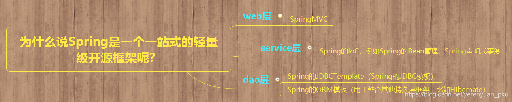
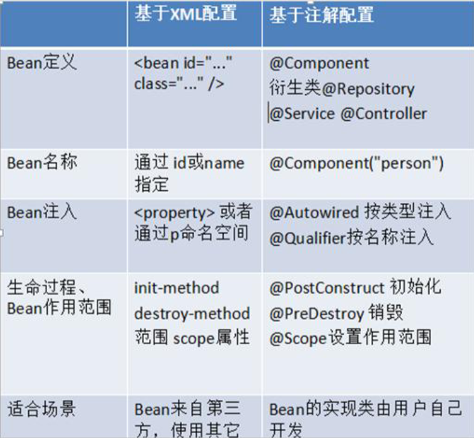

# Spring

> [Spring面试题（2020最新版）_ThinkWon的博客-CSDN博客_spring](https://blog.csdn.net/ThinkWon/article/details/104397516?ops_request_misc=%7B%22request%5Fid%22%3A%22162164889316780366516419%22%2C%22scm%22%3A%2220140713.130102334.pc%5Fall.%22%7D&request_id=162164889316780366516419&biz_id=0&utm_medium=distribute.pc_search_result.none-task-blog-2~all~first_rank_v2~hot_rank-5-104397516.first_rank_v2_pc_rank_v29&utm_term=spring&spm=1018.2226.3001.4187)
>
> [Spring框架总结【无比详细】_zp的博客-CSDN博客_spring框架](https://blog.csdn.net/itcats_cn/article/details/81479185?utm_medium=distribute.pc_relevant.none-task-blog-2~default~BlogCommendFromMachineLearnPai2~default-2.control&depth_1-utm_source=distribute.pc_relevant.none-task-blog-2~default~BlogCommendFromMachineLearnPai2~default-2.control)
>
> [Spring入门第一讲——Spring框架的快速入门_李阿昀的博客-CSDN博客_spring入门](https://blog.csdn.net/yerenyuan_pku/article/details/69663685?ops_request_misc=%7B%22request%5Fid%22%3A%22162251036516780357276805%22%2C%22scm%22%3A%2220140713.130102334.pc%5Fnavwordall.%22%7D&request_id=162251036516780357276805&biz_id=0&utm_medium=distribute.pc_search_result.none-task-blog-2~navwordall~first_rank_v2~hot_rank-14-69663685.first_rank_v2_pc_rank_v29&utm_term=spring&spm=1018.2226.3001.4187)



## 1. IOC (Inversion Of Control)

### 1.1 概念

#### 1.1.1 IOC (控制反转)

即控制权的转移，将我们创建对象的方式反转了，以前对象的创建是由我们开发人员自己维护，包括依赖关系也是自己注入。使用了spring之后，对象的创建以及依赖关系可以由spring完成创建以及注入，**反转控制就是反转了对象的创建方式，从我们自己创建反转给了程序创建(spring)**

#### 1.1.2 DI 依赖注入

Dependency Injection：spring这个容器中，管理着一系列的类，当你需要的时候可以从容器中取（前提是要注入依赖）

**作用：**降低程序耦合

**IOC底层实现：**工厂设计模式+反射+XML配置文件

> * 解决程序耦合：工厂模式 + 反射 + 配置文件
>   * 对象存在哪：Map结构，便于查找，此Map即为**容器** 唯一标识 = 全限定类名
>   * 怎么创建对象：工厂模式 + 反射（读取配置文件中配置的内容，反射创建对象）

### 1.2 环境配置

#### 1.2.1 基于 xml

1. pom.xml 导入依赖

   ```xml
   <dependency>
       <groupId>org.springframework</groupId>
       <artifactId>spring-context</artifactId>
       <version>5.0.2.RELEASE</version>
   </dependency>
   ```

2. bean.xml 添加约束

   ```xml
   <?xml version="1.0" encoding="UTF-8"?>
   <beans xmlns="http://www.springframework.org/schema/beans"
          xmlns:xsi="http://www.w3.org/2001/XMLSchema-instance"
          xsi:schemaLocation="http://www.springframework.org/schema/beans
                              https://www.springframework.org/schema/beans/spring-beans.xsd">
   ```

3. 使用工厂类创建并获取容器 （读取bean.xml）

   ```java
   //1.使用 ApplicationContext 接口，就是在获取 spring 容器
   ApplicationContext ac = new ClassPathXmlApplicationContext("bean.xml"); 
   //2.根据 bean 的 id 获取对象 
   AccountService aService = (AccountService) ac.getBean("accountService"); 
   System.out.println(aService);
   
   AccountDao aDao = ac.getBean("accountDao", AccountDao.class);
   System.out.println(aDao);
   ```

#### 1.2.2 基于注解

1. pom.xml 导入依赖（同上）

2. bean.xml 添加约束（需要多导入一个 context 名称空间下的约束）

   ```xml
   <?xml version="1.0" encoding="UTF-8"?> 
   <beans xmlns="http://www.springframework.org/schema/beans"
          xmlns:context="http://www.springframework.org/schema/context" 
          xmlns:xsi="http://www.w3.org/2001/XMLSchema-instance"
          xsi:schemaLocation="http://www.springframework.org/schema/beans
                              http://www.springframework.org/schema/beans/spring-beans.xsd
                              http://www.springframework.org/schema/context
                              http://www.springframework.org/schema/context/spring-context.xsd">
   ```

3. 告知 spring 创建容器时要扫描的包（bean.xml）

   ```xml
   <context:component-scan base-package="com.hasim"></context:component-scan>
   ```

4. 使用工厂类创建并获取容器 （同上）

#### 1.2.3 基于纯注解

> 在基于注解的基础上，使用配置类代替 bean.xml 配置文件

1. pom.xml 导入依赖（同上）
2. 编写配置类
3. 使用工厂类创建并获取容器

**注解说明：**

1. 配置类 @Configuration

   * 作用：

     * 用于指定当前类是一个 spring 配置类（**相当于 bean.xml 文件**），当创建容器时会从该类上加载注解

     * 获取容器时需要使用 AnnotationConfigApplicationContext( 有@Configuration 注解的类.class )

       ```java
       ApplicationContext ac = new AnnotationConfigApplicationContext(SpringConfiguration.class);
       ```

   * 属性：

     * value: 用于指定配置类的字节码

     ```java
     @Configuration 
     public class SpringConfiguration {
     }
     ```

2. 扫描包 @ComponentScan

   * 作用：

     * 用于指定 spring 在初始化容器时要**扫描的包**
     * 作用和在 spring 的 xml 配置文件中的：<context:component-scan base-package="com.itheima"/>是一样的

   * 属性：

     * basePackages：用于指定要扫描的包。和该注解中的 value 属性作用一样

     ```java
     @Configuration 
     @ComponentScan("com.itheima") 
     public class SpringConfiguration {
     }
     ```

3. @Bean (对于外部jar包中的类)

   * 作用： 

     * 该注解只能写在**方法**上，表明使用此方法创建一个对象，并且放入 spring 容器

   * 属性：

     * name：给当前 @Bean 注解方法创建的对象指定一个名称 (即 bean 的 id）

     ```java
     @Bean(name="dataSource") 
     public DataSource createDataSource() { 
         try {
             ComboPooledDataSource ds = new ComboPooledDataSource(); 
             ds.setUser("root"); 
             ds.setPassword("1234"); 
             ds.setDriverClass("com.mysql.jdbc.Driver"); 
             ds.setJdbcUrl("jdbc:mysql:///spring_day02"); 
             return ds;
         } catch (Exception e) { 
             throw new RuntimeException(e);
         }
     }
     ```

4. @PropertySource

   * 作用：

     * 用于加载 .properties 文件中的配置。例如我们配置数据源时，可以把连接数据库的信息写到 properties 配置文件中，就可以使用此注解指定properties 配置文件的位置

   * 属性：

     * value[]：用于指定 properties 文件位置。如果是在类路径下，需要写上 classpath:

       ```java
       @Value("${jdbc.driver}") 
       private String driver; 
       @Value("${jdbc.url}") 
       private String url;
       ```

     ```properties
     jdbc.driver=com.mysql.jdbc.Driver 
     jdbc.url=jdbc:mysql://localhost:3306/day44_ee247_spring
     ```

5. @Import

   * 作用：

     * 用于导入其他配置类，在引入其他配置类时，可以不用再写@Configuration 注解。当然，写上也没问题。 

   * 属性：

     * value[]：用于指定其他配置类的字节码。

     ```java
     @Configuration 
     @ComponentScan(basePackages = "com.itheima.spring") 
     @Import(JdbcConfig.class) 
     public class SpringConfiguration { 
     }
     
     @Configuration 
     @PropertySource("classpath:jdbc.properties") 
     public class JdbcConfig{
     }
     ```

#### 1.2.4 工厂类说明

**BeanFactory 和 ApplicationContext 的区别**

1. **BeanFactory接口**
   * Spring的顶层接口，针对原始接口的实现类功能较为单一
   * 每次在获取对象时才会创建对象
2. **ApplicationContext接口**
   * 提供了更多功能
   * 每次容器启动时就会创建容器中配置的所有对象
   * 实现类：
     1. **ClassPathXmlApplicationContext**：从类的根路径下加载配置文件
     2. FileSystemXmlApplicationContext：从磁盘路径上加载配置文件，配置文件可以在磁盘的任意位置
     3. AnnotationConfigApplicationContext：使用注解配置容器对象时，需要使用此类来创建 spring 容器。用来读取注解

### 1.3 使用

#### 1.3.1 基于 xml

##### 1. &lt;bean>标签

1. 作用：
   * 用于配置对象让 spring 来创建
   * 默认情况下它调用的是类中的无参构造函数。如果没有无参构造函数则不能创建成功
2. 属性：
   * id：给对象在容器中提供一个唯一标识。用于获取对象
   * class：指定类的全限定类名。用于反射创建对象。默认情况下调用无参构造函数
   * scope：指定对象的作用范围
     * **singleton：默认值，单例的**
     * **prototype：多例的**
     * reques：WEB 项目中，Spring 创建一个 Bean 的对象，将对象存入到 request 域中
     * session：WEB 项目中，Spring 创建一个 Bean 的对象，将对象存入到 session 域中
     * global session：WEB 项目中，应用在 Portlet 环境.如果没有 Portlet 环境那么 globalSession 相当于 session
   * init-method：指定类中的初始化方法名称
   * destroy-method：指定类中销毁方法名称
3. bean的作用范围和生命周期（scope 属性）：
   * 单例对象：scope="singleton" 
     * 一个应用只有一个对象的实例。它的作用范围就是整个引用
     * 生命周期：
       * 对象出生：当应用加载，创建容器时，对象就被创建了
       * 对象活着：只要容器在，对象一直活着
       * 对象死亡：当应用卸载，销毁容器时，对象就被销毁了
   * 多例对象：scope="prototype"
     * 每次访问对象时，都会重新创建对象实例
     * 生命周期：
       * 对象出生：当使用对象时，创建新的对象实例
       * 对象活着：只要对象在使用中，就一直活着
       * 对象死亡：当对象长时间不用时，被 java 的垃圾回收器回收了（Spring不对该Bean的整个生命周期负责。Bean创建后交由调用者负责销毁对象回收资源）

##### 2. 实例化bean（三种方式）

1. **空参构造函数（默认方式）**

   ```xml
   <bean id="accountService" class="com.itheima.service.impl.AccountServiceImpl"/>
   ```

2. 静态工厂创建（调用静态方法创建）

   属性：

   * id 属性：指定 bean 的 id，用于从容器中获取
   * class 属性：指定静态工厂的全限定类名
   * factory-method 属性：指定生产对象的静态方法

   ```xml
   <bean id="accountService" class="com.itheima.factory.StaticFactory" factory-method="createAccountService"></bean>
   ```

   ```java
   public class StaticFactory { 
       public static IAccountService createAccountService() { 
           return new AccountServiceImpl();
       }
   }
   ```

3. 实例工厂创建（调用非静态方法创建）

   > 需要配置两个bean，因为无法通过类名调用非静态方法

   属性：

   * factory-bean 属性：用于指定实例工厂 bean 的 id
   * factory-method 属性：用于指定实例工厂中创建对象的方法

   ```xml
   <bean id="instancFactory" class="com.itheima.factory.InstanceFactory"></bean>
   <bean id="accountService" factory-bean="instancFactory" factory-method="createAccountService"></bean>
   ```

   ```java
   public class InstanceFactory { 
       public IAccountService createAccountService() { 
           return new AccountServiceImpl();
       }
   }
   ```

##### 3. 依赖注入 4种（对象赋值）

1. **set 方法注入**

   * 前提：提供 set 方法

   * 标签：
     * **property**

   * 属性：
     * 给谁赋值
       * name：属性名
     * 赋什么值
       * ref：给属性赋值其他 bean 类型（值为 bean 的 id）
       * value：给属性赋值基本数据类型或 string 类型

   ```xml
   <bean id="accountService" class="com.itheima.service.impl.AccountServiceImpl"> 
       <property name="name" value="test"></property> 
       <property name="age" value="21"></property> 
       <property name="birthday" ref="now"></property>
   </bean>
   <bean id="now" class="java.util.Date"></bean>
   ```

2. 构造方法注入

   * 前提：提供有参构造方法

   * 标签：
     * **constructor-arg**

   * 属性：
     * 给谁赋值
       * **name**：指定参数在构造函数中的名称
       * index：指定参数在构造函数参数列表的索引位置 
       * type：指定参数在构造函数中的数据类型
     * 赋什么值
       * ref：给属性赋值其他 bean 类型（值为 bean 的 id）
       * value：给属性赋值基本数据类型或 string 类型

   ```xml
   <bean id="accountService" class="com.itheima.service.impl.AccountServiceImpl"> 
       <constructor-arg name="name" value="张三"></constructor-arg> 
       <constructor-arg name="age" value="18"></constructor-arg> 
       <constructor-arg name="birthday" ref="now"></constructor-arg>
   </bean>
   <bean id="now" class="java.util.Date"></bean>
   ```

3. p名称空间注入（本质还是set）

   * 前提：提供 set 方法 及添加约束 `xmlns:p="http://www.springframework.org/schema/p"`

   * 标签：
     * **p:propertyName**

   ```xml
   <bean id="accountService" class="com.itheima.service.impl.AccountServiceImpl4" 
         p:name="test" p:age="21" p:birthday-ref="now"/>
   <bean id="now" class="java.util.Date"></bean>
   ```

4. 注入集合类型

   * 集合结构：
     * List 结构：array, list, set
     * Map 结构：map, entry, props, prop

   * 标签：**property**
   * 在注入集合数据时，只要结构相同，标签可以互换

   ```xml
   <bean id="accountService" class="com.itheima.service.impl.AccountServiceImpl"> 
       <!-- 给数组注入数据 --> 
       <property name="myStrs">
           <array> 
               <value>AAA</value> 
               <value>BBB</value> 
               <value>CCC</value>
           </array>
       </property> 
       <!-- 注入 list 集合数据 -->
       <property name="myList"> 
           <list> 
               <value>AAA</value> 
               <value>BBB</value> 
               <value>CCC</value>
           </list>
       </property> 
       <!-- 注入 set 集合数据 --> 
       <property name="mySet"> 
           <set>
               <value>AAA</value> 
               <value>BBB</value> 
               <value>CCC</value>
           </set>
       </property> 
       <!-- 注入 Map 数据 -->
       <property name="myMap">
           <map> 
               <entry key="testA" value="aaa"></entry> 
               <entry key="testB"> 
                   <value>bbb</value>
               </entry> 
           </map> 
       </property>
       <!-- 注入 properties 数据 -->
       <property name="myProps"> 
           <props>
               <prop key="testA">aaa</prop>
               <prop key="testB">bbb</prop>
           </props>
       </property>
   </bean>
   ```

#### 1.3.2 基于注解

##### 1. **用于创建对象**

> 相当于：<bean id="" class="">

1. **@Component**
   * 作用：把资源让 spring 来管理。相当于在 xml 中配置一个 bean
   * 属性：
     * value：指定 bean 的 id。如果不指定 value 属性，默认 bean 的 id 是当前类的类名。首字母小写
2. **@Controller @Service @Repository**
   * 三个注解都是针对 @Component 的衍生注解，作用及属性都是一模一样的，提供了更加明确的语义化
     * @Controller：一般用于表现层的注解
     * @Service：一般用于业务层的注解
     * @Repository：一般用于持久层的注解

##### **2. 用于依赖注入**

> 相当于：<property name="" ref=""> 或 <property name="" value="">
1. **@Autowired**

   * 作用：自动按照类型注入
     * **当使用注解注入属性时，set方法可以省略**
     * 它只能注入其他**bean类型**
     * 当有多个类型匹配时，使用要注入的对象变量名称作为 bean 的 id，在 spring 容器查找，找到了也可以注入成功。找不到就报错

2. @Qualifier

   * 作用：在自动按照类型注入的基础之上，再按照 Bean 的 id 注入
     * **给字段注入**时**不能独立使用**，必须和 @Autowired 一起使用
     * 给方法参数注入时，可以独立使用
   * 属性：
     * value：指定 bean 的 id

3. @Resource

   * 作用：直接按照 Bean 的 id 注入。**只能注入其他 bean 类型**
   * 属性：name：指定 bean 的 id

4. @Value

   * 作用：注入基本数据类型和 String 类型数据的（直接 @Value("val")）

   * 属性：value：用于指定值

     > [@Value("#{}")与@Value("${}")的区别_chuang504321176的博客-CSDN博客_@value](https://blog.csdn.net/chuang504321176/article/details/80672740?utm_medium=distribute.pc_relevant.none-task-blog-2~default~BlogCommendFromMachineLearnPai2~default-3.control&depth_1-utm_source=distribute.pc_relevant.none-task-blog-2~default~BlogCommendFromMachineLearnPai2~default-3.control)
     >
     > 1. @Value(“#{}”)
     >    * 表示SpEl表达式，通常用来获取bean的属性，或者调用bean的某个方法
     >    * 表示常量
     > 2. @Value(“${}”)
     >    * 获取对应属性文件中定义的属性值

##### **3. 用于改变作用范围**

> 相当于：<bean id="" class="" scope="">

* @Scope
  * 作用：指定 bean 的作用范围
  * 属性：
    * value：指定范围的值
    * 取值：singleton prototype request session globalsession

##### **4. 和生命周期相关的 (了解)**

> 相当于：<bean id="" class="" init-method="" destroy-method="" />

1. @PostConstruct          用于指定初始化方法
2. @PreDestroy               用于指定销毁方法



### 1.4 案例

```xml
<?xml version="1.0" encoding="UTF-8"?>
<beans xmlns="http://www.springframework.org/schema/beans"
       xmlns:xsi="http://www.w3.org/2001/XMLSchema-instance"
       xsi:schemaLocation="http://www.springframework.org/schema/beans
        https://www.springframework.org/schema/beans/spring-beans.xsd">
    <!-- 配置Service -->
    <bean id="accountService" class="com.hasim.service.impl.AccountServiceImpl">
        <!-- 注入 Dao -->
        <property name="accountDao" ref="accountDao"></property>
    </bean>
    <!-- 配置 Dao -->
    <bean id="accountDao" class="com.hasim.dao.impl.AccountDaoImpl">
        <!-- 注入 QueryRunner -->
        <property name="runner" ref="queryRunner"></property>
    </bean>
    <!-- 配置 queryRunner -->
    <bean id="queryRunner" class="org.apache.commons.dbutils.QueryRunner" scope="prototype">
        <!-- 注入数据源 -->
        <constructor-arg name="ds" ref="dataSource"></constructor-arg>
    </bean>
    <!-- 配置数据源 -->
    <bean id="dataSource" class="com.mchange.v2.c3p0.ComboPooledDataSource">
        <!-- 连接数据库必备信息 -->
        <property name="driverClass" value="com.mysql.cj.jdbc.Driver"></property>
        <property name="jdbcUrl" value="jdbc:mysql://localhost:3306/spring?serverTimezone=GMT"></property>
        <property name="user" value="root"></property>
        <property name="password" value="980528"></property>
    </bean>
</beans>
```

## 2. AOP (Aspect Oriented Programming)

### 2.1 概念

#### 2.1.1 AOP

面向切面编程：把程序重复的代码抽取出来，在需要执行的时候，使用**动态代理**的技术，在不修改源码的基础上，对我们的**已有方法进行增强**

#### 2.1.2 AOP相关术语

1. Joinpoint (连接点)：所谓连接点是指那些被拦截到的点。在 spring 中,这些点指的是方法,因为 spring 只支持方法类型的连接点
2. Pointcut (切入点)：所谓切入点是指我们要对哪些 Joinpoint 进行拦截的定义（即被拦截的连接点）
3. Advice (通知/增强)：所谓通知是指拦截到 Joinpoint 之后所要做的事情就是通知
   * 通知的类型：前置通知，后置通知，异常通知，最终通知，环绕通知
4. Introduction (引介)：引介是一种特殊的通知在不修改类代码的前提下, Introduction 可以在运行期为类动态地添加一些方
   法或 Field
5. Target (目标对象)：代理的目标对象
6. Weaving (织入)：是指把增强应用到目标对象来创建新的代理对象的过程。 spring 采用动态代理织入，而 AspectJ 采用编译期织入和类装载期织入
7. Proxy (代理)：一个类被 AOP 织入增强后，就产生一个结果代理类
8. Aspect (切面)：是切入点和通知（引介）的结合

### 2.2 环境配置

#### 2.2.1 基于 xml

1. pom.xml 导入依赖（同IOC）

   ```xml
   <dependency>
       <groupId>org.springframework</groupId>
       <artifactId>spring-context</artifactId>
       <version>5.0.2.RELEASE</version>
   </dependency>
   ```

2. bean.xml 添加约束（导入 aop 的约束）

   ```xml
   <?xml version="1.0" encoding="UTF-8"?>
   <beans xmlns="http://www.springframework.org/schema/beans" 
          xmlns:xsi="http://www.w3.org/2001/XMLSchema-instance" 
          xmlns:aop="http://www.springframework.org/schema/aop"
          xsi:schemaLocation="http://www.springframework.org/schema/beans
                              http://www.springframework.org/schema/beans/spring-beans.xsd
                              http://www.springframework.org/schema/aop
                              http://www.springframework.org/schema/aop/spring-aop.xsd">
   ```

3. 使用工厂类创建并获取容器 （同IOC）

   ```java
   //1.使用 ApplicationContext 接口，就是在获取 spring 容器
   ApplicationContext ac = new ClassPathXmlApplicationContext("bean.xml"); 
   //2.根据 bean 的 id 获取对象 
   AccountService aService = (AccountService) ac.getBean("accountService"); 
   System.out.println(aService);
   
   AccountDao aDao = ac.getBean("accountDao", AccountDao.class);
   System.out.println(aDao);
   ```

#### 2.2.2 基于注解

1. pom.xml 导入依赖（同上）

2. bean.xml 添加约束（导入 aop 的约束和 context 的名称空间，注解要context）

   ```xml
   <?xml version="1.0" encoding="UTF-8"?>
   <beans xmlns="http://www.springframework.org/schema/beans" 
          xmlns:aop="http://www.springframework.org/schema/aop"
          xmlns:context="http://www.springframework.org/schema/context" 
          xmlns:xsi="http://www.w3.org/2001/XMLSchema-instance"
          xsi:schemaLocation="http://www.springframework.org/schema/beans
                              http://www.springframework.org/schema/beans/spring-beans.xsd
                              http://www.springframework.org/schema/aop
                              http://www.springframework.org/schema/aop/spring-aop.xsd
                              http://www.springframework.org/schema/context
                              http://www.springframework.org/schema/context/spring-context.xsd">
   ```

3. 开启对注解AOP的支持

   ```xml
   <aop:aspectj-autoproxy/>
   ```

4. 使用工厂类创建并获取容器 （同上）

### 2.3 使用

#### 2.3.1 基于 xml

1. 抽取公共代码制作成通知类（TransactionManager）

2. 配置通知类（bean.xml）

   ```xml
   <bean id="txManager" class="com.hasim.utils.TransactionManager"> 
       <property name="dbAssit" ref="dbAssit"></property>
   </bean>
   ```

3. 声明 aop 配置（bean.xml）

   ```xml
   <!-- 声明开始 aop 的配置 -->
   <aop:config>
       <!-- 配置切入点表达式，指定对哪些类的哪些方法进行增强 -->
       <aop:pointcut id="pt1" expression="execution(* com.hasim.service.impl.AccountServiceImpl.*(..))"/>
       
       <!-- 配置切面 -->
       <!-- 
   		属性：
   			id：给切面提供一个唯一标识
   			ref：引用通知类
   	-->
       <aop:aspect id="logAdvice" ref="logger">
           <!-- 配置通知类型和切入点 -->
           <!-- method：指定通知中方法的名称
   			 pointct：定义切入点表达式
   			 pointcut-ref：指定切入点表达式的引用 -->
           <!-- 前置通知 -->
           <aop:before method="beforePrintLog" pointcut-ref="pt1"></aop:before>
           <!-- 后置通知 -->
           <aop:after-returning method="afterReturningPrintLog" pointcut-ref="pt1"></aop:after-returning>
           <!-- 异常通知 -->
           <aop:after-throwing method="afterThrowingPrintLog" pointcut-ref="pt1"></aop:after-throwing>
           <!-- 最终通知 -->
           <aop:after method="afterPrintLog" pointcut-ref="pt1"></aop:after>
           <!-- 配置环绕通知 pjp 配置后具体代码看文档 -->
           <aop:around method="aroundPrintLog" pointcut-ref="pt1"></aop:around>
       </aop:aspect>
   </aop:config>
   ```

#### 2.3.2 基于注解

1. 配置IOC（资源加注解，xml 配置扫描包）

2. 配置通知类

   * 加容器注解 @Component
   * @Aspect 注解声明为切面

3. 在增强方法上配置通知

   * @Before 前置
   * @AfterReturning 后置
   * @AfterThrowing 异常
   * @After 最终
   * @Around 环绕

4. 切入点表达式 @Pointcut

   ```java
   @Pointcut("execution(* com.itheima.service.impl.*.*(..))")
   private void pt1() {}
   
   // 引用
   @Around("pt1()")//注意：千万别忘了写括号
   ```

## 3. JdbcTemplate

> Spring中提供了一个可以操作数据库的对象，对象封装了jdbc技术——JDBCTemplate JDBC模板对象，而JdbcDaoSupport则对JdbcTemplate进行了封装，所以要操作JdbcTemplate，只需要继承JdbcDaoSupport即可

### 3.1 xml 配置文件中引入外部属性（配置）文件

#### 方式一

```xml
<bean class="org.springframework.beans.factory.config.PropertyPlaceholderConfigurer">
    <property name="location" value="classpath:jdbc.properties"/>
</bean>
```

#### 方式二

```xml
<context:property-placeholder location="classpath:jdbc.properties"/>
```

### 3.2 基本使用

```java
// 增
jdbcTemplate.update("insert into account(name,money) values(?,?)", "fff", 5000);
// 删
jdbcTemplate.update("delete from account where id = ?", 6);
// 改
jdbcTemplate.update("update account set money = ? where id = ?",300,6);
// 查询所有
List<Account> accounts = jdbcTemplate.query("select * from account where money > ? ", new AccountRowMapper(), 500);
for(Account o : accounts){ 
    System.out.println(o);
}
//查询一个 
List<Account> as = jdbcTemplate.query("select * from account where id = ? ", new AccountRowMapper(), 55);
System.out.println(as.isEmpty() ? "没有结果" : as.get(0));
//查询返回一行一列：使用聚合函数，在不使用 group by 字句时，都是返回一行一列。最长用的就是分页中获取总记录条数 
Integer total = jdbcTemplate.queryForObject("select count(*) from account where money > ?", Integer.class, 500);

public class AccountRowMapper implements RowMapper<Account>{ 
    @Override 
    public Account mapRow(ResultSet rs, int rowNum) throws SQLException { 
        Account account = new Account(); 
        account.setId(rs.getInt("id")); 
        account.setName(rs.getString("name")); 
        account.setMoney(rs.getFloat("money")); 
        return account;
    }
}
```

### 3.3 dao 中使用

#### 方式一

* 在 dao 实现类中引入成员变量 jdbcTemplate
* 在 Dao 类中定义 JdbcTemplate的方式，适用于所有配置方式（xml和注解都可以）

#### 方式二

* dao 实现类继承 JdbcDaoSupport，并注入数据源，后直接用 getJdbcTemplate() 获取模板对象
* 让 Dao 继承 JdbcDaoSupport 的方式，只能用于基于 XML的方式，注解用不了

## 4. 事务控制

## 5. Spring 整合 Junit

1. 添加 spring-test 依赖

   在原有的基础上添加（pom.xml）

   ```xml
   <dependency>
       <groupId>org.springframework</groupId>
       <artifactId>spring-test</artifactId>
       <version>5.0.2.RELEASE</version>
   </dependency>
   ```

2. 使用@RunWith 注解替换原有运行器

   ```java
   @RunWith(SpringJUnit4ClassRunner.class) 
   public class AccountServiceTest {
   }
   ```

3. 使用@ContextConfiguration 指定 spring 配置文件的位置

   ```java
   @RunWith(SpringJUnit4ClassRunner.class)
   @ContextConfiguration(locations= {"classpath:bean.xml"}) 
   public class AccountServiceTest {
   }
   /*
   @ContextConfiguration 注解： 
   	locations 属性：用于指定配置文件的位置。如果是类路径下，需要用 classpath:表明
   	classes 属性：用于指定注解的类。当不使用 xml 配置时，需要用此属性指定注解类的位置
   */
   ```

4. 使用@Autowired 给测试类中的变量注入数据

   ```java
   @RunWith(SpringJUnit4ClassRunner.class) 
   @ContextConfiguration(locations= {"classpath:bean.xml"}) 
   public class AccountServiceTest {
       @Autowired 
       private IAccountService as;
   }
   ```

## 6. 动态代理

> 代理模式：用于增强现有方法
>
> 动态代理特点：字节码随用随创建，随用随加载。它与静态代理的区别也在于此。因为静态代理是字节码一上来就创建好，并完成加载。装饰者模式就是静态代理的一种体现

### 6.1 基于接口的动态代理

* 提供者：JDK 官方的 Proxy 类

* 要求：被代理类最少实现一个接口

* 案例


```java
/** 代理类接口 **/
public interface Actor {
    
    void basicAct(float money);

    void dangerAct(float money);
}
```

```java
/** 代理类接口实现类 **/
public class ActorImpl implements Actor {
    public void basicAct(float money) {
        System.out.println("拿到钱，开始基本的表演："+money);
    }

    public void dangerAct(float money) {
        System.out.println("拿到钱，开始危险的表演："+money);
    }
}
```

```java
/** 基于接口的动态代理实现 **/
import java.lang.reflect.InvocationHandler;
import java.lang.reflect.Method;
import java.lang.reflect.Proxy;

public class Client {
    public static void main(String[] args) {
        // 被代理对象需用 final 修饰
        final Actor actor = new ActorImpl();

        /**
         * 获取代理对象
         * 要求：被代理类至少实现一个接口
         * 创建方式：Proxy.newProxyInstance( 3个参数 )
         * 参数含义：
         *      ClassLoader：和被代理对象使用相同的类加载器
         *      Interfaces：和被代理对象具有相同的行为。实现相同的接口
         *      InvocationHandler：如何代理
         */
        Actor proxyActor = (Actor) Proxy.newProxyInstance(actor.getClass().getClassLoader(), actor.getClass().getInterfaces(), new InvocationHandler() {
            /**
             * 执行被代理对象的任何方法，都会经过该方法
             * 参数：
             *      proxy：代理对象的引用。不一定每次都用得到
             *      method：当前执行的方法对象
             *      args：执行方法所需的参数
             *      返回值：当前执行方法的返回值
             */
            public Object invoke(Object proxy, Method method, Object[] args) throws Throwable {
                String name = method.getName();
                Float money = (Float) args[0];
                Object rtValue = null;

                if ("basicAct".equals(name)) {
                    if (money > 2000) {
                        // method.invoke(被代理对象, 调用方法参数值)
                        rtValue = method.invoke(actor, money / 2);
                    }
                }
                if ("dangerAct".equals(name)) {
                    if (money > 5000) {
                        rtValue = method.invoke(actor, money / 2);
                    }
                }
                return rtValue;
            }
        });

        proxyActor.basicAct(3000);
        proxyActor.dangerAct(6000);
    }
}
```

### 6.2 基于子类的动态代理

* 提供者：第三方的 CGLib，如果报 asmxxxx 异常，需要导入 asm.jar
* 要求：被代理类不能用 final 修饰的类（最终类）

```java
/** 被代理类 **/
public class Actor {
    public void basicAct(float money) {
        System.out.println("拿到钱，开始基本的表演："+money);
    }

    public void dangerAct(float money) {
        System.out.println("拿到钱，开始危险的表演："+money);
    }
}
```

```java
/** 基于子类的动态代理实现 **/
import org.springframework.cglib.proxy.Enhancer;
import org.springframework.cglib.proxy.MethodInterceptor;
import org.springframework.cglib.proxy.MethodProxy;

import java.lang.reflect.Method;

public class Client {
    public static void main(String[] args) {
        // 被代理对象需用 final 修饰
        final Actor actor = new Actor();

        /**
         * 基于子类的动态代理
         * 要求：被代理对象不能是最终类
         * 创建方式：Enhancer.create( 2个参数 )
         * 参数含义：
         *      Class：被代理对象的字节码
         *      Callback：如何代理
         */
        Actor proxyActor = (Actor) Enhancer.create(actor.getClass(), new MethodInterceptor() {
            /**
             * 执行被代理对象的任何方法，都会经过该方法
             * 参数：
             *      o：代理对象的引用。不一定每次都用得到
             *      method：当前执行的方法对象
             *      objects：执行方法所需的参数
             *      MethodProxy：当前执行方法的代理对象
             *      返回值：当前执行方法的返回值
             */
            public Object intercept(Object o, Method method, Object[] objects, MethodProxy methodProxy) throws Throwable {
                String name = method.getName();
                Float money = (Float) objects[0];
                Object rtValue = null;

                if ("basicAct".equals(name)) {
                    if(money > 2000){
                        // method.invoke(被代理对象, 调用方法参数值)
                        rtValue = method.invoke(actor, money/2);
                    }
                }
                if ("dangerAct".equals(name)) {
                    if(money > 5000){
                        rtValue = method.invoke(actor, money/2);
                    }
                }
                return rtValue;
            }
        });

        proxyActor.basicAct(3000);
        proxyActor.dangerAct(6000);
    }
}
```


