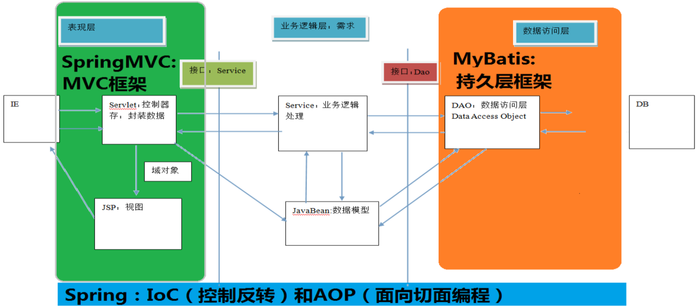

# SpringMVC

> [SpringMVC常见面试题总结（超详细回答）_张维鹏的博客-CSDN博客_springmvc面试题](https://blog.csdn.net/a745233700/article/details/80963758?ops_request_misc=%7B%22request%5Fid%22%3A%22162169022216780264074092%22%2C%22scm%22%3A%2220140713.130102334.pc%5Fall.%22%7D&request_id=162169022216780264074092&biz_id=0&utm_medium=distribute.pc_search_result.none-task-blog-2~all~first_rank_v2~hot_rank-1-80963758.first_rank_v2_pc_rank_v29&utm_term=springmvc&spm=1018.2226.3001.4187)

## 1. 三层架构和MVC

### 1.1 三层架构

B/S架构中，系统标准的三层架构包括：表现层、业务层、持久层

1. **表现层**（web层）： 
   * 负责接收客户端请求，向客户端响应结果（通常客户端使用http协议请求 web 层，web 需要接收 http 请求，完成 http 响应）
   * 表现层包括展示层和控制层：控制层负责接收请求，展示层负责结果的展示
   * 表现层依赖业务层，接收到客户端请求一般会调用业务层进行业务处理，并将处理结果响应给客户端
   * 表现层的设计一般都使用 MVC 模型。（**MVC 是表现层的设计模型**，和其他层没有关系）
2. 业务层（service 层）： 
   * 负责业务逻辑处理，和我们开发项目的需求息息相关
   * web 层依赖业务层，但是业务层不依赖 web 层
   * 业务层在业务处理时可能会依赖持久层，如果要对数据持久化需要保证事务一致性（也就是我们说的，**事务应该放到业务层来控制**） 
3. 持久层（dao 层）：
   * 负责数据持久化，包括 数据层即数据库 和 数据访问层，数据库是对数据进行持久化的载体，数据访问层是业务层和持久层交互的接口，业务层需要通过数据访问层将数据持久化到数据库中。通俗的讲，持久层就是和数据库交互，对数据库表进行曾删改查的

### 1.2 MVC

> MVC 全名是 Model View Controller，是模型(model)－视图(view)－控制器(controller)的缩写， 是一种用于设计 Web 应用程序表现层的模式

1. Model（模型）：通常指的是数据模型。一般用于封装数据

2. View（视图）：通常指的是 jsp 或者 html。一般用于展示数据，通常视图依据模型数据创建

3. Controller（控制器）： 是应用程序中处理用户交互的部分。作用一般是处理程序逻辑

   > 例子：
   >
   > * 我们要保存一个用户的信息，该用户信息中包含了姓名，性别，年龄等等
   > * 这时候表单输入要求年龄必须是 1~100 之间的整数。姓名和性别不能为空。并且把数据填充到模型之中
   > * 此时除了 js 的校验之外，服务器端也应该有数据准确性的校验，那么校验就是控制器的该做的
   > * 当校验失败后，由控制器负责把错误页面展示给使用者
   > * 如果校验成功，也是控制器负责把数据填充到模型，并且调用业务层实现完整的业务需求

## 2. SpringMVC



### 2.1 案例

1. 添加依赖（pom.xml）

2. 配置核心控制器（Servlet  web.xml）

   [web.xml中的contextConfigLocation在spring中的作用_zhangliao613的专栏-CSDN博客_contextconfiglocation](https://blog.csdn.net/zhangliao613/article/details/6289114?utm_medium=distribute.pc_relevant.none-task-blog-2~default~BlogCommendFromMachineLearnPai2~default-1.control&depth_1-utm_source=distribute.pc_relevant.none-task-blog-2~default~BlogCommendFromMachineLearnPai2~default-1.control)

3. 配置springmvc.xml

4. 编写控制器并使用注解配置

```xml
1. 添加依赖 pom.xml
<!-- 版本锁定 --> 
<properties> 
    <spring.version>5.0.2.RELEASE</spring.version>
</properties>
<!-- SpringMVC 所需依赖 --> 
<dependencies>
    <dependency>
        <groupId>org.springframework</groupId>
        <artifactId>spring-context</artifactId>
        <version>${spring.version}</version>
    </dependency>
    
    <dependency>
        <groupId>org.springframework</groupId>
        <artifactId>spring-web</artifactId>
        <version>${spring.version}</version>
    </dependency>
    <dependency>
        <groupId>org.springframework</groupId>
        <artifactId>spring-webmvc</artifactId>
        <version>${spring.version}</version>
    </dependency>
    
    <dependency>
        <groupId>javax.servlet</groupId>
        <artifactId>servlet-api</artifactId>
        <version>2.5</version>
        <scope>provided</scope>
    </dependency>
    <dependency>
        <groupId>javax.servlet.jsp</groupId>
        <artifactId>jsp-api</artifactId>
        <version>2.0</version>
        <scope>provided</scope>
    </dependency>
</dependencies>
```

```xml
2. 配置核心控制器（Servlet） web.xml
<!-- 配置 spring mvc 的核心控制器 --> 
<servlet> 
    <servlet-name>SpringMVCDispatcherServlet</servlet-name> 
    <servlet-class>org.springframework.web.servlet.DispatcherServlet</servlet-class> 
    <!-- 配置初始化参数，用于读取 SpringMVC 的配置文件 --> 
    <init-param> 
        <param-name>contextConfigLocation</param-name> 
        <param-value>classpath:SpringMVC.xml</param-value>
    </init-param> 
    <!-- 配置 servlet 的对象的创建时间点：应用加载时创建。 取值只能是非 0 正整数，表示启动顺序 -->
    <!--
        <load-on-startup> 标记容器是否在启动时就加载这个servlet
        0或者大于0：表示容器在应用启动时就加载这个servlet   正数的值越小，启动该servlet的优先级越高
        负数时/没有指定：表示容器在该servlet被选择时才加载
    -->
    <load-on-startup>1</load-on-startup>
</servlet> 
<servlet-mapping> 
    <servlet-name>SpringMVCDispatcherServlet</servlet-name>
    <url-pattern>/</url-pattern>
</servlet-mapping>
```

```xml
3. 配置 springmvc.xml （spring中的bean.xml）
<?xml version="1.0" encoding="UTF-8"?> 
<beans xmlns="http://www.springframework.org/schema/beans" 
       xmlns:mvc="http://www.springframework.org/schema/mvc"
       xmlns:context="http://www.springframework.org/schema/context" 
       xmlns:xsi="http://www.w3.org/2001/XMLSchema-instance"
       xsi:schemaLocation="http://www.springframework.org/schema/beans
                           http://www.springframework.org/schema/beans/spring-beans.xsd
                           http://www.springframework.org/schema/mvc
                           http://www.springframework.org/schema/mvc/spring-mvc.xsd
                           http://www.springframework.org/schema/context
                           http://www.springframework.org/schema/context/spring-context.xsd">
    <!-- 配置创建 spring 容器要扫描的包 --> 
    <context:component-scan base-package="com.itheima"></context:component-scan>
    
    <!-- 配置视图解析器 --> 
    <bean class="org.springframework.web.servlet.view.InternalResourceViewResolver"> 
        <property name="prefix" value="/WEB-INF/pages/"></property> 
        <property name="suffix" value=".jsp"></property>
    </bean>
</beans>
```

```java
@Controller("helloController") 
public class HelloController {
    @RequestMapping("/hello") 
    public String sayHello() { 
        System.out.println("HelloController 的 sayHello 方法执行了。。。。"); 
        return "success";
    }
}
```

#### 1.1.1 &lt;mvc:annotation-driven&gt;说明

使用&lt;mvc:annotation-driven>自动加载 RequestMappingHandlerMapping（处理映射器）和 RequestMappingHandlerAdapter（处理适配器），可 用在 SpringMVC.xml 配置文件中使用&lt;mvc:annotation-driven>替代注解处理器和适配器的配置

等价于：

```xml
<!-- HandlerMapping --> 
<bean class="org.springframework.web.servlet.mvc.method.annotation.RequestMappingHandlerMapping"></bean> 
<bean class="org.springframework.web.servlet.handler.BeanNameUrlHandlerMapping"></bean> 
<!-- HandlerAdapter --> 
<bean class="org.springframework.web.servlet.mvc.method.annotation.RequestMappingHandlerAdapter"></bean> 
<bean class="org.springframework.web.servlet.mvc.HttpRequestHandlerAdapter"></bean> 
<bean class="org.springframework.web.servlet.mvc.SimpleControllerHandlerAdapter"></bean> 
<!-- HadnlerExceptionResolvers --> 
<bean class="org.springframework.web.servlet.mvc.method.annotation.ExceptionHandlerExceptionResolver"></bean> 
<bean class="org.springframework.web.servlet.mvc.annotation.ResponseStatusExceptionResolv er"></bean> 
<bean class="org.springframework.web.servlet.mvc.support.DefaultHandlerExceptionResolver"></bean>
```

### 2.2 SpringMVC 组件

**三大组件：处理器映射器、处理器适配器、视图解析器**

**1. DispatcherServlet：前端控制器**

用户请求到达前端控制器，它就相当于 mvc 模式中的 c，DispatcherServlet 是整个流程控制的中心，**由它调用其它组件处理用户的请求**，DispatcherServlet 的存在降低了组件之间的耦合性

**2. HandlerMapping：处理器映射器**

HandlerMapping 负责根据用户请求找到 Handler 即处理器（根据请求找方法），SpringMVC 提供了不同的映射器实现不同的映射方式，例如：配置文件方式，实现接口方式，注解方式等

**3. Handler：处理器**

开发中编写的具体业务控制器。由 DispatcherServlet 把用户请求转发到 Handler。由 Handler 对具体的用户请求进行处理

**4. HandlAdapter：处理器适配器**

通过 HandlerAdapter 对处理器进行执行，这是适配器模式的应用，通过扩展适配器可以对更多类型的处理器进行执行

**5. View Resolver：视图解析器**

View Resolver 负责将处理结果生成 View 视图，View Resolver 首先根据逻辑视图名解析成物理视图名，即具体的页面地址，再生成 View 视图对象，最后对 View 进行渲染将处理结果通过页面展示给用户

**6. View：视图**

SpringMVC 框架提供了很多的 View 视图类型的支持，包括：jstlView、freemarkerView、pdfView 等。我们最常用的视图就是 jsp。 一般情况下需要通过页面标签或页面模版技术将模型数据通过页面展示给用户，需要由程序员根据业务需求开发具体的页面

### 2.3 常用注解

1. @RequestMapping
   * 作用：用于建立请求 URL 和处理请求方法之间的对应关系
   * 位置：
     * 类上： 
       * 请求 URL 的第一级访问目录。此处不写的话，就相当于应用的根目录。写的话需要以/开头
       * 它出现的目的是为了使我们的 URL 可以按照模块化管理
     * 方法上：
       * 请求 URL 的第二级访问目录
   * 属性：
     * **value**：用于指定请求的 URL。它和 path 属性的作用是一样的
     * **method**：用于指定请求的方式（枚举类型，RequestMapping.GET 等）
     * params：用于指定限制请求参数的条件。它支持简单的表达式。要求请求参数的 key 和 value 必须和配置的**一模一样**
       * 例如：params = {"accountName"}，表示请求参数必须有 accountName 
       * params = {"moeny!100"}，表示请求参数中 money 不能是 100
     * headers：用于指定限制请求消息头的条件。 注意：
       以上四个属性只要出现 2 个或以上时，他们的关系是**与的关系**
2. 

### 2.4 请求参数的绑定(获取)

#### 2.4.1 绑定机制

自动将请求参数作为控制器中的方法参数传入

#### 2.4.2 支持的数据类型

1. 基本类型参数：包括基本类型和 String 类型 
2. POJO 类型参数：包括实体类，以及关联的实体类
3. 数组和集合类型参数：包括 List 结构和 Map 结构的集合（包括数组）

#### 2.4.3 使用要求

1. 基本类型或者 String类型： 要求参数名称必须和控制器中方法的形参名称保持一致 (严格区分大小写)

2. POJO类型，或者它的关联对象： 要求表单中参数名称和 POJO 类的属性名称保持一致。并且控制器方法的参数类型是 POJO 类型

   * 特殊情况（类中类）

     ```jsp
     <!-- 采用对象名.属性名，方法参数为原始pojo对象 -->
     uname:<input type="text" name="user.uname"><br/>
     ```

3. 如果是集合类型，有两种方式：

   * 第一种
     * 要求集合类型的请求参数必须在 POJO 中。在表单中请求参数名称要和 POJO 中集合属性名称相同

     * 给 List 集合中的元素赋值，使用下标

       ```jsp
       账户 1 名称：<input type="text" name="accounts[0].name" ><br/>
       ```

     * 给 Map 集合中的元素赋值，使用键值对

       ```jsp
       账户 3 名称：<input type="text" name="accountMap['one'].name" ><br/>
       ```

   * 第二种

     * 接收的请求参数是 json 格式数据。需要借助一个注解实现

### 2.5 请求参数乱码问题

#### 2.5.1 post 请求方式

在 web.xml 中配置一个过滤器

```xml
<!-- 配置 springMVC 编码过滤器 --> 
<filter> 
    <filter-name>CharacterEncodingFilter</filter-name> 
    <filter-class>org.springframework.web.filter.CharacterEncodingFilter</filter-class>
    <!-- 设置过滤器中的属性值 --> 
    <init-param> 
        <param-name>encoding</param-name> 
        <param-value>UTF-8</param-value>
    </init-param> 
    <!-- 启动过滤器 --> 
    <init-param> 
        <param-name>forceEncoding</param-name> 
        <param-value>true</param-value>
    </init-param>
</filter> 
<!-- 过滤所有请求 --> 
<filter-mapping> 
    <filter-name>CharacterEncodingFilter</filter-name> 
    <url-pattern>/*</url-pattern>
</filter-mapping>
```

在 springmvc 的配置文件中可以配置，静态资源不过滤：

```xml
<!-- location 表示路径，mapping 表示文件，**表示该目录下的文件以及子目录的文件 --> 
<mvc:resources location="/css/" mapping="/css/**"/> 
<mvc:resources location="/images/" mapping="/images/**"/>
<mvc:resources location="/scripts/" mapping="/javascript/**"/>
```

#### 2.5.2 get 请求方式

tomacat对GET和POST请求处理方式是不同的，GET请求的编码问题，要改tomcat 的server.xml 配置文件，如下：

```xml
<Connector connectionTimeout="20000" port="8080" protocol="HTTP/1.1" redirectPort="8443"/>
```

改为

```xml
<Connector connectionTimeout="20000" port="8080" protocol="HTTP/1.1" redirectPort="8443"
useBodyEncodingForURI="true"/>
```

如果遇到 ajax 请求仍然乱码，请把： useBodyEncodingForURI="true"改为 URIEncoding="UTF-8"即可

### 2.6 响应数据和结果视图

#### 2.6.1 返回字符串

方法：使用Model

```java
@RequestMapping(value="/initUpdate") 
public String initUpdate(Model model) { 
    // 模拟从数据库中查询的数据 
    User user = new User(); 
    user.setUsername("张三"); 
    user.setPassword("123"); 
    user.setMoney(100d); 
    user.setBirthday(new Date()); 
    model.addAttribute("user", user); 
    return "update";
}
```


请求转发和重定向，路径，访问 WEB-INF


[Model、ModelMap和ModelAndView的使用详解_空空说技术的博客-CSDN博客_model](https://zoutao.blog.csdn.net/article/details/79685610?utm_medium=distribute.pc_relevant.none-task-blog-2~default~BlogCommendFromMachineLearnPai2~default-1.control&depth_1-utm_source=distribute.pc_relevant.none-task-blog-2~default~BlogCommendFromMachineLearnPai2~default-1.control)


web.xml 中 Servlet 中 <url-pattern> 的配置

使用‘/’开头，使用‘/*’结尾，表示使用路径匹配，比如/foo/bar/*

使用'*.xxx'表示使用后缀匹配；

只使用‘/*’，表示匹配所有的请求；

只使用'/'，表示是一个默认的Servlet；（查无则扔给他）


异常处理


