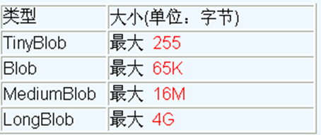
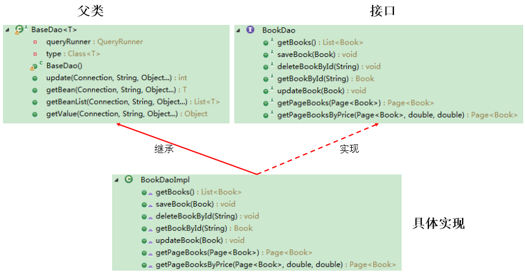

# JDBC

[参考CSDN](https://blog.csdn.net/qq_43674132/article/details/95171884?utm_medium=distribute.pc_relevant.none-task-blog-2%7Edefault%7EBlogCommendFromMachineLearnPai2%7Edefault-1.control&dist_request_id=1331978.10272.16186248073686841&depth_1-utm_source=distribute.pc_relevant.none-task-blog-2%7Edefault%7EBlogCommendFromMachineLearnPai2%7Edefault-1.control)

> * DML（data manipulation language）：
>   它们是SELECT、UPDATE、INSERT、DELETE，就象它的名字一样，这4条命令是用来对数据库里的数据进行操作的语言
> * DDL（data definition language）：
>   DDL比DML要多，主要的命令有CREATE、ALTER、DROP等，DDL主要是用在定义或改变表（TABLE）的结构，数据类型，表之间的链接和约束等初始化工作上，他们大多在建立表时使用

## 1. 概述

1. 数据的持久化:
    持久化(persistence)：**把数据保存到可掉电式存储设备中以供之后使用**。

2. JDBC的理解：
   * JDBC(Java Database Connectivity)规范定义接口（获取连接、关闭连接、DML、DDL、DCL)，具体的实现由各大数据库厂商来实现
   * 数据库厂商**针对于JDBC这套接口**，提供的**具体实现类**的集合为数据库驱动

3. 图示理解：


好处：

* **面向应用的API**：Java API，抽象接口，供应用程序开发人员使用（连接数据库，执行SQL语句，获得结果）
* **面向数据库的API**：Java Driver API，供开发商开发数据库驱动程序用

>从开发程序员的角度：不需要关注具体的数据库的细节
>数据库厂商：只需要提供标准的具体实现
4. 使用的包

   |        包        |                             说明                             |
   | :--------------: | :----------------------------------------------------------: |
   |   **java.sql**   |             所有与 JDBC 访问数据库相关的接口和类             |
   |  **javax.sql**   |        数据库扩展包，提供数据库额外的功能。如：连接池        |
   | **数据库的驱动** | 由各大数据库厂商提供，需要额外去下载，是对 JDBC 接口实现的类 |
   |    **工具类**    |                                                              |

5. 核心API

   |         接口或类          |                             作用                             |
   | :-----------------------: | :----------------------------------------------------------: |
   | **DriverManager** **类**  |      1) 管理和注册数据库驱动     2) 得到数据库连接对象       |
   |  **Connection** **接口**  | 一个连接对象，可用于创建 Statement 和 PreparedStatement 对象 |
   |  **Statement** **接口**   |     一个 SQL 语句对象，用于将 SQL 语句发送给数据库服务器     |
   | **PreparedStatemen 接口** |           一个 SQL 语句对象，是 Statement 的子接口           |
   |    **ResultSet 接口**     |                                                              |
   |      **Driver 接口**      |                     驱动接口，由产商实现                     |

### 整体流程

1. 注册和加载驱动(可以省略)
2. 获取连接
3. Connection 获取 Statement / PreparedStatement 对象
4. 使用 Statement / PreparedStatement 对象执行 SQL 语句
5. 返回结果集
6. 释放资源


## 2. DriverManager类

### 2.1 DriverManager 作用

1. 管理和注册驱动
2. 创建数据库的连接

### 2.2 常用方法

|               **DriverManager 类中的静态方法**               |                        描述                        |
| :----------------------------------------------------------: | :------------------------------------------------: |
| **Connection getConnection (String url, String user, String password)** | 通过连接字符串，用户名，密码来得到数据库的连接对象 |
|  **Connection getConnection (String url, Properties info)**  |       通过连接字符串，属性对象来得到连接对象       |

### 2.3 JDBC连接数据库参数

|          参数          |                             说明                             |
| :--------------------: | :----------------------------------------------------------: |
|       **用户名**       |                         登录的用户名                         |
|        **密码**        |                          登录的密码                          |
| **连接字符串** **URL** | 不同的数据库 URL 是不同的，mysql 的写法jdbc:mysql://localhost:3306/数据库[?参数名=参数值] |
|  **驱动类的字符串名**  |       com.mysql.jdbc.Driver / com.mysql.cj.jdbc.Driver       |

```java
    /**
     * 方式五：配置文件
     * 优点：
     * 1. 实现数据代码分离（解耦）
     * @throws Exception
     */
    @Test
    public void getConnection5() throws Exception {
        //1. 读取配置文件信息
        InputStream is = ConnectionTest.class.getClassLoader().getResourceAsStream("jdbc.properties");
        Properties pros = new Properties();
        pros.load(is);
        //pros.list(System.out); //将内容输出到控制台

        String user = pros.getProperty("user");
        String password = pros.getProperty("password");
        String url = pros.getProperty("url");
        String driverClass = pros.getProperty("driverClass");

        //2. 加载Driver
        Class aClass = Class.forName(driverClass); //类加载时自动注册(通过DriverManager)

        //3. 获取连接
        Connection connection = DriverManager.getConnection(url, user, password);
    }
```

## 3. Conection接口

### 3.1 Connection 作用

Connection 接口，具体的实现类由数据库的厂商实现，代表一个连接对象

### 3.2 常用方法

|              Connection 接口中的方法               |            描述             |
| :------------------------------------------------: | :-------------------------: |
| **PreparedStatement prepareStatement(String sql)** | 创建 PreparedStatement 对象 |
|          **Statement createStatement()**           |    创建一条 SQL 语句对象    |

## 4. Statement接口

### 4.1 Statement 作用

代表一条语句对象，用于发送 SQL 语句给服务器，用于执行静态 SQL 语句并返回它所生成结果的对象

### 4.2 常用方法

|         Statement 接口中的方法         |                             描述                             |
| :------------------------------------: | :----------------------------------------------------------: |
|   **int executeUpdate(String sql)**    | 用于发送 DML 语句，增删改的操作，insert、update delete<br/>参数：SQL 语句<br/>返回值：返回对数据库影响的行数 |
| **ResultSet executeQuery(String sql)** | 用于发送 DQL 语句，执行查询的操作select<br/>参数：SQL 语句<br/>返回值：查询的结果集 |

## 5. PrepatedStatement接口

### 5.1 PrepatedStatement 作用

PreparedStatement 是 Statement 接口的子接口，继承父接口中所有的方法。它是一个**预编译**的 SQL 语句

### 5.2 常用方法

| PreparedStatement 接口中的方法 |                   描述                   |
| :----------------------------: | :--------------------------------------: |
|    **int executeUpdate()**     | 执行 DML，增删改的操作，返回影响的行数。 |
|  **ResultSet executeQuery()**  |     执行 DQL，查询的操作，返回结果集     |
|     **boolean execute()**      |     执行SQL语句，返回ResultSet则true     |

### 5.3 使用方法

1. 编写 SQL 语句，未知内容使用?占位 : "SELECT * FROM user WHERE name=? AND password=?"
2. 获得 PreparedStatement 对象
3. 设置实际参数(setXxx方法)：setXxx(占位符的位置, 真实的值)  **索引从1开始**
4. 执行参数化 SQL 语句(execute())
5. 关闭资源（ResultSet 结果集，Statement 语句，Connection 连接）

|      **PreparedStatement 中设置参数的方法**      |              **描述**               |
| :----------------------------------------------: | :---------------------------------: |
| **void setDouble(int parameterIndex, double x)** | 将指定参数设置为给定 Java double 值 |
|  **void setFloat(int parameterIndex, float x)**  |  将指定参数设置为给定 Java REAL 值  |
|    **void setInt(int parameterIndex, int x)**    |  将指定参数设置为给定 Java int 值   |
|   **void setLong(int parameterIndex, long x)**   |  将指定参数设置为给定 Java long 值  |
| **void setObject(int parameterIndex, Object x)** |    使用给定对象设置指定参数的值     |
| **void setString(int parameterIndex, String x)** | 将指定参数设置为给定 Java String 值 |

###  5.4 PreparedStatement vs Statement

PreparedStatement：

1. prepareStatement()会先将 SQL 语句发送给数据库预编译。PreparedStatement 会引用着预编译后的结果

   <u>语句在被DBServer的编译器编译后的执行代码被缓存下来，那么下次调用时只要是相同的预编译语句就不需要编译，只要将参数直接传入编译过的语句执行代码中就会得到执行。</u>可以多次传入不同的参数给 PreparedStatement 对象并执行。减少 SQL 编译次数，提高效率，可实现更高效的批量操作

2. 安全性更高，没有 SQL 注入的隐患
3. 提高了程序的可读性
4. 可操作Blob数据

### 5.5 ResultSet与ResultSetMetaData

#### 5.5.1 ResultSet接口

1. 作用：封装数据库查询的结果集，对结果集进行遍历，取出每一条记录(由数据库厂商提供实现)

2. 常用方法

   | **ResultSet 接口中的方法** |                           **描述**                           |
   | :------------------------: | :----------------------------------------------------------: |
   |     **boolean next()**     | 1) 游标向下移动 1 行<br/>2) 返回 boolean 类型，如果还有下一条记录，返回 true，否则返回 false |
   | **数据类型** **getXxx()**  | 1) 通过字段名，参数是 String 类型。返回不同的类型<br/>2) 通过列号，参数是整数，从 1 开始。返回不同的类型 |

#### 5.5.2 ResultSetMetaData接口

1. 作用：可用于获取关于 ResultSet 对象中列的类型和属性信息的对象

2. 常用方法 `ResultSetMetaData meta = rs.getMetaData();`

   |                   方法                   |               描述               |
   | :--------------------------------------: | :------------------------------: |
   |   **String getColumnName(int column)**   |         获取指定列的名称         |
   |  **String getColumnLabel(int column)**   |         获取指定列的别名         |
   |         **int getColumnCount()**         | 返回当前 ResultSet 对象中的列数  |
   | **String getColumnTypeName(int column)** | 检索指定列的数据库特定的类型名称 |

   

   **问题1：得到结果集后, 如何知道该结果集中有哪些列 ？ 列名是什么？**

   ​     需要使用一个描述 ResultSet 的对象， 即 ResultSetMetaData

   **问题2：关于ResultSetMetaData**

   1. **如何获取 ResultSetMetaData**： 调用 ResultSet 的 getMetaData() 方法即可
   2. **获取 ResultSet 中有多少列**：调用 ResultSetMetaData 的 getColumnCount() 方法
   3. **获取 ResultSet 每一列的列的别名是什么**：调用 ResultSetMetaData 的getColumnLabel() 方法

   

### 5.6 Java与SQL对应数据类型转换表

| Java类型           | SQL类型                   |
| ------------------ | ------------------------- |
| boolean            | BIT                       |
| byte               | TINYINT                   |
| short              | SMALLINT                  |
| int                | INTEGER                   |
| long               | BIGINT                    |
| String             | CHAR,VARCHAR, LONGVARCHAR |
| byte   array       | BINARY, VAR BINARY        |
| java.sql.Date      | DATE                      |
| java.sql.Time      | TIME                      |
| java.sql.Timestamp | TIMESTAMP                 |

```java
/**
 * 通用的增删改操作
 *
 * @param sql
 * @param args
 */
public void update(String sql, Object... args) {
    Connection connection = null;
    PreparedStatement ps = null;
    try {
        //1. 获取数据库连接
        connection = JDBCUtils.getConnection();

        //2. 预编译sql语句(携带sql语句)，返回PreparedStatement实例
        ps = connection.prepareStatement(sql);

        //3. 填充占位符
        for (int i = 0; i < args.length; i++) {
            ps.setObject(i + 1, args[i]);
        }

        //4. 执行操作
        ps.executeUpdate();
    } catch (Exception e) {
        e.printStackTrace();
    } finally {
        //5. 资源关闭
        JDBCUtils.closeResource(connection, ps);
    }
}

/**
 * 针对不同表的通用查询操作，返回一条记录
 *
 * @param clazz
 * @param sql
 * @param args
 * @param <T>
 * @return
 */
public <T> T getInstance(Class<T> clazz, String sql, Object... args) {
    Connection connection = null;
    PreparedStatement ps = null;
    ResultSet resultSet = null;
    try {
        //1. 获取数据库连接
        connection = JDBCUtils.getConnection();

        //2. 预编译sql语句(携带sql语句)，返回PreparedStatement实例
        ps = connection.prepareStatement(sql);

        //3. 填充占位符
        for (int i = 0; i < args.length; i++) {
            ps.setObject(i + 1, args[i]);
        }

        //4. 执行并返回结果集
        resultSet = ps.executeQuery();
        ResultSetMetaData rsmd = resultSet.getMetaData(); // 获取结果集的元数据
        int columnCount = rsmd.getColumnCount(); // 通过ResultSetMetaData获取结果集列数
        //5. 处理结果集
        if (resultSet.next()) { // 判断结果集下一条是否有数据，有数据返回true指针下移
            // 获取当前这条数据的各个字段值
            T t = clazz.newInstance();
            for (int i = 0; i < columnCount; i++) {
                Object columnValue = resultSet.getObject(i + 1);
                // 获取每个列的列名
                //String columnName = rsmd.getColumnName(i + 1);
                String columnName = rsmd.getColumnLabel(i + 1);

                //给customer对象指定的columnName属性赋值columnValue(反射)
                Field field = clazz.getDeclaredField(columnName);
                field.setAccessible(true);
                field.set(t, columnValue);
            }
            return t;
        }
        return null;
    } catch (Exception e) {
        e.printStackTrace();
    } finally {
        //6. 关闭资源
        JDBCUtils.closeResource(connection, ps, resultSet);
    }
    return null;
}

public <T> List<T> getForList(Class<T> clazz, String sql, Object... args) {
    Connection connection = null;
    PreparedStatement ps = null;
    ResultSet resultSet = null;
    try {
        //1. 获取数据库连接
        connection = JDBCUtils.getConnection();

        //2. 预编译sql语句(携带sql语句)，返回PreparedStatement实例
        ps = connection.prepareStatement(sql);

        //3. 填充占位符
        for (int i = 0; i < args.length; i++) {
            ps.setObject(i + 1, args[i]);
        }

        //4. 执行并返回结果集
        resultSet = ps.executeQuery();
        ResultSetMetaData rsmd = resultSet.getMetaData(); // 获取结果集的元数据
        int columnCount = rsmd.getColumnCount(); // 通过ResultSetMetaData获取结果集列数
        ArrayList<T> list = new ArrayList<>(); // 创建集合
        //5. 处理结果集
        while (resultSet.next()) { // 判断结果集下一条是否有数据，有数据返回true指针下移
            // 获取当前这条数据的各个字段值
            T t = clazz.newInstance();
            for (int i = 0; i < columnCount; i++) {
                Object columnValue = resultSet.getObject(i + 1);
                // 获取每个列的列名
                //String columnName = rsmd.getColumnName(i + 1);
                String columnName = rsmd.getColumnLabel(i + 1);

                //给customer对象指定的columnName属性赋值columnValue(反射)
                Field field = clazz.getDeclaredField(columnName);
                field.setAccessible(true);
                field.set(t, columnValue);
            }
            list.add(t);
        }
        return list;
    } catch (Exception e) {
        e.printStackTrace();
    } finally {
        //6. 关闭资源
        JDBCUtils.closeResource(connection, ps, resultSet);
    }
    return null;
}
```

## 6. 两个特殊应用(PrepatedStatement)

### 6.1 操作BLOB类型字段

1. 作用：MySQL中，BLOB是一个二进制大型对象，是一个可以存储大量数据的容器，它能容纳不同大小的数据

2. MySQL的四种BLOB类型(除了在存储的最大信息量上不同外，他们是等同的)

   

> - 实际使用中根据需要存入的数据大小定义不同的BLOB类型
> - 需要注意的是：如果存储的文件过大，数据库的性能会下降
> - 如果在指定了相关的Blob类型以后，还报错：xxx too large，那么在mysql的安装目录下，找my.ini文件加上如下的配置参数： **max_allowed_packet=16M**。同时注意：修改了my.ini文件之后，需要重新启动mysql服务

```java
/** 插入 **/
//获取连接
Connection conn = JDBCUtils.getConnection();
String sql = "insert into customers(name,email,birth,photo)values(?,?,?,?)";
PreparedStatement ps = conn.prepareStatement(sql);
// 填充占位符
ps.setString(1, "徐海强");
ps.setString(2, "xhq@126.com");
ps.setDate(3, new Date(new java.util.Date().getTime()));
// 操作Blob类型的变量
FileInputStream fis = new FileInputStream("xhq.png");
ps.setBlob(4, fis);
//执行
ps.execute();
fis.close();
JDBCUtils.closeResource(conn, ps);

/** 修改 **/
Connection conn = JDBCUtils.getConnection();
String sql = "update customers set photo = ? where id = ?";
PreparedStatement ps = conn.prepareStatement(sql);

// 填充占位符
// 操作Blob类型的变量
FileInputStream fis = new FileInputStream("coffee.png");
ps.setBlob(1, fis);
ps.setInt(2, 25);
//执行
ps.execute();
fis.close();
JDBCUtils.closeResource(conn, ps);

/** 读取 **/
String sql = "SELECT id, name, email, birth, photo FROM customer WHERE id = ?";
conn = getConnection();
ps = conn.prepareStatement(sql);
ps.setInt(1, 8);
rs = ps.executeQuery();

if(rs.next()){
	Integer id = rs.getInt(1);
    String name = rs.getString(2);
	String email = rs.getString(3);
    Date birth = rs.getDate(4);
	Customer cust = new Customer(id, name, email, birth);
    System.out.println(cust); 
    //读取Blob类型的字段
	Blob photo = rs.getBlob(5);
	InputStream is = photo.getBinaryStream();
	OutputStream os = new FileOutputStream("c.jpg");
	byte [] buffer = new byte[1024];
	int len = 0;
	while((len = is.read(buffer)) != -1){
		os.write(buffer, 0, len);
	}
    JDBCUtils.closeResource(conn, ps, rs);
		
	if(is != null){
		is.close();
	}
	if(os !=  null){
		os.close();
	}
}
```

### 6.2 批量插入

> update delete 本身具有批量操作效果
> 这里的批量操作指insert

1. 作用：当需要成批插入或者更新记录时，可以采用Java的批量**更新**机制，这一机制允许**多条语句一次性提交**给数据库批量处理。通常情况下比单独提交处理更有效率

2. 常用方法

   |      方法      |               描述                |
   | :------------: | :-------------------------------: |
   |   addBatch()   | 添加需要批量处理的SQL语句或是参数 |
   | executeBatch() |         执行批量处理语句          |
   |  clearBatch()  |          清空缓存的数据           |

```java
/*
 * 1： 使用 addBatch() / executeBatch() / clearBatch()
 * 2：mysql服务器默认是关闭批处理的，我们需要通过一个参数，让mysql开启批处理的支持。
 * 	  ?rewriteBatchedStatements=true 写在配置文件的url后面
 */
@Test
public void testInsert1() throws Exception{
	long start = System.currentTimeMillis();
    
	Connection conn = JDBCUtils.getConnection();
	String sql = "insert into goods(name)values(?)";
	PreparedStatement ps = conn.prepareStatement(sql);
		
	for(int i = 1;i <= 1000000;i++){
		ps.setString(1, "name_" + i);
		//1.“攒”sql
		ps.addBatch();
		if(i % 500 == 0){
			//2.执行
			ps.executeBatch();
			//3.清空
			ps.clearBatch();
		}
	}
		
	long end = System.currentTimeMillis();
	System.out.println("花费的时间为：" + (end - start));//20000条：625                                                                    
	JDBCUtils.closeResource(conn, ps);
}

/*
* 设置不允许自动提交数据（事务）
* 使用Connection 的 setAutoCommit(false)  /  commit()
*/
@Test
public void testInsert2() throws Exception{
	long start = System.currentTimeMillis();

	Connection conn = JDBCUtils.getConnection();
	//1.设置为不自动提交数据
	conn.setAutoCommit(false); //连接池中记得还回去前修改为true
		
	String sql = "insert into goods(name)values(?)";
	PreparedStatement ps = conn.prepareStatement(sql);
		
	for(int i = 1;i <= 1000000;i++){
		ps.setString(1, "name_" + i);
		//1.“攒”sql
		ps.addBatch();
		if(i % 500 == 0){
			//2.执行
			ps.executeBatch();
			//3.清空
			ps.clearBatch();
		}
	}
	//2.提交数据
	conn.commit();
		
	long end = System.currentTimeMillis();
	System.out.println("花费的时间为：" + (end - start));//1000000条:4978 
	JDBCUtils.closeResource(conn, ps);
}
```

## 7. 数据库事务

### 7.1 事务

- **事务：一组逻辑操作单元，使数据从一种状态变换到另一种状态。**
- **事务处理（事务操作）：**当在一个事务中执行多个操作时，要么所有的事务都**被提交(commit)**，那么这些修改就永久地保存下来（不可回滚）；要么数据库管理系统将放弃所作的所有修改，整个事务**回滚(rollback)**到最初状态
- 数据何时被提交？
  - 执行SQL语句后
    - DDL操作（set autocommit = false 无效）
    - DML操作（set autocommit = false 有效）
  - 关闭连接后（set autocommit = false 有效）

### 7.2 事务的ACID属性

1. **原子性（Atomicity）**
   原子性是指事务是一个不可分割的工作单位，事务中的操作要么都发生，要么都不发生。 
2. **一致性（Consistency）**
   事务必须使数据库从一个一致性状态变换到另外一个一致性状态。
3. **隔离性（Isolation）**
   事务的隔离性是指一个事务的执行不能被其他事务干扰，即一个事务内部的操作及使用的数据对并发的其他事务是隔离的，并发执行的各个事务之间不能互相干扰。
4. **持久性（Durability）**
   持久性是指一个事务一旦被提交，它对数据库中数据的改变就是永久性的，接下来的其他操作和数据库故障不应该对其有任何影响。

### 7.3 数据库的并发问题

- 对于同时运行的多个事务, 当这些事务访问数据库中相同的数据时, 如果没有采取必要的隔离机制, 就会导致各种并发问题:
  - **脏读**: 对于两个事务 T1, T2, T1 读取了已经被 T2 更新但还**没有被提交**的字段。之后, 若 T2 回滚, T1读取的内容就是临时且无效的。
  - **不可重复读**: 对于两个事务T1, T2, T1 读取了一个字段, 然后 T2 **更新**了该字段。之后, T1再次读取同一个字段, 值就不同了。
  - **幻读**: 对于两个事务T1, T2, T1 从一个表中读取了一个字段, 然后 T2 在该表中**插入**了一些新的行。之后, 如果 T1 再次读取同一个表, 就会多出几行。
- **数据库事务的隔离性**: 数据库系统必须具有隔离并发运行各个事务的能力, 使它们不会相互影响, 避免各种并发问题。
- 一个事务与其他事务隔离的程度称为隔离级别。数据库规定了多种事务隔离级别, 不同隔离级别对应不同的干扰程度, **隔离级别越高, 数据一致性就越好, 但并发性越弱。**

### 7.4 隔离级别

- 数据库提供的4种事务隔离级别：

  /1-课件/课件-md/尚硅谷_宋红康_JDBC.assets/1555586275271.png)

- Oracle 支持的 2 种事务隔离级别：**READ COMMITED**, SERIALIZABLE。 Oracle 默认的事务隔离级别为: **READ COMMITED** 。


- Mysql 支持 4 种事务隔离级别。Mysql 默认的事务隔离级别为: **REPEATABLE READ**

### 7.5 常用方法

|                    方法                    |                             描述                             |
| :----------------------------------------: | :----------------------------------------------------------: |
| **void setAutoCommit(boolean autoCommit)** | 参数是 true 或 false<br/> false: 关闭自动提交，相当于开启事务 |
|             **void commit()**              |                           提交事务                           |
|            **void rollback()**             |                           回滚事务                           |

> 若此时 Connection 没有被关闭，还可能被重复使用，则需要恢复其自动提交状态 setAutoCommit(true)。尤其是在使用数据库连接池技术时，执行close()方法前，建议恢复自动提交状态

```java
/** 案例：用户AA向用户BB转账100 **/
public void testJDBCTransaction() {
	Connection conn = null;
	try {
		// 1.获取数据库连接
		conn = JDBCUtils.getConnection();
		// 2.开启事务
		conn.setAutoCommit(false);
        // 设置隔离级别（可选）
        connection.setTransactionIsolation(Connection.TRANSACTION_READ_COMMITTED);
		// 3.进行数据库操作
		String sql1 = "update user_table set balance = balance - 100 where user = ?";
		update(conn, sql1, "AA");

		// 模拟网络异常
		//System.out.println(10 / 0);

		String sql2 = "update user_table set balance = balance + 100 where user = ?";
		update(conn, sql2, "BB");
		// 4.若没有异常，则提交事务
		conn.commit();
	} catch (Exception e) {
		e.printStackTrace();
		// 5.若有异常，则回滚事务
		try {
			conn.rollback();
		} catch (SQLException e1) {
			e1.printStackTrace();
		}
    } finally {
        try {
			//6.恢复每次DML操作的自动提交功能
			conn.setAutoCommit(true);
		} catch (SQLException e) {
			e.printStackTrace();
		}
        //7.关闭连接
		JDBCUtils.closeResource(conn, null, null); 
    }  
}
```

## 8. 数据库连接池

> 获取连接

### 8.1 数据库连接池技术

- **数据库连接池的基本思想**：就是为数据库连接建立一个“缓冲池”。预先在缓冲池中放入一定数量的连接，当需要建立数据库连接时，只需从“缓冲池”中取出一个，使用完毕之后再放回去。

- **数据库连接池**负责分配、管理和释放数据库连接，它**允许应用程序重复使用一个现有的数据库连接，而不是重新建立一个**。

- 数据库连接池在初始化时将创建一定数量的数据库连接放到连接池中，这些数据库连接的数量是由**最小数据库连接数来设定**的。无论这些数据库连接是否被使用，连接池都将一直保证至少拥有这么多的连接数量。连接池的**最大数据库连接数量**限定了这个连接池能占有的最大连接数，当应用程序向连接池请求的连接数超过最大连接数量时，这些请求将被加入到等待队列中。

- 工作原理

  

- **数据库连接池技术的优点**

  **1. 资源重用**

  由于数据库连接得以重用，避免了频繁创建，释放连接引起的大量性能开销。在减少系统消耗的基础上，另一方面也增加了系统运行环境的平稳性。

  **2. 更快的系统反应速度**

  数据库连接池在初始化过程中，往往已经创建了若干数据库连接置于连接池中备用。此时连接的初始化工作均已完成。对于业务请求处理而言，直接利用现有可用连接，避免了数据库连接初始化和释放过程的时间开销，从而减少了系统的响应时间

  **3. 新的资源分配手段**

  对于多应用共享同一数据库的系统而言，可在应用层通过数据库连接池的配置，实现某一应用最大可用数据库连接数的限制，避免某一应用独占所有的数据库资源

  **4. 统一的连接管理，避免数据库连接泄漏**

  在较为完善的数据库连接池实现中，可根据预先的占用超时设定，强制回收被占用连接，从而避免了常规数据库连接操作中可能出现的资源泄露

### 8.2 多种开源的数据库连接池

- JDBC 的数据库连接池使用 **javax.sql.DataSource** 来表示，**DataSource 只是一个接口**，该接口通常由服务器(Weblogic, WebSphere, Tomcat)提供实现，也有一些开源组织提供实现：
  - **DBCP** 是Apache提供的数据库连接池。tomcat 服务器自带dbcp数据库连接池。**速度相对c3p0较快**，但因自身存在BUG，Hibernate3已不再提供支持。
  - **C3P0** 是一个开源组织提供的一个数据库连接池，**速度相对较慢，稳定性还可以。**hibernate官方推荐使用
  - **Proxool** 是sourceforge下的一个开源项目数据库连接池，有监控连接池状态的功能，**稳定性较c3p0差一点**
  - **BoneCP** 是一个开源组织提供的数据库连接池，速度快
  - **Druid** 是阿里提供的数据库连接池，据说是集DBCP 、C3P0 、Proxool 优点于一身的数据库连接池，但是速度不确定是否有BoneCP快
- DataSource 通常被称为数据源，它包含**连接池和连接池管理**两个部分，习惯上也经常把 DataSource 称为连接池
- **DataSource用来取代DriverManager来获取Connection，获取速度快，同时可以大幅度提高数据库访问速度。**
- 特别注意：
  - 数据源和数据库连接不同，数据源无需创建多个，它是产生数据库连接的工厂，因此**整个应用只需要一个数据源即可。**
  - 当数据库访问结束后，程序还是像以前一样关闭数据库连接：conn.close(); 但conn.close()并没有关闭数据库的物理连接，它仅仅把数据库连接释放，归还给了数据库连接池。

### 8.3 Druid（德鲁伊）数据库连接池

> Druid是阿里巴巴开源平台上一个数据库连接池实现，它结合了C3P0、DBCP、Proxool等DB池的优点，同时加入了日志监控，可以很好的监控DB池连接和SQL的执行情况，可以说是针对监控而生的DB连接池，**可以说是目前最好的连接池之一。**

```java
package com.atguigu.druid;

import java.sql.Connection;
import java.util.Properties;

import javax.sql.DataSource;

import com.alibaba.druid.pool.DruidDataSourceFactory; //包

public class TestDruid {
	public static void main(String[] args) throws Exception {
        // 加载配置文件
		Properties pro = new Properties();
         pro.load(TestDruid.class.getClassLoader().getResourceAsStream("druid.properties"));
        // 建立连接池(工厂)
		DataSource ds = DruidDataSourceFactory.createDataSource(pro);
        // 获取连接
		Connection conn = ds.getConnection();
		System.out.println(conn);
	}
}
```

```properties
# druid.properties
url=jdbc:mysql://localhost:3306/test?rewriteBatchedStatements=true
username=root
password=123456
driverClassName=com.mysql.jdbc.Driver

initialSize=10
maxActive=20
maxWait=1000
filters=wall
```

配置参数

| **配置**                      | **缺省** | **说明**                                                     |
| ----------------------------- | -------- | ------------------------------------------------------------ |
| name                          |          | 配置这个属性的意义在于，如果存在多个数据源，监控的时候可以通过名字来区分开来。   如果没有配置，将会生成一个名字，格式是：”DataSource-” +   System.identityHashCode(this) |
| url                           |          | 连接数据库的url，不同数据库不一样。例如：mysql :   jdbc:mysql://10.20.153.104:3306/druid2      oracle :   jdbc:oracle:thin:@10.20.149.85:1521:ocnauto |
| username                      |          | 连接数据库的用户名                                           |
| password                      |          | 连接数据库的密码。如果你不希望密码直接写在配置文件中，可以使用ConfigFilter。详细看这里：<https://github.com/alibaba/druid/wiki/%E4%BD%BF%E7%94%A8ConfigFilter> |
| driverClassName               |          | 根据url自动识别   这一项可配可不配，如果不配置druid会根据url自动识别dbType，然后选择相应的driverClassName(建议配置下) |
| initialSize                   | 0        | 初始化时建立物理连接的个数。初始化发生在显示调用init方法，或者第一次getConnection时 |
| maxActive                     | 8        | 最大连接池数量                                               |
| maxIdle                       | 8        | 已经不再使用，配置了也没效果                                 |
| minIdle                       |          | 最小连接池数量                                               |
| maxWait                       |          | 获取连接时最大等待时间，单位毫秒。配置了maxWait之后，缺省启用公平锁，并发效率会有所下降，如果需要可以通过配置useUnfairLock属性为true使用非公平锁。 |
| poolPreparedStatements        | false    | 是否缓存preparedStatement，也就是PSCache。PSCache对支持游标的数据库性能提升巨大，比如说oracle。在mysql下建议关闭。 |
| maxOpenPreparedStatements     | -1       | 要启用PSCache，必须配置大于0，当大于0时，poolPreparedStatements自动触发修改为true。在Druid中，不会存在Oracle下PSCache占用内存过多的问题，可以把这个数值配置大一些，比如说100 |
| validationQuery               |          | 用来检测连接是否有效的sql，要求是一个查询语句。如果validationQuery为null，testOnBorrow、testOnReturn、testWhileIdle都不会其作用。 |
| testOnBorrow                  | true     | 申请连接时执行validationQuery检测连接是否有效，做了这个配置会降低性能。 |
| testOnReturn                  | false    | 归还连接时执行validationQuery检测连接是否有效，做了这个配置会降低性能 |
| testWhileIdle                 | false    | 建议配置为true，不影响性能，并且保证安全性。申请连接的时候检测，如果空闲时间大于timeBetweenEvictionRunsMillis，执行validationQuery检测连接是否有效。 |
| timeBetweenEvictionRunsMillis |          | 有两个含义： 1)Destroy线程会检测连接的间隔时间2)testWhileIdle的判断依据，详细看testWhileIdle属性的说明 |
| numTestsPerEvictionRun        |          | 不再使用，一个DruidDataSource只支持一个EvictionRun           |
| minEvictableIdleTimeMillis    |          |                                                              |
| connectionInitSqls            |          | 物理连接初始化的时候执行的sql                                |
| exceptionSorter               |          | 根据dbType自动识别   当数据库抛出一些不可恢复的异常时，抛弃连接 |
| filters                       |          | 属性类型是字符串，通过别名的方式配置扩展插件，常用的插件有：   监控统计用的filter:stat日志用的filter:log4j防御sql注入的filter:wall |
| proxyFilters                  |          | 类型是List，如果同时配置了filters和proxyFilters，是组合关系，并非替换关系 |

## 9. Apache-DBUtils

> CRUD
>
> commons-dbutils 是 Apache 组织提供的一个开源 JDBC工具类库，它是对JDBC的简单封装，学习成本极低，并且使用dbutils能极大简化jdbc编码的工作量，同时也不会影响程序的性能

### 9.1 常用API

|                     API                     |                             描述                             |
| :-----------------------------------------: | :----------------------------------------------------------: |
|   org.apache.commons.dbutils.QueryRunner    |                       用于执行SQL语句                        |
| org.apache.commons.dbutils.ResultSetHandler | 该接口用于处理 java.sql.ResultSet，将数据按要求转换为另一种形式 |
| org.apache.commons.dbutils.DbUtils(工具类)  | 提供如关闭连接、装载JDBC驱动程序等常规工作的工具类，里面的所有方法都是静态的 |

### 9.2 QueryRunner类

- **该类简单化了SQL查询，它与ResultSetHandler组合在一起使用可以完成大部分的数据库操作，能够大大减少编码量。**

- QueryRunner类提供了两个构造器：

  - 默认的构造器
  - 需要一个 javax.sql.DataSource 来作参数的构造器

- QueryRunner类的主要方法：

  |  类型  |                             方法                             |                             描述                             |
  | :----: | :----------------------------------------------------------: | :----------------------------------------------------------: |
  |  更新  | public int update(Connection conn, String sql, Object... params) |           用来执行一个更新（插入、更新或删除）操作           |
  |  插入  | public <T> T insert(Connection conn,String sql,ResultSetHandler<T> rsh, Object... params) |                       只支持INSERT语句                       |
  | 批处理 | public int[] batch(Connection conn,String sql,Object[][] params) |                INSERT, UPDATE, or DELETE语句                 |
  | 批处理 | public <T> T insertBatch(Connection conn,String sql,ResultSetHandler<T> rsh,Object[][] params) |                       只支持INSERT语句                       |
  |  查询  | public Object query(Connection conn, String sql, ResultSetHandler rsh,Object... params) | 执行一个查询操作<br/>对象数组中作为查询语句的置换参数<br/>会自行处理 PreparedStatement 和<br/> ResultSet 的创建关闭 |

```java
// 测试添加
@Test
public void testInsert() throws Exception {
	QueryRunner runner = new QueryRunner();
	Connection conn = JDBCUtils.getConnection3();
	String sql = "insert into customers(name,email,birth)values(?,?,?)";
    
	int count = runner.update(conn, sql, "何成飞", "he@qq.com", "1992-09-08");

	System.out.println("添加了" + count + "条记录");
	JDBCUtils.closeResource(conn, null);
}
```

### 9.3 ResultSetHandler接口及实现类

- 该接口用于处理 java.sql.ResultSet，将数据按要求转换为另一种形式。

- ResultSetHandler 接口提供了一个单独的方法：Object handle (java.sql.ResultSet .rs)。

- 接口的主要实现类：

  - ArrayHandler：把结果集中的第一行数据转成对象数组。
  - ArrayListHandler：把结果集中的每一行数据都转成一个数组，再存放到List中。
  - **BeanHandler：**将结果集中的第一行数据封装到一个对应的JavaBean实例中。
  - **BeanListHandler：**将结果集中的每一行数据都封装到一个对应的JavaBean实例中，存放到List里。
  - ColumnListHandler：将结果集中某一列的数据存放到List中。
  - KeyedHandler(name)：将结果集中的每一行数据都封装到一个Map里，再把这些map再存到一个map里，其key为指定的key。
  - **MapHandler：**将结果集中的第一行数据封装到一个Map里，key是列名，value就是对应的值。
  - **MapListHandler：**将结果集中的每一行数据都封装到一个Map里，然后再存放到List
  - **ScalarHandler：**查询单个值对象

```java
/*
 * 测试查询:查询一条记录
 * 
 * 使用ResultSetHandler的实现类：BeanHandler
 */
@Test
public void testQueryInstance() throws Exception{
	QueryRunner runner = new QueryRunner();
	Connection conn = JDBCUtils.getConnection3();
	String sql = "select id,name,email,birth from customers where id = ?";
		
	// BeanHandler
	BeanHandler<Customer> handler = new BeanHandler<>(Customer.class);
    // 查询
	Customer customer = runner.query(conn, sql, handler, 23);
	System.out.println(customer);	
	JDBCUtils.closeResource(conn, null);
}
```

```java
/*
 * 测试查询:查询多条记录构成的集合
 * 
 * 使用ResultSetHandler的实现类：BeanListHandler
 */
@Test
public void testQueryList() throws Exception{
	QueryRunner runner = new QueryRunner();
	Connection conn = JDBCUtils.getConnection3();
	String sql = "select id,name,email,birth from customers where id < ?";
		
	// BeanListHandler
	BeanListHandler<Customer> handler = new BeanListHandler<>(Customer.class);
	List<Customer> list = runner.query(conn, sql, handler, 23);
	list.forEach(System.out::println);
		
	JDBCUtils.closeResource(conn, null);
}
```

```java
/*
 * 自定义ResultSetHandler的实现类
 */
@Test
public void testQueryInstance1() throws Exception{
	QueryRunner runner = new QueryRunner();
	Connection conn = JDBCUtils.getConnection3();
	String sql = "select id,name,email,birth from customers where id = ?";
		
	ResultSetHandler<Customer> handler = new ResultSetHandler<Customer>() {
		@Override
		public Customer handle(ResultSet rs) throws SQLException {
			System.out.println("handle");
//			return new Customer(1,"Tom","tom@126.com",new Date(123323432L));
			if(rs.next()){
				int id = rs.getInt("id");
				String name = rs.getString("name");
				String email = rs.getString("email");
				Date birth = rs.getDate("birth");
					
				return new Customer(id, name, email, birth);
			}
			return null;
		}
	};
		
	Customer customer = runner.query(conn, sql, handler, 23);
	System.out.println(customer);
	JDBCUtils.closeResource(conn, null);
}
```

```java
/*
 * 如何查询类似于最大的，最小的，平均的，总和，个数相关的数据，
 * 使用ScalarHandler
 * 
 */
@Test
public void testQueryValue() throws Exception{
	QueryRunner runner = new QueryRunner();
	Connection conn = JDBCUtils.getConnection3();
		
	//测试一：
//	String sql = "select count(*) from customers where id < ?";
//	ScalarHandler handler = new ScalarHandler();
//	long count = (long) runner.query(conn, sql, handler, 20);
//	System.out.println(count);
		
	//测试二：
	String sql = "select max(birth) from customers";
	ScalarHandler handler = new ScalarHandler();
	Date birth = (Date) runner.query(conn, sql, handler);
	System.out.println(birth);
		
	JDBCUtils.closeResource(conn, null);
}
```

## 10. DAO及相关实现类

- DAO：Data Access Object访问数据信息的类和接口，包括了对数据的CRUD（Create、Retrival、Update、Delete），而不包含任何业务相关的信息。有时也称作：BaseDAO

- 作用：为了实现功能的模块化，更有利于代码的维护和升级。

  