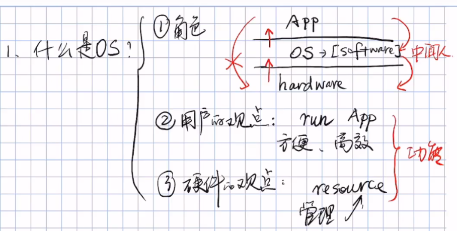
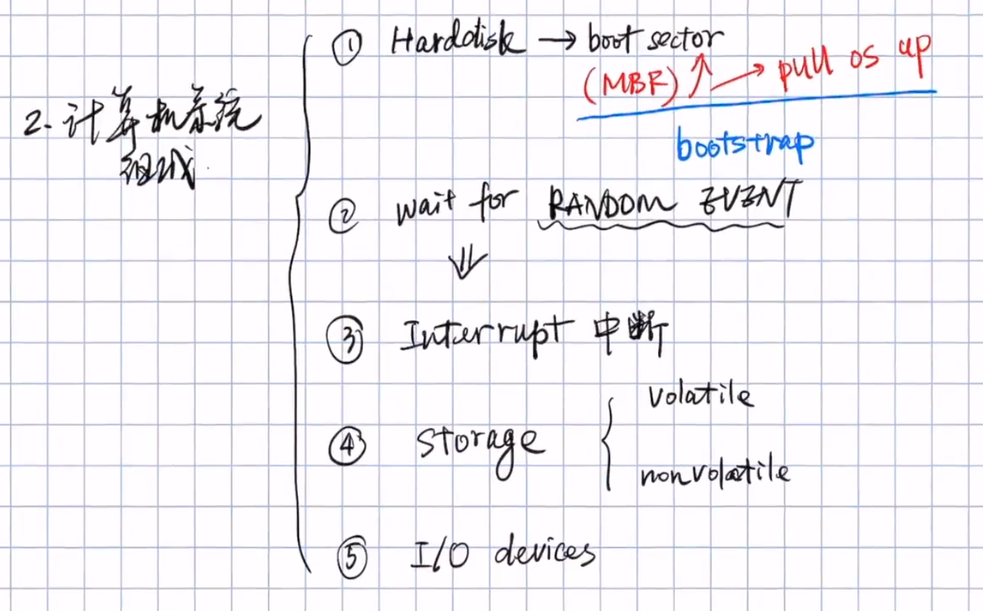
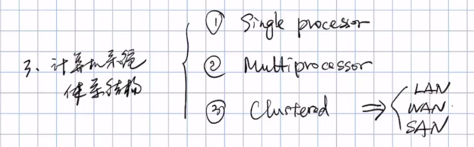
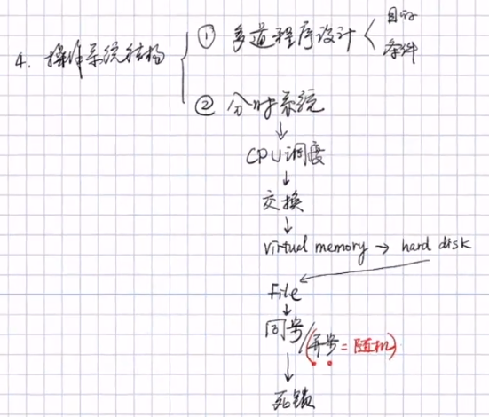
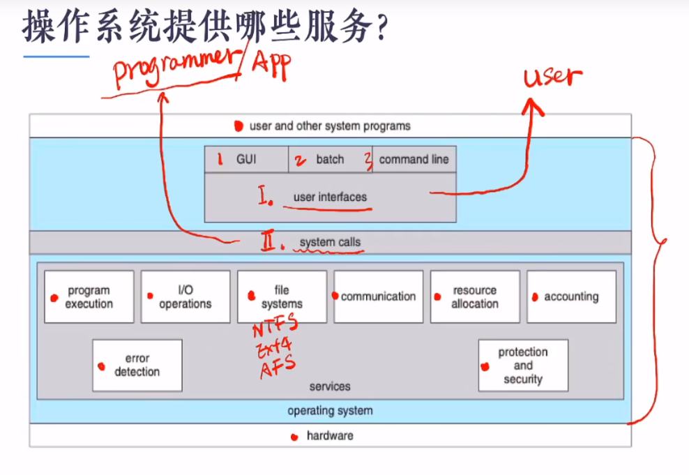
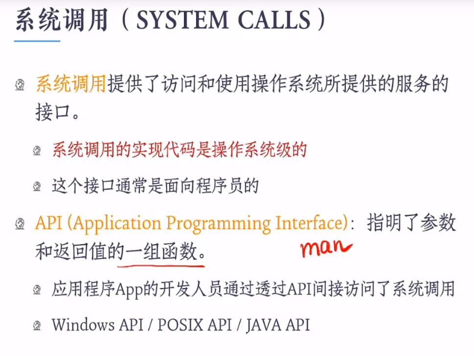
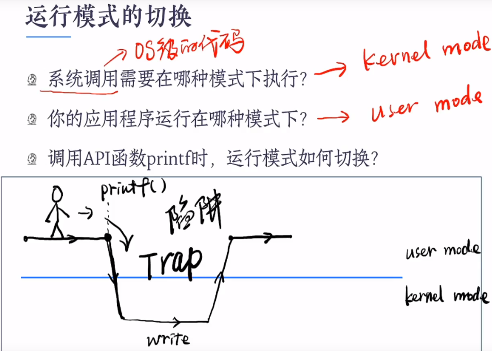
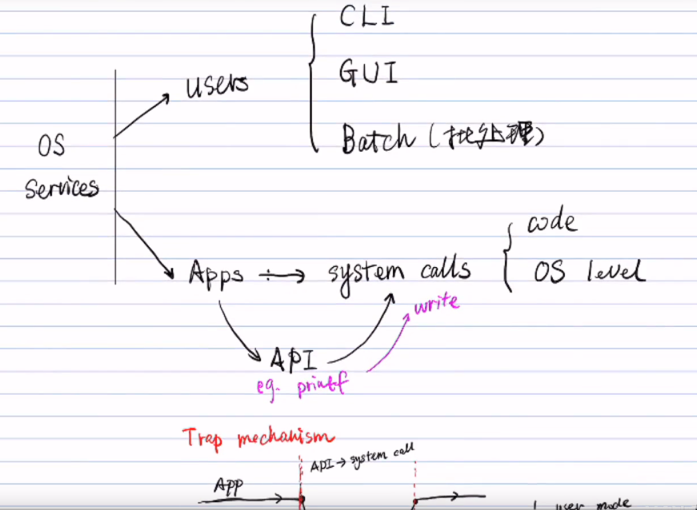
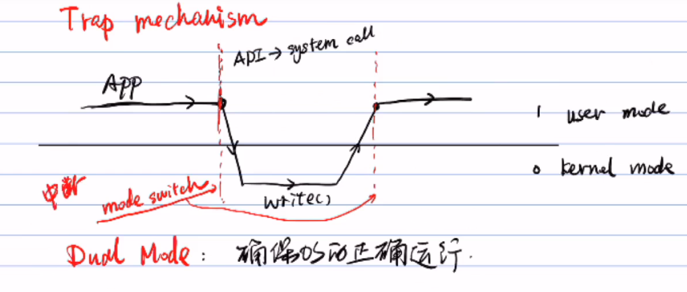

# OS

> [写给大忙人看的操作系统](https://blog.csdn.net/qq_36894974/article/details/104554120?ops_request_misc=%7B%22request%5Fid%22%3A%22162388909916780262516694%22%2C%22scm%22%3A%2220140713.130102334.pc%5Fall.%22%7D&request_id=162388909916780262516694&biz_id=0&utm_medium=distribute.pc_search_result.none-task-blog-2~all~first_rank_v2~rank_v29-19-104554120.first_rank_v2_pc_rank_v29&utm_term=操作系统&spm=1018.2226.3001.4187)
>
> 

## 2. 进程与线程

