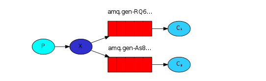

# RabbitMQ

> [参考链接](https://blog.csdn.net/kavito/article/details/91403659?ops_request_misc=%257B%2522request%255Fid%2522%253A%2522163177482716780262592218%2522%252C%2522scm%2522%253A%252220140713.130102334..%2522%257D&request_id=163177482716780262592218&biz_id=0&utm_medium=distribute.pc_search_result.none-task-blog-2~all~top_positive~default-1-91403659.pc_search_ecpm_flag&utm_term=RabbitMQ&spm=1018.2226.3001.4187)
>
> [RabbitMQ_wanght笔记](https://blog.csdn.net/weixin_38305440/article/details/102810522?ops_request_misc=%7B%22request%5Fid%22%3A%22163231141516780366559277%22%2C%22scm%22%3A%2220140713.130102334..%22%7D&request_id=163231141516780366559277&biz_id=0&utm_medium=distribute.pc_search_result.none-task-blog-2~all~top_positive~default-2-102810522.pc_search_ecpm_flag&utm_term=rabbitmq&spm=1018.2226.3001.4187)
>
> [消息中间件MQ与RabbitMQ面试题](https://blog.csdn.net/ThinkWon/article/details/104588612?ops_request_misc=%7B%22request%5Fid%22%3A%22163231155516780255254265%22%2C%22scm%22%3A%2220140713.130102334.pc%5Fall.%22%7D&request_id=163231155516780255254265&biz_id=0&utm_medium=distribute.pc_search_result.none-task-blog-2~all~first_rank_ecpm_v1~rank_v29_name-1-104588612.pc_search_ecpm_flag&utm_term=rabbitmq面试题&spm=1018.2226.3001.4187)
>
> [rabbitmq整合springboot](https://developer.aliyun.com/article/769883)

[TOC]

## 1. 基本概念

### 1.1 Broker

接收和分发消息的应用，RabbitMQ Server 就是 Message Broker 

### 1.2 Virtual host

出于多租户和安全因素设计的，把 AMQP 的基本组件划分到一个虚拟的分组中，类似于网络中的 namespace 概念。当多个不同的用户使用同一个 RabbitMQ server 提供的服务时，可以划分出多个 vhost，每个用户在自己的 vhost 创建 exchange／queue 等（沙箱）

### 1.3 Connection

publisher／consumer 和 broker 之间的 TCP 连接 

### 1.4 Channel

如果每一次访问 RabbitMQ 都建立一个 Connection，在消息量大的时候建立 TCP Connection 的开销将是巨大的，效率也较低。Channel 是在 connection 内部建立的逻辑连接，如果应用程 序支持多线程，通常每个 thread 创建单独的 channel 进行通讯，AMQP method 包含了 channel id 帮助客 户端和message broker 识别 channel，所以 channel 之间是完全隔离的。Channel 作为轻量级的 Connection 极大减少了操作系统建立 TCP connection 的开销

### 1.5 Exchange

message 到达 broker 的第一站，根据分发规则，匹配查询表中的 routing key，分发消息到 queue 中去（只负责转发消息，不具备存储消息的能力），常用的类型有

#### 1. Fanout（广播）

把接收到的消息广播到与其绑定的队列中

#### 2. Direct（定向）

把接收到的消息发送到绑定对应key的队列中

#### 3. topic（主题）

direct的升级版，匹配对应的通配符队列

#### 4. header（标题）

少用，是忽略 routing key 的一种路由方式，使用 Headers 来匹配

### 1.6 Queue

消息最终被送到这里等待 consumer 取走 

### 1.7 Binding

exchange 和 queue 之间的虚拟连接，binding 中可以包含 routing key，Binding 信息被保存到 exchange 中的查询表中，用于message 的分发依据

## 2. 六种消息模型

> 实现代码参照 rabbitmq-learn-1

### 2.1 基本消息模型

* P：生产者，也就是要发送消息的程序
* C：消费者：消息的接受者，会一直等待消息到来
* queue：消息队列，图中红色部分。可以缓存消息；生产者向其中投递消息，消费者从其中取出消息

### 2.2 work 工作模式(工作队列)

* 与基本消息模型类似，只不过消费者增加
* 此场景下考虑公平与非公平的情况（消费者的性能与状态不同，非公平队列在手动ack状态下生效）
  * 公平：雨露均沾（默认）
  * 非公平：能者多劳（通过ack实现）

### 2.3 publish/subscribe 发布订阅模式

* 交换机类型：Fanout（广播）
* 将消息发送给所有绑定到交换机的队列

### 2.4 routing 路由模式

* 交换机类型：Direct（定向）
* 把消息发送给符合指定 routing key 的队列

### 2.5 topic 主题模式(路由模式的一种)

* 交换机类型：Topic（通配符）
* 把消息交给符合 routing pattern（路由模式） 的队列
  * `#`：匹配一个或多个词
  * `*`：匹配1个词   

### 2.6 RPC模式

## 3. 其他队列

> 实现代码参照 rabbitmq-learn-2

### 3.1 死信队列

> 某些原因导致 queue 中的某些消息无法被消费，这样的消息如果没有后续的处理，就变成了死信
>
> 可用于捕获异常信息

#### 1. 死信来源

* 消息 TTL 过期
* 队列达到最大长度(队列满了，无法再添加数据到mq中)  先到的先死信
* 消息被拒绝(basic.reject 或 basic.nack)并且 requeue=false

### 3.2 延迟队列

> 用来存放需要在指定时间被处理的元素的队列（定时器）
>
> 为死信队列的特殊应用
>
> 注意使用消息ttl与队列ttl不同，使用消息ttl只会检查第一条消息是否过期
>
> 解决方案：安装rabbitmq插件 rabbitmq_delayed_message_exchange 装完就可以直接用了，不用再搞死信队列那一套

### 3.3 备份交换机

> 实现代码参照 rabbitmq-learn-5
>
> 不可路由消息根本没有机会进入到队列，因此无法使用死信队列来保存消息
>
> 当交换机接收到一条不可路由消息时，将会把这条消息转发到备份交换机中
>
> 通常备份交换机的类型为 Fanout ，这样就能把所有消息都投递到与其绑定的队列中

## 4. 确认机制

> 实现代码参照 rabbitmq-learn-3

### 4.1 发布确认

#### 1. 单个发布确认（同步）

发布一个消息之后只有它 被确认发布，后续的消息才能继续发布

#### 2. 批量发布确认（同步）

发布一批消息然后一起确认，缺点是当发生故障导致发布出现问题时，不知道是哪个消息出现问题

#### 3. 异步发布确认

#### 4. springboot可靠的发布确认

* 发布确认

* 回退消息

  > 实现代码参照 rabbitmq-learn-4

  * 交换机接收到消息后，会直接给消息生产者发送确认消息，如果发现该消息不可路由，那么消息会被直接丢弃，此时生产者不知道消息被丢弃
  * 回退消息即可用于告知不可路由消息

### 4.2 接收确认

## 5. 持久化

### 5.1 临时队列

具有随机名称的队列，一旦断开了消费者的连接，队列将被自动删除

### 5.2 持久化队列

需要将队列和消息都标记为持久化

## 6. 其他

### 6.1 优先级队列

### 6.2 惰性队列

惰性队列会尽可能的将消息存入磁盘中，而在消费者消费到相应的消息时才会被加载到内存中，它的一个重要的设计目标是能够支持更长的队列

